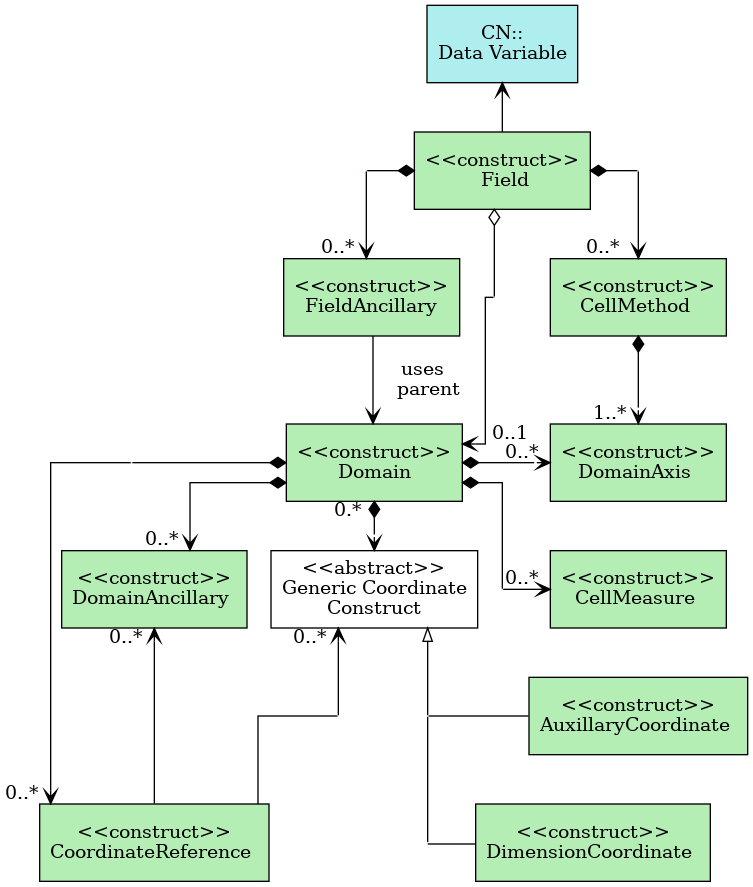

[[appendix-CF-data-model, Appendix I, The CF data model]]

[appendix]
== The CF data model

[abstract]
== Abstract

The CF conventions are designed to promote the creation, processing,
and sharing of climate and forecasting data using Network Common Data
Form (netCDF) files and libraries. This appendix contains the explicit
data model for CF to provide an interpretation of the conceptual
structure of CF which is consistent, comprehensive, and as far as
possible independent of the netCDF encoding. An explicit comprehensive
data model promotes the CF conventions being better understood,
provides guidance during the development of future extensions to the
CF conventions, and helps software developers to design CF-compliant
data-processing applications and to build interfaces to other explicit
data models.

== Introduction

A data model is an abstract interpretation of the data, that
identifies the elements of the dataset and their scientific intent,
and describes how they are related to one another and to the real or
model world from which the data were derived. A data model is
necessary because it imposes the rules, constraints, and relationships
connecting metadata to the data that are needed to imagine how the
quantities included in the dataset should be combined and processed
scientifically.

The CF data model was first created for CF version 1.6 and published
externally in journal Geoscientific Model Development (GMD) <<CFDM>>,
and that version also includes further discussions on the background
and motivation, as well as on the relationships between the CF data
model and other data models. The data model was transcribed from the
GMD paper into the CF conventions at version 1.9, also incorporating
the modifications required to represent new features introduced at
versions 1.7, 1.8 and 1.9.

=== Design criteria of the CF data model

The primary requirement of the data model is that it should be able to
describe all existing and conceivable CF-compliant datasets.

The data model should comprise a minimal set of elements that are
sufficient for accommodating all aspects of the CF conventions. The
elements of the data model are restricted to those that are explicitly
mentioned in CF, but there do not have to be as many elements in the
data model as there are entities described by CF, because a single
data model element can incorporate more than one CF entity. For
example, in CF, coordinates and coordinate bounds are distinct
entities, but coordinate bounds cannot exist without
coordinates. Therefore, it makes sense in the data model to group them
into a single element.

Similarly, while it is possible to introduce additional elements not
presently needed or used by CF, this would not be desirable because it
would increase the likelihood of the data model becoming outdated or
inconsistent with future versions of CF.

The CF data model should also be independent of the encoding. This
means that it should not be constrained by the parts of the CF
conventions which describe explicitly how to store (i.e. encode)
metadata in a netCDF file. The virtue of this is that should netCDF
ever fail to meet the community needs, the groundwork for applying CF
to other file formats will already exist.

===  The netCDF data model

The existing CF conventions are for use with netCDF files following
the netCDF "classic" data model (<>). We first give a
brief summary of this explicit data model, since the CF conventions
cannot be described without reference to the components of netCDF.

NetCDF classic files contain data in named variables, which can be
single numbers (with no dimensions), one-dimensional arrays (vectors),
or multidimensional arrays, and the dimensions are declared by name in
the file. Variables can be of integer, floating point or character
data types. Variables may have attributes attached, of any data type.
Attributes can have a single value or consist of a one-dimensional
array. NetCDF files also have "global" file attributes which provide
information about the dataset as a whole. NetCDF library software has
functions to define dimensions, variables and attributes, and write
and read data.

[[img-netCDF, figure 3]]
[.text-center]
.Key components of the netCDF classic data model. Files consist of global attributes, dimensions and variables. Variables contain attributes and data, and attributes also contain data. Variables, attributes and dimensions all contain properties, such as a "name" which identifies them in the file. A data array has a data type for all of its elements (e.g. "double" for 64-bit floating point numbers).
image::images/cfdm_netcdf_classic_data_model.png[,50%,pdfwidth=50vw,align="center"]

=== Elements of CF-netCDF

The CF-netCDF elements are listed in <<table-cf-concepts>> and shown
(in blue) with their interrelationships in <>. The CF
data model has been derived from these CF-netCDF elements and
relationships with the aims of removing aspects specific to the netCDF
encoding, and reducing the number of elements, whilst retaining the
ability to describe the CF conventions fully, in order to meet the
design criteria.

[[table-cf-concepts, table 1]]
.The elements of the CF-netCDF conventions. The relationships to netCDF entities are shown in <>.
[options="header",cols="2",caption="Table 1. "]
|===============
|{set:cellbgcolor!}
CF-netCDF element
| Description

| Data variable
| Scientific data discretised within a domain

| Dimension
| Independent axis of the domain

| Coordinate variable
| Unique coordinates for a single axis

| Auxiliary coordinate variable
| Additional or alternative coordinates for any axes

| Scalar coordinate variable
| Coordinate for an implied size one axis

| Grid mapping variable
| Horizontal coordinate system

| Boundary variable
| Cell vertices

| Cell measure variable
| Cell areas or volumes

| Ancillary data variable
| Metadata that depends on the domain

| Formula terms attribute
| Vertical coordinate system

| Feature type attribute
| Characteristics of discrete sampling geometry

| Cell methods attribute
| Description of variation within cells
|===============

[[img-cf-concepts, figure 2]]
[.text-center]
.The relationships between CF-netCDF elements and their corresponding netCDF variables, dimensions and attributes (defined in <> and identified here with the "NC" prefix). It is useful to define an abstract generic coordinate variable that can be used to refer to coordinates when the their type (coordinate, auxiliary or scalar coordinate variable) is not an issue. The CF convention details the mechanisms which are used in the netCDF file to express the relationships among the CF-netCDF elements, but these are not shown.
image::images/cfdm_cf_concepts.png[,75%,pdfwidth=75vw,align="center"]

== The CF data model

The elements of the CF data model (<>, <> and
<>) are called "constructs", a term chosen
to differentiate from the CF-netCDF entities previously defined and to
be programming language-neutral (i.e. as opposed to "object" or
"structure"). The constructs, listed in <<table-cf-constructs>>, are
related to CF-netCDF entities (<>), which in turn
relate to the components of netCDF file (<>).

[[table-cf-constructs, table 2]]
.The constructs of the CF data model. The relationships between the constructs and CF-netCDF entities are shown in in <>, <> and <>.
[options="header",cols="2",caption="Table 2. "]
|===============
|{set:cellbgcolor!}
CF construct
| Description

| Field
| Scientific data discretised within a domain

| Domain axis
| Independent axes of the domain

| Dimension coordinate
| Cell locations

| Auxiliary coordinate
| Cell locations

| Coordinate reference
| Domain coordinate systems

| Domain ancillary
| Cell locations in alternative coordinate   systems

| Cell measure
| Cell size or shape

| Field ancillary
| Ancillary metadata which varies within the domain 

| Cell method
| Describes how data represents variation within cells
|===============

=== Field construct

The field construct is central to the CF data model and includes all
the other constructs (<>). A field corresponds to a
CF-netCDF data variable with all of its metadata. All CF-netCDF
elements are mapped to some component of the CF field construct and
the field constructs completely contain all the data and metadata
which can be extracted from the file using the CF conventions. Note
that the constructs contained by the field construct cannot exist
independently, as is indicated by the nature of the class associations
shown in <>.

The field construct consists of a data array and the definition of its
domain, ancillary metadata defined over the same domain, metadata to
describe how the cell values represent the variation of the physical
quantity within the cells of the domain (<>), and
properties to describe aspects of the data that are independent of the
domain. All of the constructs contained by the field construct are
optional (as indicated by "0..*" in <>). The only component
of the field which is mandatory is the data array. Because the CF
conventions do not mention the concept of the domain, it is not
regarded as a construct of the data model. Instead, the domain is
defined collectively by various other constructs included in the
field.

The properties of the field construct correspond to some netCDF
attributes of variables (e.g. the **`units`**, **`long_name`**, and
**`standard_name`**), and some netCDF global file attributes
(e.g. **`history`** and **`institution`**). The term "property" is
used, rather than "attribute", because not all CF-netCDF attributes
are properties in this sense--some CF-netCDF attributes are used to
point to (i.e. reference) other netCDF variables and so only describe
the data indirectly (e.g. the coordinates attribute), and others have
structural functions in the CF-netCDF file (e.g. the Conventions
attribute).

In the data model, netCDF global file attributes apply to every data
variable in the file, except where they are overridden by netCDF data
variable attributes with the same name. This interpretation of global
file attributes is not stated in the CF conventions, but for the data
model it is necessary because there is no notion of a file. Hence,
metadata stored in attributes of the file as a whole have to be
transferred to the field construct. If present, the global file
attribute featureType applies to every data variable in the file with
a discrete sampling geometry. Hence, the feature type is regarded as a
property of the field construct.

The standard_name property constrains the units property (i.e. only
certain units are consistent with each standard name) and in some
cases also the dimensions that a data variable must have. These
constraints, however, do not supply any further information--they are
just for self consistency. Similarly the featureType property imposes
some requirements on the axes the domain must have. Following the aim
of constructing a minimal data model, the standard name and
featureType are not regarded as separate constructs within the field,
because they do not depend on any other construct for their
interpretation.

[[img-field, figure 3]]
[.text-center]
.The constructs of the CF data model. The field construct corresponds to a CF-netCDF data variable (defined in <> and identified here with the "CN" prefix). Relationships between other constructs and CF-netCDF are given in <> and <>. The domain provides the linkage between the field construct and the constructs which describe measurement locations and cell properties. It is not a construct of the data model, but is an abstract concept that is useful for understanding it. Similarly, it is useful to define an abstract generic coordinate construct that can be used to refer to coordinates when the their type (dimension or auxiliary coordinate construct) is not an issue.

=== Domain axis construct and the data array

A domain axis construct (<>) comprises a positive integer
which specifies the number of cells lying along an independent axis of
the domain. In CF-netCDF, it is usually defined either by a netCDF
dimension or by a scalar coordinate variable, which implies a domain
axis of size one. The field construct's data array spans the domain
axis constructs of the domain, except that the size-one axes may
optionally be omitted, because their presence makes no difference to
the order of the elements. Hence, the data array may be
zero-dimensional (i.e. scalar) if there are no domain axis constructs
of size greater than one.

When a collection of discrete sampling geometry (DSG) features has
been combined in a data variable using the incomplete orthogonal or
ragged representations to save space, the axis size has to be
inferred, but this is an aspect of unpacking the data, rather than its
conceptual description. In practice, the unpacked data array may be
dominated by missing values (as could occur, for example, if all
features in a collection of time series had no common time
coordinates), in which case it may be preferable to view the
collection as if each DSG feature were a separate variable, each one
corresponding to a different field construct.

=== Coordinates: dimension coordinate and auxiliary constructs

Coordinate constructs (<>) provide information which
locate the cells of the domain and which depend on a subset of the
domain axis constructs. A coordinate construct consists of an optional
data array of the coordinate values spanning the subset of the domain
axis constructs, properties to describe the coordinates (in the same
sense as for the field construct), an optional data array of cell
bounds recording the extents of each cell, and any extra arrays needed
to interpret the cell bounds values. The data array of the coordinate
values is required, execpt for the special cases described below.

There are two distinct types of coordinate construct: dimension
coordinate constructs unambiguously describe cell locations for a
single domain axis, thus providing independent variables on which the
field construct's data depend; and auxiliary coordinate constructs
provide any type of coordinate information for one or more of the
domain axes.

A dimension coordinate construct contains numeric coordinates for a
single domain axis that are non-missing and strictly monotonically
increasing or decreasing. CF-netCDF coordinate variables and numeric
scalar coordinate variables correspond to dimension coordinate
constructs.

Auxiliary coordinate constructs have to be used, instead of dimension
coordinate constructs, when a single domain axis requires more than
one set of coordinate values, when coordinate values are not numeric,
strictly monotonic, or contain missing values, or when they vary along
more than one domain axis construct simultaneously. CF-netCDF
auxiliary coordinate variables and non-numeric scalar coordinate
variables correspond to auxiliary coordinate constructs.

When cell bounds are provided, each cell comprises one or more parts,
and each part is either a collection of points, a line defined by a
connected series of points, or a polygonal area (i.e. the region
enclosed by a connected series of points, where the first and last
points are connected as well). All parts of all the cells must be of
the same one of these three kinds, which are called "geometry
types". The bounds array spans the domain axis constructs of the
coordinate construct, with the addition of two trailing ragged
dimensions. The first extra dimension indexes the parts of each cell
and the second indexes the points that describe each part.

If cell bounds are provided for a dimension coordinate construct then
each cell must have exactly two vertices forming a line geometry. For
climatological time coordinates the actual cell extent comprises
multiple time segments equivalent to multiple line geometry parts, but
the bounds require just two points to define each cell, namely the
earliest and latest times of the sequence. The cell method constructs
indicate how the multiple time segments should be inferred from these
climatological bounds.

If a polygonal cell is composed of multiple parts it may have holes,
i.e. polygon regions that are to be omitted from, as opposed to
included in, the cell extent. When such holes are present an "interior
ring" array is required that records whether each polygon is to be
included or excluded from the cell, and is supplied by an interior
ring variable in CF-netCDF. The interior ring array spans the domain
axis constructs of the coordinate construct, with the addition of an
extra ragged dimension that indexes the parts for each cell. For
example, a cell describing the land area surrounding a lake would
require two polygon parts: one defines the outer boundary of the land
area; the other, recorded as an interior ring, is the lake boundary,
defining the inner boundary of the land area.

If a domain axis construct does not correspond to a continuous
physical quantity, then it is not necessary for it to be associated
with a dimension coordinate construct. For example, this is the case
for an axis that runs over ocean basins or area types, or for a domain
axis that indexes a time series at scattered points. These axes are
discrete axes in CF-netCDF. In such cases cells may be described with
one-dimensional auxiliary coordinate constructs for which, provided
that there is a cell bounds array to describe the cell extents, the
coordinate array is optional, since coordinates are not always well
defined for such cells. A CF-netCDF geometry container variable is
used to store cell bounds without coordinates for a discrete axis.

In CF-netCDF, when a geometry container variable is present it
explicitly describes the geometry type and identifies the node
coordinate variables that contain the cell vertices. The geometry
container variable also identifies a node count variable that contains
the number of nodes per cell when more than one cell is present, and a
part node count variable that contains the number of nodes per cell
part when cells are composed of multipart lines, multipart polygons,
or polygons with holes. When a geometry container variable is not
present then the bounds contain exactly one part and their geometry
type is implied by convention: for multidimensional auxiliary
coordinates each cell is a single polygon, and for all other types of
coordinate each cell is a single line segment defined by two
points. In the case of climatological time coordinates, the two points
of the cell bounds, in conjunction with the cell methods, imply the
existence of multiple line parts, different subsets of which are
associated with the different cell methods required to define the
climatology. For example, when the field construct's data are
multiannual averages of monthly minima, the implied cell parts define
the individual months over which the original data was minimised; and
all of the implied parts taken together define the exact temporal
extent of the average of the monthly minima.

[[img-dim-aux, figure 4]]
[.text-center]
.The relationship between domain axis, dimension coordinate and auxiliary coordinate constructs and CF-netCDF (defined in <> and identified here with the "CN" prefix). A dimension or auxiliary coordinate construct is defined by a CF-netCDF coordinate, scalar coordinate or auxiliary coordinate variable, and the associated CF-netCDF boundary variable if it exists. A generic coordinate construct spans one or more domain axis constructs, but the mapping of which ones is only held by the parent field construct.
image::images/cfdm_coordinates.png[,75%,pdfwidth=50vw,align="center"]

=== Coordinate reference construct

The domain may contain various coordinate systems, each of which is
constructed from a subset of the dimension and auxiliary coordinate
constructs. For example, the domain of a four-dimensional field
construct may contain horizontal (__y__-__x__), vertical (_z_), and
temporal (_t_) coordinate systems. There may be more than one of each
of these, if there is more than one coordinate construct applying to a
particular spatiotemporal dimension (for example, there could be both
latitude-longitude and __y__-__x__ projection coordinate systems).

A coordinate system may be constructed _implicitly_ from any subset of
the coordinate constructs, yet a coordinate construct does not need to
be explicitly or exclusively associated with any coordinate system.  A
coordinate system of the field construct can be _explicitly_ defined
by a coordinate reference construct (<>)
which relates the coordinate values of the coordinate system to
locations in a planetary reference frame and consists of the
following:

* The dimension coordinate and auxiliary coordinate constructs that
  define the coordinate system to which the coordinate reference
  construct applies. Note that the coordinate values are not relevant
  to the coordinate reference construct, only their properties.

* A definition of a datum specifying the zeroes of the dimension and
  auxiliary coordinate constructs which define the coordinate
  system. The datum may be explicitly indicated via properties, or it
  may be implied by the metadata of the contained dimension and
  auxiliary coordinate constructs. For example, in a two-dimensional
  geographical latitude-longitude coordinate system based upon a
  spherical Earth, the datum is assumed to be 0^o^N, 0^o^E. Note that
  the datum may contain the definition of a geophysical surface which
  corresponds to the zero of a vertical coordinate construct, and this
  may be required for both horizontal and vertical coordinate systems.

* A coordinate conversion, which defines a formula for converting
  coordinate values taken from the dimension or auxiliary coordinate
  constructs to a different coordinate system. A term of the
  conversion formula can be a scalar or vector parameter which does
  not depend on any domain axis constructs, may have units (such as a
  reference pressure value), or may be a descriptive string (such as
  the projection name "mercator"), or it can be a domain ancillary
  construct (such as one containing spatially varying orography data).

For __y__-__x__ coordinates, the coordinate conversion is either a map
projection, which converts between Cartesian coordinates and spherical
or ellipsoidal coordinates on the vertical datum, or a conversion
between different spherical coordinate systems (as in the case of
rotated pole coordinates). In the case of _z_ coordinates, the
conversion is between a coordinate construct with parameterised values
(such as ocean sigma coordinates) and a coordinate construct with
dimensional values (such as depths), again with respect to the
vertical datum. The coordinate conversion is not required if no other
coordinate systems are described.

Some parts of the coordinate reference construct may not be relevant
to a given coordinate construct which it contains. The relevant parts
are determined by an application using the coordinate reference
construct. For example, for a coordinate reference construct which
contained coordinate constructs for __y__-__x__ projection and latitude
and longitude coordinates, a datum comprising a reference ellipsoid
would apply to all of them, but projection parameters would only apply
to the projection coordinates.

In CF-netCDF, coordinate system information that is not found in
coordinate or auxiliary coordinate variables is stored in a grid
mapping variable or the formula_terms attribute of a coordinate
variable, for horizontal or vertical coordinate variables,
respectively. Although these two cases are arranged differently in
CF-netCDF, each one contains, sometimes implicitly, a datum or a
coordinate conversion formula (or both) and is therefore regarded as a
coordinate reference construct by the data model. A grid mapping name
or the standard name of a parametric vertical coordinate corresponds
to a string-valued scalar parameter of a coordinate conversion
formula. A grid mapping parameter which has more than one value (as is
possible with the "standard parallel" attribute) corresponds to a
vector parameter of a coordinate conversion formula. A data variable
referenced by a formula_terms attribute corresponds to the term of a
coordinate conversion formula--either a domain ancillary construct or,
if it is zero-dimensional, a scalar parameter.

[[img-coordinate-reference, figure 5]]
[.text-center]
.The relationship between coordinate reference and domain ancillary constructs and CF-netCDF (defined in <> and identified here with the "CN" prefix). A coordinate reference construct is defined either by a grid mapping variable, or a **`formula_terms`** attribute of a CF-netCDF coordinate variable. The coordinate reference construct is composed of generic coordinate constructs, a datum, and a coordinate conversion formula. The coordinate conversion formula is usually defined by a named formula in the CF conventions. A domain ancillary construct term of a coordinate conversion formula is defined by a CF-netCDF data variable or a CF-netCDF generic coordinate variable.
image::images/cfdm_coordinate_reference.png[,75%,pdfwidth=75vw,align="center"]

=== Domain ancillary construct

A domain ancillary construct (<>) provides
information which is needed for computing the location of cells in an
alternative coordinate system. It is the value of a term of a
coordinate conversion formula that contains a data array which is
either scalar or which depends on one, more or all of the domain axis
constructs.

It also contains an optional array of cell bounds recording the
extents of each cell (only applicable if the array contains coordinate
data) and properties to describe the data (in the same sense as for
the field construct). An array of cell bounds spans the same domain
axes as the data array, with the addition of an extra dimension whose
size is that of the number of vertices of each cell.

CF-netCDF variables named by the **`formula_terms`** attribute of a
CF-netCDF coordinate variable correspond to domain ancillary
constructs. These CF-netCDF variables may be coordinate, scalar
coordinate, or auxiliary coordinate variables, or they may be data
variables. For example, in a coordinate conversion for converting
between ocean sigma and height coordinate systems, the value of the
"depth" term for horizontally varying distance from ocean datum to sea
floor would correspond to a domain ancillary construct. In the case of
a named term being a type of coordinate variable, that variable will
correspond to an independent domain ancillary construct in addition to
the coordinate construct; that is, a single CF-netCDF variable is
translated into two constructs (see <<cdl-domain-anc-coordinate>>).

[[cdl-domain-anc-coordinate, example 1]]
[caption="Example 1. "]
.A single CF-netCDF variable corresponding to two data model constructs. The netCDF variable **`A`** corresponds to an auxiliary coordinate construct (since it is referenced by the **`coordinates`** attribute) as well as a domain ancillary construct (since it is referenced by the **`formula_terms`** attribute). Similarly for the netCDF variable **`B`**.
 
====

----
float eta(eta) ;
  eta:long_name = "eta at full levels" ;
  eta:positive = "down" ;
  eta:standard_name = "atmosphere_hybrid_sigma_pressure_coordinate" ;
  eta:formula_terms = "a: A b: B ps: PS p0: P0" ;
float A(eta) ;
  A:units = "Pa" ;
float B(eta) ;
  B:units = "1" ;
float PS(lat, lon) ;
  PS:units = "Pa" ;
float P0 ;
  P0:units = "Pa" ;
float temp(eta, lat, lon) ;
  temp:standard_name = "air_temperature" ;
  temp:units = "K";
  temp:coordinates = "A B" ;
----

====

=== Cell measure construct

A cell measure (<>) construct provides information about
the size or shape of the cells and depending on one, more or all of
the domain axis constructs. Cell measure constructs have to be used
when the size or shape of the cells cannot be deduced from the
dimension or auxiliary coordinate constructs without special knowledge
that a generic application cannot be expected to have.

The cell measure construct consists of a numeric array of the metric
data which span one, more or all of the domain axis constructs, and
properties to describe the data (in the same sense as for the field
construct). The properties must contain a "measure" property, which
indicates which metric of the space it supplies, e.g. cell horizontal
areas, and a units property consistent with the measure property,
e.g. m2. It is assumed that the metric does not depend on axes of the
domain which are not spanned by the array, along which the values are
implicitly propagated. CF-netCDF cell measure variables correspond to
cell measure constructs.

=== Field ancillary constructs

The field ancillary construct (<>) provides metadata which
are distributed over the same sampling domain as the field itself. For
example, if a data variable holds a variable retrieved from a
satellite instrument, a related ancillary data variable might provide
the uncertainty estimates for those retrievals (varying over the same
spatiotemporal domain).

The field ancillary construct consists of an array of the ancillary
data which is either scalar or which depends on one, more or all of
the domain axis constructs, and properties to describe the data (in
the same sense as for the field construct). It is assumed that the
data do not depend on axes of the domain which are not spanned by the
array, along which the values are implicitly propagated. CF-netCDF
ancillary data variables correspond to field ancillary
constructs. Note that a field ancillary construct is constrained by
the domain definition of the parent field construct but does not
contribute to the domain’s definition, unlike, for instance, an
auxiliary coordinate construct or domain ancillary construct.

=== Cell method construct

The cell method constructs (<>) describe how the cell
values represent the variation of the physical quantity within its
cells--the structure of the data at a higher resolution. A single cell
method construct consists of a set of axes (see below), a "method"
property which describes how a value of the field construct's data
array describes the variation of the quantity within a cell over those
axes (e.g. a value might represent the cell area average), and
properties serving to indicate more precisely how the method was
applied (e.g. recording the spacing of the original data, or the fact
the method was applied only over El Niño years).

The field construct may contain an ordered sequence of cell method
constructs describing multiple processes which have been applied to
the data, e.g. a temporal maximum of the areal mean has two
components--a mean and a maximum, each acting over different sets of
axes. It is an ordered sequence because the methods specified are not
necessarily commutative. There are properties to indicate
climatological time processing, e.g. multiannual means of monthly
maxima, in which case multiple cell method constructs need to be
considered together to define a special interpretation of boundary
coordinate array values. The **`cell_methods`** attribute of a
CF-netCDF data variable corresponds to one or more cell method
constructs.

The axes over which a cell method applies are either a subset of the
domain axis constructs or a collection of strings which identify axes
that are not part of the domain. The latter case is particularly
useful when the coordinate range for an axis cannot be precisely
defined, making it impossible to define a domain axis construct. For
example, a climatological time mean might be based on data which are
not available over the same time periods at every horizontal
location--the useful information that the data have been temporally
averaged can be recorded without specifying the range of times. The
strings which identify such axes are well defined in that they must be
standard names (e.g. time, longitude) or the special string
**`area`**, indicating a combination of horizontal axes.
