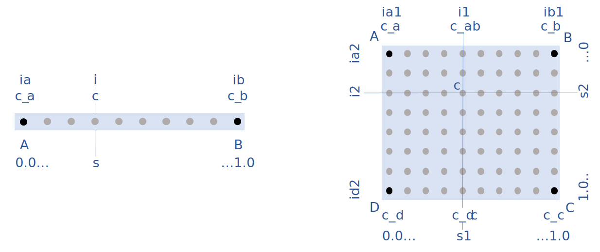

[[appendix-coordinate-sampling, Appendix J, Coordinate Sampling]] 
[appendix]
== Coordinate Sampling Methods

The general description of  of the compression by coordinate sampling is given in section <<compression-by-coordinate-sampling>>. This appendix provides details on the available methods for compression by coordinate sampling. 

The definitions and guidance given here allow an application to compress an existing data set using coordinate sampling, while letting the creator of the compressed dataset control the accuracy of the reconstituted coordinates through the degree of subsampling and the choice of interpolation method.

Futhermore, the definitions given here allow an application to uncompress coordinate and auxiliary coordinate variables that have been compressed using coordinate sampling. The key element of this process is the reconstitution of the full resolution coordinates in the domain of the data by interpolation between the lower resolution coordinates, the tie points, stored in the compressed dataset.

All floating point calculations defined in this appendix must be carried out in 64 bit floating point, even if the related coordinates and interpolation parameters are stored in the netCDF files with a lower precision.

The appendix is organised in a sections on <<common_definitions_and_notation>>, <<common_conversions_and_formulas>>, <<interpolation_methods>> and finally two sections with step procedures <<coordinate_compression_steps>> and <<coordinate_uncompression_steps>>.

[[common_definitions_and_notation]]
=== Common Definitions and Notation

The target domain is segmented into smaller interpolation zones as described in <<compression-by-coordinate-sampling-tie-points-and-interpolation-zones>>.

For one-dimensional interpolation, an interpolation zone is defined by two tie points, one at each end of the interpolation zone; for two-dimensional interpolation, an interpolation zone is defined by four tie points, one at each corner of a rectangular area aligned with the domain axes; etc. Examples of one-dimensional and two-dimensional interpolation zones are shown in <<interpolation>>.

[[interpolation, figure 1]]
[.text-center]
.Tie Points A, B, C and D, interpolation indices i, interpolation variables s and coordinate values c for one and two dimensional interpolation.
 

The coordinate interpolation methods are named to indicate the number of dimensions they interpolate as well as the type of interpolation provided. For example, the interpolation method named `linear` provides linear interpolation in one dimension and the method named `bi_linear` provides linear interpolation in two dimensions. Equivalently, the interpolation method named `quadratic` provides quadratic interpolation in one dimension and the interpolation method named `bi_quadratic` provides quadratic interpolation in two dimensions.

When an interpolation method is referred to as linear or quadratic, it means that the method is linear or quadratic in the indices of the interpolation dimensions. 

For convenience, an interpolation variable `s` is introduced, calculated as a function of the index in the target domain of the coordinate value to be reconstituted. In the case of one dimensional interpolation the interpolation variable is computed as 

`s = s(ia, ib, i) = (i - ia)/(ib - ia)`

where `ia` and `ib` are the indices in the target domain of the tie points `A` and `B` and `i` is the index in the target domain of the coordinate value to be reconstituted. 

Note that the value of `s` varies from `0.0` at the tie point `A` to `1.0` at tie point `B`. For example, if `ia = 100` and `ib = 110` and the index in the target domain of the coordinate value to be reconstituted is `i = 105`, then `s = (105 - 100)/(110 - 100) = 0.5`.

In the case of two dimensional interpolation, the two interpolation variables are equivalently computed as

`s1 = s(ia1, ib1, i1) = (i1 - ia1)/(ib1 - ia1)`  +
`s2 = s(ia2, ic2, i2) = (i2 - ia2)/(ic2 - ia2)`

where `ia1` and `ib1` are the first dimension indices in the target domain of the tie points `A` and `B` respectively, `ia2` and `ic2` are the second dimension indices in the target domain of the tie points `A` and `D` respectively and the indices `i1` and `i2` are the first and second dimension indices respectively in the target domain of the coordinate value to be reconstituted. 

For the reconstitution of the uncompressed coordinate and auxiliary coordinate variables the interpolation method can be applied independently for each interpolation zone, making it possible to parallelize the computational process.

The following notation is used: +  
A variable staring with `v` denotes a vector and `v.x` , `v.y` and `v.z` refer to the three coordinates of that vector. +
A variable staring with `ll` denotes a latitude-longitude coordinate pair and `ll.lat` and `ll.lon` refer to the latitude and longitude coordinates. +
For one dimensional interpolation, `i` is an index in the interpolation dimension, `tp` is an index in the tie point interpolation dimension and `iz` is an index in the interpolation zone dimensions. 
For two dimensional interpolation, `i1` and `i2` are indices in the interpolation dimensions, `tp1` and `tp2` are indices in the tie point interpolation dimensions and `iz1` and `iz2` are indices in the interpolation zone dimensions. +

Note that, for simplicity of notation, the descriptions of the interpolation methods in most places leave out the indices of tie point related variables and refer to these with `a` and `b` in the one dimensional case and with `a`, `b`, `c` and `d` in the two dimensional case. In the two dimensional case, `a = tp(tp2, tp1)`, `b = tp(tp2, tp1+1)`, `c = tp(tp2+1, tp1)` and `d = tp(tp2+1, tp1+1)` would reflect the way the tie point data would be stored in the data set, see also <<interpolation>>.

[[interpolation_methods]]
=== Interpolation Methods

==== Linear Interpolation

[cols="6,15"]
|===============
| Name | **`interpolation_name = "linear"`** 
| Description | General purpose one dimensional linear interpolation method for one or more coordinates
| Interpolation Parameter terms  | None
| Coordinate Compression Calculations | None
| Coordinate Uncompression Calculations | 
 The coordinate value `u(i)` at index `i` between tie points `A` and `B` is calculated from:   +
 `u(i) = fl(ua, ub, s(i)) = (1 - s)*ua + s*ub`; + 
where `ua` and `ub` are the coordinate values at tie points `A` and `B` respectively. +

|===============

==== Bilinear Interpolation 

[cols="6,15"]
|===============
| Name | **`interpolation_name = "bi_linear"`** 
| Description | General purpose two dimensional linear interpolation method for one or more coordinates
| Interpolation Parameter terms | None
| Coordinate Compression Calculations | None
| Coordinate Uncompression Calculations | 
The interpolation function fl() defined for linear interpolation above is first applied twice in the interpolation dimension 2, once between tie points `A` and `C` and once between tie points `B` and `D`. It is then applied once in the interpolation dimension 1, between the two resulting coordinate points, yielding the interpolated coordinate value `u(i2, i1)`:  +  
`uac = fl(ua, uc, s(ia2, ic2, i2))`; +
`ubd = fl(ub, ud, s(ia2, ic2, i2))`; +
`u(i2, i1) = fl(uac, ubd, s(ia1, ib1, i1))`; +

|===============

[[quadratic]]
==== Quadratic Interpolation

[cols="6,15"]
|===============
| Name | **`interpolation_name = "quadratic"`** 
| Description | General purpose one dimensional quadratic interpolation method for one coordinate. 

| Interpolation Parameter terms | Optionally interpolation coefficient `c`, which must span the interpolation_zone dimension.

| Coordinate Compression Calculations | 
The expression +
`c = fc(ua, ub, u(i), s(i)) = ((u - (1 - s) * ua - s * ub)/( 4 * (1 - s) * s)` +
enables the creator of the dataset to calculate `c` from the coordinate values `ua` and `ub` at tie points `A` and `B` respectively, and the coordinate value `u(i)` at index `i` between the tie points `A` and `B`. If the size of the interpolation zone `(ib - ia)` is an even number, then the data point at index `i = (ib + ia)/2` shall be selected for this calculation, otherwise the data point at index `i = (ib + ia - 1)/2` shall be selected. 
  
| Coordinate Uncompression Calculations | 
The coordinate value `u(i)` at index `i` between tie points `A` and `B` is calculated from:   +
 `u(i) = fq(ua, ub, c, s(i)) = (1 - s) * ua + 4 * (1 - s) * s * c + s * ub`; + 
where `ua` and `ub` are the coordinate values at tie points `A` and `B` respectively and the coefficient `c` is available as a term in the `interpolation_parameters`, or otherwise defaults to `0.0`. +
|===============

[[quadratic_geo]]
==== Quadratic Interpolation of geographic coordinates latitude and longitude

[cols="6,15"]
|===============
| Name | **`interpolation_name = "quadratic_remote_sensing"`** 
| Description | A one dimensional quadratic method for interpolation of the geographic coordinates latitude and longitude, typically used for remote sensing products with geographic coordinates on the reference ellipsoid. +

Requires a pair of latitude and longitude tie point variables, as defined unambiguously in <<latitude-coordinate>> and <<longitude-coordinate>>.

By default, interpolation is performed directly in the latitude and longitude coordinates, but may be performed in cartesian coordinates where required for achieving the desired accuracy. This must be indicated by setting the `location_use_cartesian` flag within the interpolation parameter `interpolation_zone_flags` for each interpolation zone where interpolation in cartesian coordinates is required.  

The quadratic interpolation coefficients `cea = (ce, ca)`, stored as interpolation parameters in the product, describe a point `P` between the tie points `A` and `B`, which is equivalent of an additional tie point in the sense that the method will accurately reconstitute the point `P` in the same way as it accurately reconstitutes the tie points `A` and `B`. See <<quadratic1>> and <<quadratic2>>.

Although equivalent to a tie point, the coefficients `ce` and `ca` have two advantages over tie points. Firstly, they can often be stored as a lower precision floating point number compared to the tie points, as `ce` and `ca` only describes the position of `P` relative to the midpoint `M` between the tie points `A` and `B`. Secondly, if any of `ce` and `ca` do not contribute significantly to the accuracy of the reconstituted points, it can be left out of the data set and its value will default to zero during uncompression. 

The coefficients may be represented in three different ways:

For storage in the dataset as the non-dimensional coefficients `cea = (ce, ca)`, referred to as the parametric representation. The component `ce` is the offset projected on the line from tie point `B` to tie point `A` and expressed as a fraction of the distance between `A` and `B`. The component `ca` is the offset projected on the line perpendicular to the line from tie point `B` to tie point `A` and  perpendicular to the plane spanned by `va` and `vb`, the vector representations of the two tie points, and expressed as a fraction of the length of `A x B`. +

For interpolation in cartesian coordinates as the coefficients `cv = (cv.x, cv.y, cv.z)`, expressing the offset components along the cartesian axes X, Y and Z respectively.

For interpolation in geographic coordinates latitude and longitude as the coefficients `cll = (cll.lat, cll.lon)`, expressing the offset components along the longitude and latitude directions respectively.

The functions `fq()` and `fc()` referenced in the following are defined in <<quadratic>>. 
 
| Interpolation Parameter terms | Any subset of interpolation coefficients `ce, ca`, which must each span the interpolation_zone dimension. +
Optionally the flag variable `interpolation_zone_flags`, which must span the `interpolation_zone` dimension and must include `location_use_cartesian` in the `flag_meanings` attribute. 

| Coordinate Compression Calculations | 
First calculate the tie point vector representations from the tie point latitude-longitude representations +
`va = fll2v(lla);  vb = fll2v(llb);` +
Then calculate the cartesian representation of the interpolation coefficients from the tie points `va` and `vb` as well as the point `vp(i)` at index `i` between the tie points `A` and `B`. If the size of the interpolation zone `(ib - ia)` is an even number, then the data point at index `i = (ib + ia)/2` shall be selected for this calculation, otherwise the data point at index `i = (ib + ia - 1)/2` shall be selected. +
The cartesian interpolation coefficients are found from +
`cv = fcv(va, vb, vp(i), s(i)) = (fc(va.x, vb.x, vp(i).x, s(i)), fc(va.y, vb.y, vp(i).y, s(i)), fc(va.z, vb.z, vp(i).z, s(i))).` +
Finally, for storage in the dataset, convert the coefficients to the parametric representation + 
`cea(iz) = (ce(iz), ca(iz)) = fcv2cea(va, vb, cv) = (fdot(cv, fminus(va, vb))/ gsqr), fdot(cv, fcross(va, vb))/(rsqr*gsqr));` + 
where `vr = fmultiply(0.5, fplus(va, vb))`, `rsqr = fdot(vr, vr)`, `vg = fminus(va, vb)` and `gsqr = fdot(vg, vg).` +  
The interpolation parameter term `interpolation_zone_flags(iz)` shall have the flag `location_use_cartesian` set if the interpolation zone intersects the `longitude = 180.0` or if the interpolation zone extends into `latitude > latitude_limit` or `latitude < -latitude_limit`, where the choice of `latitude_limit` will impact the coordinate reconstitution accuracy. 
| Coordinate Uncompression Calculations | 
First calculate the tie point vector representations from the tie point latitude-longitude representations +
`va = fll2v(lla);  vb = fll2v(llb);` +
Then calculate the cartesian representation of the interpolation coefficients from the parametric representation stored in the dataset using + 
`cv = fcea2cv(va, vb, cea(iz)) = fplus(fmultiply(ce, fminus(va, vb)), fmultiply(ca, fcross(va, vb)), fmultiply(cr, vr));` + 
where +
`vr = fmultiply(0.5, fplus(va, vb))`; + 
`rsqr = fdot(vr, vr);` +
`cr = fsqrt(1 - ce(iz)*ce(iz) - ca(iz)*ca(iz)) - fsqrt(rsqr).` +
If the flag `location_use_cartesian` of the interpolation parameter term `interpolation_zone_flags(iz2, iz1)` is set, use the following expression to reconstitute any point `llp(i)` between the tie points `A` and `B` using interpolation in cartesian coordinates + 
`vp(i) = fqv(va, vb, cv, s(i)) = (fq(va.x, vb.x, cv.x, s(i)), fq(va.y, vb.y, cv.y, s(i)), fq(va.z, vb.z, cv.z, s(i)));` +
`llp(i) = fv2ll(vp(i)).` +
Otherwise, first calculate latitude-longitude representation of the interpolation coefficients + 
`cll = fcll(lla, llb, llab) = (fc(lla.lat, llb.lat, llab.lat, 0.5), fc(lla.lon, llb.lon, llab.lon, 0.5));` + 
where `llab = fv2ll(fqv(va, vb, cv, 0.5))`. +
Then use the following expression to reconstitute any point `llp(i)` between the tie points `A` and `B` using interpolation in latitude-longitude coordinates + 
`llp(i) = (llp(i).lat, llp(i).lon) = fqll(lla, llb, cll, s(i)) = (fq(lla.lat, llb.lat, cll.lat, s(i)), fq(lla.lon, llb.lon, cll.lon, s(i)))`. + 
|===============   
  
[[quadratic1, figure 2]]
[.text-center]
.With the expansion coefficient ce = 0 and the alignment coefficient ca = 0, the method reconstitutes the points at regular intervals along a great circle between tie points A and B.
image::images/ci_quadratic1.svg[,100%,pdfwidth=50vw,align="center"] 

[[quadratic2, figure 3]]
[.text-center]
.With the expansion coefficient ce > 0 and the alignment coefficient ca > 0, the method reconstitutes the points at intervals of expanding size (ce) along an arc with an alignment offset (ca) from the great circle between tie points A and B.
image::images/ci_quadratic2.svg[,100%,pdfwidth=50vw,align="center"]  

[[bi_quadratic_geo]]
==== Biquadratic Interpolation of geographic coordinates

[cols="6,15"]
|===============
| Name | **`interpolation_name = "bi_quadratic_remote_sensing"`** 
| Description | A two dimensional quadratic method for interpolation of the geographic coordinates latitude and longitude, typically used for remote sensing products with geographic coordinates on the reference ellipsoid. 

Requires a pair of latitude and longitude tie point variables, as defined unambiguously in <<latitude-coordinate>> and <<longitude-coordinate>>.

The functions `fcv()`, `fcv2cea()`, `fcea2cv()`, `fcll()`, `fqv()` and `fqll()` referenced in the following are defined in <<quadratic_geo>>. As for that method, interpolation is performed directly in the latitude and longitude coordinates or in cartesian coordinates, where required for achieving the desired accuracy. Similarly, it shares the three different representations of the quadratic interpolation coefficients, the parametric representation `cea = (ce, ca)` for storage in the dataset, `cll = (cll.lat, cll.lon)` for interpolation in geographic coordinates latitude and longitude and `cv = (cv.x, cv.y, cv.z)` for interpolation in cartesian coordinates. 

The parametric representation of the interpolation coefficients, stored in the interpolation parameters `ce1, ca1, ce2, ca2, ce3` and `ca3`, is equivalent to five additional tie points for the interpolation zone as shown in <<quadratic3>>, which also shows the orientation and indices of the parameters.  

| Interpolation Parameter terms  | 
Any subset of interpolation coefficients `ce1, ca1`, which must each span the `tie_point_interpolation_2` and `interpolation_zone_1` dimensions; +
Any subset of interpolation coefficients `ce2, ca2`, which must each span the `interpolation_zone_2` and `tie_point_interpolation_1` dimensions; +
Any subset of interpolation coefficients `ce3, ca3`, which must each span the `interpolation_zone_2` and `interpolation_zone_1` dimensions; + 

Optionally the flag variable `interpolation_zone_flags`, which must span the `interpolation_zone_2` and `interpolation_zone_1` dimensions and must include `location_use_cartesian` in the `flag_meanings` attribute.  

| Coordinate Compression Calculations | 
First calculate the tie point vector representations from the tie point latitude-longitude representations +
`va = fll2v(lla);  vb = fll2v(llb); vc = fll2v(llc); vd = fll2v(lld).` +
Then calculate the cartesian representation of the interpolation coefficients sets from the tie points as well as a point `vp(i2, i1)` between the tie points. If the size of the interpolation zone in the first dimension `(ib1 - ia1)` is an even number, then the index 
`i1 = (ib1 + ia1)/2` shall be selected for this calculation, otherwise the index 
`i1 = (ib1 + ia1 - 1)/2` shall be selected. If the size of the interpolation zone in the second dimension `(ib2 - ic2)` is an even number, then the index `i2 = (ib2 + ic2)/2` shall be selected for this calculation, otherwise the index `i2 = (ib2 + ic2 - 1)/2` shall be selected. +
Using the selected `(i2, i1)`, the cartesian interpolation coefficients are found from + 
`s1 = s(ia1, ib1, i1);`
`s2 = s(ia2, ic2, i2);` +
`vac = fll2v(ll(i2, ia1));`
`vbd = fll2v(ll(i2, ib1));` +
`cv_ac = fcv(va, vc, vac, s2);` +
`cv_bd = fcv(vb, vd, vbd, s2);` +
`cv_ab = fcv(va, vb, fll2v(ll(ia2, i1)), s1);` +
`cv_cd = fcv(vc, vd, fll2v(ll(ic2, i1)), s1);` +
`cv_zz = fcv(vac, vbd, fll2v(ll(i2, i1)), s1);` +
`vz = fqv(vac, vbd, cv_zz, 0.5);` +
`vab = fqv(va, vb, cv_ab, 0.5);` +
`vcd = fqv(vc, vd, cv_cd, 0.5);` +
`cv_z = fcv(vab, vcd, vz, s2);` +
Finally, before storing them in the dataset's interpolation parameters, convert the coefficients to the parametric representation + 
`cea1(tp2, iz1)  = fcv2cea( va, vb, cv_ab);` + 
`cea1(tp2+1, iz1)  = fcv2cea( vc, vd, cv_cd);` + 
`cea2(iz2, tp1)  = fcv2cea( va, vc, cv_ac);` +
`cea2(iz2, tp1+1)  = fcv2cea( vb, vd, cv_bd);` + 
`cea3(iz2, iz1)  = fcv2cea( vab, vcd, cv_z).` +
The interpolation parameter term `interpolation_zone_flags(iz2, iz1)` shall have the flag `location_use_cartesian` set if the interpolation zone intersects the `longitude = 180.0` or if the interpolation zone extends into `latitude > latitude_limit` or `latitude < -latitude_limit`, where the choice of `latitude_limit` will impact the coordinate reconstitution accuracy. 
| Coordinate Uncompression Calculations |
First calculate the tie point vector representations from the tie point latitude-longitude representations +
`va = fll2v(lla);  vb = fll2v(llb); vc = fll2v(llc); vd = fll2v(lld).` +
Then calculate the cartesian representation of the interpolation coefficient sets from the parametric representation stored in the dataset +
`cv_ac = fcea2cv(va, vc, cea2(iz2, tp1));` +
`cv_bd = fcea2cv(vb, vd, cea2(iz2, tp1 + 1));` +
`vab = fqv(va, vb, fcea2cv(va, vb, cea1(tp2, iz1)), 0.5);` +
`vcd = fqv(vc, vd, fcea2cv(vc, vd,  cea1(tp2 + 1, iz1)), 0.5);` +
`cv_z = fcea2cv(vab, vcd, cea3(iz2, iz1));` +
If the flag `location_use_cartesian` of the interpolation parameter term `interpolation_zone_flags` is set, use the following expression to reconstitute any point `llp(i2, i1)` between the tie points `A` and `B` using interpolation in cartesian coordinates + 
`llp(i2, i1) = fv2ll(fqv(vac, vbd, cv_zz, s(ia1, ib1, i1)));` +
where +
`s2 = s(ia2, ic2, i2);` +
`vac = fqv(va, vc, cv_ac, s2);` +
`vbd = fqv(vb, vd, cv_bd, s2);` +
`vz = fqv(vab, vcd, cv_z, s2);` +
`cv_zz = fcv(vac, vbd, vz, 0.5);` +
Otherwise, first calculate latitude-longitude representation of the interpolation coefficients + 
`llc_ac = fcll(lla, llc, fv2ll(fqv(va, vc, cv_ac, 0.5)), 0.5);` +
`llc_bd = fcll(llb, lld, fv2ll(fqv(vb, vd, cv_bd, 0.5)), 0.5);` +
`llab = fv2ll(vab);` +
`llcd = fv2ll(vcd);` +
`llc_z = fcll(llab, llcd, fv2ll(fqv(vab, vcd, cv_z, 0.5)), 0.5);` +
Then use the following expression to reconstitute any point `llp(i2, i1)` in the tie point zone using interpolation in latitude-longitude coordinates + 
`llp(i2, i1) = fqll(llac, llbd, cl_zz, s(ia1, ib1, i1));` +
where +
`s2 = s(ia2, ic2, i2);` +
`llac = fqll(a, c, llc_ac, s2);` +
`llbd = fqll(b, d, llc_bd, s2);` +
`llz = fqll(llab, llcd, llc_z, s2);` +
`cl_zz = fcll(llac, llbd, llz, 0.5);` +
|===============   

[[quadratic3, figure 4]]
[.text-center]
.The parametric representation of the interpolation coefficients `cea = (ce, ca)`, stored in the interpolation parameters `ce1, ca1, ce2, ca2, ce3` and `ca3`, is equivalent to five additional tie points for the interpolation zone. Shown with parameter orientation and indices.  
image::images/ci_quadratic3.svg[,50%,pdfwidth=50vw,align="center"] 

[[common_conversions_and_formulas]]
==== Common conversions and formulas

[cols="1, 8, 8"]  
|=============== 
| |Description | Formula 

| fll2v | Conversion from geocentric `(latitude, longitude)` to cartesian vector `(x, y, z)` | `(x, y, z) = fll2v(ll) = (cos⁡(ll.lat)*cos⁡(ll.lon), cos⁡(ll.lat)*sin⁡(ll.lon), sin⁡(ll.lat))` +

| fv2ll | Conversion from cartesian vector `(x, y, z)` to geocentric `(latitude, longitude)`| `(lat, lon) = fv2ll(v) = (atan2(v.y, v.x), atan2(z, sqrt(v.x * v.x + v.y * v.y))` +
 
| faz2v | Conversion from `(azimuth, zenith)` angles to cartesian vector `(x, y, z)` | `(x, y, z) = faz2v(az) = (sin⁡(az.zenith) * sin⁡(az.azimuth), sin⁡(az.zenith) * cos⁡(az.azimuth), cos⁡(az.zenith))` +

| fv2az | Conversion from cartesian vector `(x, y, z)` to `(azimuth, zenith)` angles | `(azimuth, zenith) = fv2az(v) = (atan2(y, x), atan2(sqrt(x * x + y * y), z)` +

| fsqrt | Square Root | `s = fsqrt(t)`

| fplus | Vector Sum | `(x, y, z) = fplus(va , vb) = (va.x + vb.x, va.y + vb.y, va.z + vb.z)` + 
`(x, y, z) = fplus(va , vb, vc) = (va.x + vb.x + vc.x, va.y + vb.y + vc.y, va.z + vb.z + vc.z)` 

| fminus | Vector Difference | `(x, y, z) = fminus(va, vb) = (va.x - vb.x, va.y - vb.y, va.z - vb.z)` + 

| fmultiply | Vector multiplied by Scalar | `(x, y, z) = fmultiply(r, v) = (r * v.x, r * v.y, r * v.z)` + 
 
| fcross | Vector Cross Product | `(x, y, z) = fcross(va, vb) = (va.y*vb.z - va.z*vb.y, va.z*vb.x - va.x*vb.z, va.x*vb.y - va.y*vb.x)` + 

| norm | Normalised Vector | `(x, y, z) = norm(v) = (v.x, v.y, v.z) / sqrt (v.x*v.x + v.y*v.y + v.z*v.z)` + 

| fdot | Vector Dot Product | `d = fdot(va, vb) = va.x*vb.x + va.y*vb.y + va.z*vb.z`

|===============  

[[coordinate_compression_steps]]
=== Coordinate Compression Steps

[[compression-by-coordinate-sampling-generation-of-tie-points]]
.Generation of Tie Point Variables and Interpolation Variables
[options="header",cols="1,16,6",caption="Table J.1. "]
|===============
| Step | Description | Link

| 1
| Identify the coordinate and auxillary coordinate variables for which tie point and interpolation variables are required.
| 

| 2
| Identify non-overlapping subsets of the coordinate variables to be interpolated by the same interpolation method. For each coordinate variable subset, create an interpolation variable and specify the selected interpolation method using the **`interpolation_name`** attribute of the interpolation variable. 
| <<compression-by-coordinate-sampling-interpolation-variable>>

| 3
| For each coordinate variable subset, add the coordinates variable subset and the corresponding interpolation variable to the the **`tie_points`** attribute of the data variable. 
| <<compression-by-coordinate-sampling-tie-points-attribute>>

| 4
| For each coordinate variable subset, identify the set of interpolation dimensions and the set of non-interpolation dimensions.
| <<compression-by-coordinate-sampling-dimensions>>

| 5
| For each set of the interpolation dimensions, identify the interpolation areas and select the interpolation zones and the tie points, taking into account the required coordinate reconstitution accuracy when selecting the density of tie points.
| <<compression-by-coordinate-sampling-tie-points-and-interpolation-zones>>

| 6
| For each of the interpolation dimensions, add the interpolation dimension, the corresponding tie point interpolation dimension and, if required by the selected interpolation method, its corresponding interpolation zone dimension to the **`tie_point_dimensions`** attribute of the interpolation variable.
| <<compression-by-coordinate-sampling-tie-point-dimensions-attribute>>

| 7
| For each of the interpolation dimensions, record the location of each identified tie point in a tie point index variable. For each interpolation dimension, add the interpolation dimension and its tie point index variable to the **`tie_point_indices`** attribute of the interpolation variable.
| <<compression-by-coordinate-sampling-tie-point-indices>>

| 8
| For each of the target coordinate and auxillary coordinate variables, create the corresponding tie point coordinate variable and copy the coordinate values from the target domain coordinate variables to the tie point variables for the target domain indices identified by the tie point index variable. Repeat this step for each combination of indices of the non-interpolation dimensions.
| <<compression-by-coordinate-sampling-tie-point-indices>>

| 9
| For each of the target coordinate and auxillary coordinate variable having a **`bounds`** attribute, add the **`bounds`** attribute to the tie point coordinate variable, create the tie point bounds variable and copy the bounds values from the target domain bounds variable to the tie point bounds variable for the target domain indices identified by the tie point index variable. Repeat this step for each combination of indices of the non-interpolation dimensions.
| <<compression-by-coordinate-sampling-bounds>>

| 10
| Finally, if required by the selected interpolation method, follow the steps defined for the method in <<interpolation_methods>> to create any required interpolation parameter variables. As relevant, create the  **`interpolation_parameters`** attribute and populate it with the interpolation parameter variables.
| <<compression-by-coordinate-sampling-interpolation-variable>> +
<<interpolation_methods>> 

|===============

[[coordinate_uncompression_steps]]
=== Coordinate Uncompression Steps

[[compression-by-coordinate-sampling-reconstitution-of-coordinates]]
.Reconstitution of Coordinate and Auxillary Coordinate Variables
[options="header",cols="1,16,6",caption="Table J.2. "]
|===============
| Step | Description | Link

| 1
| From the **`tie_points`** attribute of the data variable, identify the coordinate and auxillary coordinate variable subsets, for which tie point interpolation is required, and the interpolation variable corresponding to each subset.
| <<compression-by-coordinate-sampling-tie-points-attribute>>

| 2
| For each coordinate variable subset, identify the interpolation method from the 
**`interpolation_name`** attribute of the interpolation variable.
| <<compression-by-coordinate-sampling-interpolation-variable>>

| 3
| For each coordinate variable subset, identify the set of interpolation dimensions and the set of non-interpolation dimensions from the **`tie_point_dimensions`** attribute of the interpolation variable.
| <<compression-by-coordinate-sampling-dimensions>> <<compression-by-coordinate-sampling-tie-point-dimensions-attribute>>

| 4
| From the **`tie_point_dimensions`** attribute of the interpolation variable, identify for each of the interpolation dimensions the corresponding tie point interpolation dimension and, if defined, the corresponding interpolation zone dimension.
| <<compression-by-coordinate-sampling-tie-point-dimensions-attribute>>

| 5
| From the tie point index variables referenced in the **`tie_point_indices`** attribute of the interpolation variable, identify the location of the tie points in the corresponding interpolation dimension.
| <<compression-by-coordinate-sampling-tie-point-indices>>

| 6
| For each of the interpolation dimensions, identify pairs of adjacent indices in the tie point index variable with index values differing by more than one, each index pair defining the extend of an interpolation zone in that dimension. A full interpolation zone is defined by one such index pair per interpolation dimension, with combinations of one index from each pair defining the interpolation zone tie points.
| <<compression-by-coordinate-sampling-tie-points-and-interpolation-zones>>

| 7
| As required by the selected interpolation method, identify the interpolation parameter variables from the interpolation variable attribute **`interpolation_parameters`**.
| <<compression-by-coordinate-sampling-interpolation-variable>>

| 8
| For each of the tie point coordinate and auxillary coordinate variables, create the corresponding target coordinate variable. For each interpolation zone, apply the interpolation method, as described in <<interpolation_methods>>, to reconstitute the target domain coordinate values and store these in the target domain coordinate variables. Repeat this step for each combination of indices of the non-interpolation dimensions.
| <<compression-by-coordinate-sampling-tie-point-indices>> +
<<interpolation_methods>>  

| 9
| For each of the tie point coordinate and auxillary coordinate variables having a **`bounds`** attribute, add the **`bounds`** attribute to the target coordinate variable and create the target domain bounds variable. For each interpolation zone, apply the interpolation method to reconstitute the target domain bound values and store these in the target domain bound variables. Repeat this step for each combination of indices of the non-interpolation dimensions.
| <<compression-by-coordinate-sampling-bounds>>
 
| 10
| If auxiliary coordinate variables have been reconstituted, then, if not already present, add a **`coordinates`** attribute to the data variable and add to the attribute the list of the names of the reconstituted auxiliary coordinate variables.
| <<coordinate-system>>

|===============
