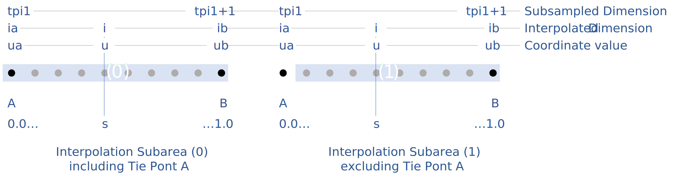
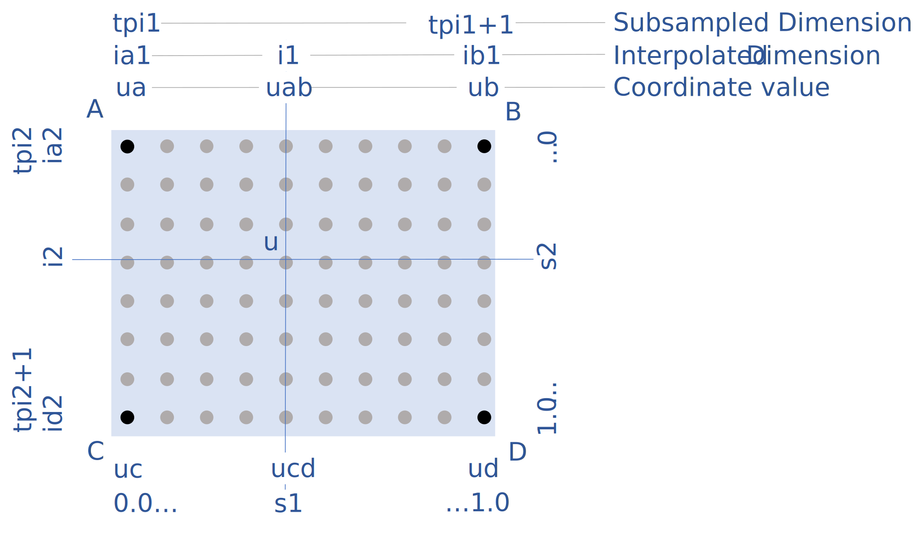
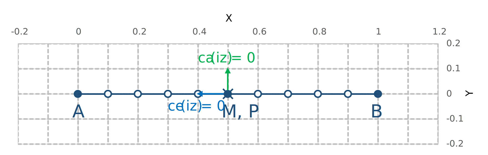
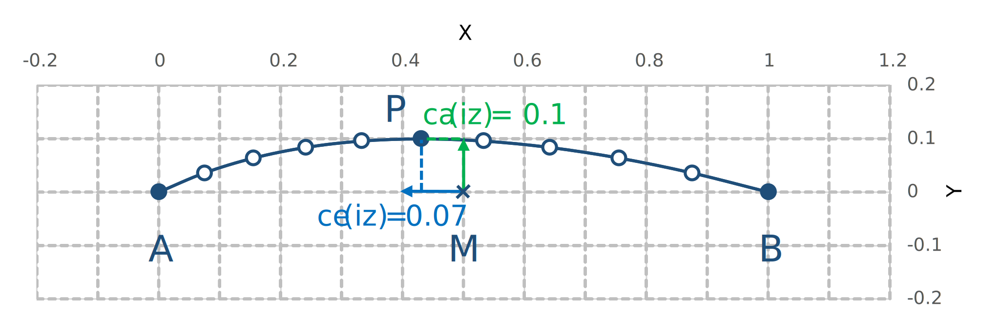
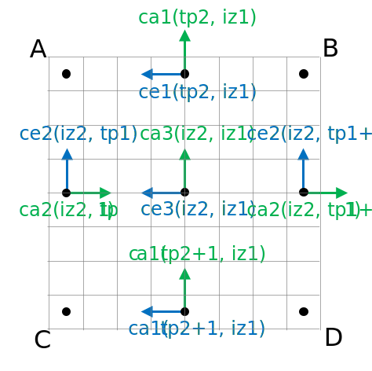

[[appendix-coordinate-subsampling, Appendix J, Coordinate Interpolation Methods]]
:doc-part: J
:figure: 0
[appendix]
== Coordinate Interpolation Methods

The general description of the compression by coordinate subsampling is given in section <<compression-by-coordinate-subsampling>>. This appendix provides details on the available methods for compression by coordinate subsampling.

The definitions and guidance given here allow an application to compress an existing data set using coordinate subsampling, while letting the creator of the compressed dataset control the accuracy of the reconstituted coordinates through the degree of subsampling, the choice of interpolation method and by setting the computational precision.

Furthermore, the definitions given here allow an application to uncompress coordinate and auxiliary coordinate variables that have been compressed using coordinate subsampling. The key element of this process is the reconstitution of the full resolution coordinates in the domain of the data by interpolation between the subsampled coordinates, the tie points, stored in the compressed dataset.

The appendix is organised in a sections on <<common-definitions-and-notation>>, <<common-conversions-and-formulas>>, <<interpolation-methods>> and finally two sections with step procedures <<coordinate-compression-steps>> and <<coordinate-uncompression-steps>>.

[[common-definitions-and-notation, Section J.1, "Common Definitions and Notation"]]
=== Common Definitions and Notation

The coordinate interpolation methods are named to indicate the number of dimensions they interpolate as well as the type of interpolation provided. For example, the interpolation method named `linear` provides linear interpolation in one dimension and the method named `bi_linear` provides linear interpolation in two dimensions. Equivalently, the interpolation method named `quadratic` provides quadratic interpolation in one dimension and the interpolation method named `bi_quadratic` provides quadratic interpolation in two dimensions.

When an interpolation method is referred to as linear or quadratic, it means that the method is linear or quadratic in the indices of the interpolated dimensions.

For convenience, an interpolation argument `s` is introduced, calculated as a function of the index in the target domain of the coordinate value to be reconstituted. In the case of one-dimensional interpolation the variable is computed as 

`s = s(ia, ib, i) = (i - ia)/(ib - ia)`

where `ia` and `ib` are the indices in the target domain of the tie points `A` and `B` and `i` is the index in the target domain of the coordinate value to be reconstituted. 

Note that the value of `s` varies from `0.0` at the tie point `A` to `1.0` at tie point `B`. For example, if `ia = 100` and `ib = 110` and the index in the target domain of the coordinate value to be reconstituted is `i = 105`, then `s = (105 - 100)/(110 - 100) = 0.5`.

In the case of two-dimensional interpolation, the interpolation arguments are similarly computed as

`s1 = s(ia1, ib1, i1) = (i1 - ia1)/(ib1 - ia1)`  +
`s2 = s(ia2, ic2, i2) = (i2 - ia2)/(ic2 - ia2)`

where `ia1` and `ib1` are the first dimension indices in the target domain of the tie points `A` and `B` respectively, `ia2` and `ic2` are the second dimension indices in the target domain of the tie points `A` and `C` respectively and the indices `i1` and `i2` are the first and second dimension indices respectively in the target domain of the coordinate value to be reconstituted. 

The target domain is segmented into smaller interpolation subareas as described in <<compression-by-coordinate-subsampling-tie-points-and-interpolation-subareas>>.

For one-dimensional interpolation, an interpolation subarea is defined by two tie points, one at each end of the interpolation subarea. However, the tie points may be inside or outside the interpolation subareas as shown in <<interpolation_subareas_1d>>. When interpolation methods are applied for a given interpolation subarea, it must be ensured that reconstituted coordinate points are only generated inside the interpolation subarea being processed, even if some of the tie point coordinates lie outside of that interpolation subarea. See also description in <<compression-by-coordinate-subsampling-tie-points-and-interpolation-subareas>>. 

[[interpolation_subareas_1d]]
[caption="Figure {doc-part}.{counter:figure}. ", reftext=Figure {doc-part}.{figure}]
[.text-center]
.One-dimensional interpolation subareas, one including and one excluding tie point A.
 

For two-dimensional interpolation, an interpolation subarea is defined by four tie points, one at each corner of a rectangular area aligned with the domain axes, see <<interpolation_subarea_2d>>.

[[interpolation_subarea_2d]]
[caption="Figure {doc-part}.{counter:figure}. ", reftext=Figure {doc-part}.{figure}]
[.text-center]
.Two-dimensional interpolation subarea.
 

For the reconstitution of the uncompressed coordinate and auxiliary coordinate variables the interpolation method can be applied independently for each interpolation subarea, making it possible to parallelize the computational process.

The following notation is used:

A variable staring with `v` denotes a vector and `v.x`, `v.y` and `v.z` refer to the three coordinates of that vector.

A variable staring with `ll` denotes a latitude-longitude coordinate pair and `ll.lat` and `ll.lon` refer to the latitude and longitude coordinates.

For one-dimensional interpolation, `i` is an index in the interpolated dimension, `tpi` is an index in the subsampled dimension and `is` is an index in the interpolation subarea dimensions.

For two-dimensional interpolation, `i1` and `i2` are indices in the interpolated dimensions, `tpi1` and `tpi2` are indices in the subsampled dimensions and `is1` and `is2` are indices in the interpolation subarea dimensions. Dimension 1 is the dimension with index values increasing from tie point A to tie point B, dimension 2 is the dimension with index values increasing from tie point A to tie point C.

Note that, for simplicity of notation, the descriptions of the interpolation methods in most places leave out the indices of tie point related variables and refer to these with `a` and `b` in the one-dimensional case and with `a`, `b`, `c` and `d` in the two-dimensional case. In the two-dimensional case, `a = tp(tpi2, tpi1)`, `b = tp(tpi2, tpi1+1)`, `c = tp(tpi2+1, tpi1)` and `d = tp(tpi2+1, tpi1+1)` would reflect the way the tie point data would be stored in the data set, see also <<interpolation_subarea_2d>>.

[[common-conversions-and-formulas, Section J.2, "Common Conversions and Formulas"]]
==== Common Conversions and Formulas

[cols="2, 8, 8"]  
|=============== 
| |Description | Formula 

| `sqrt` | Square Root | `s = sqrt(t)`

| `atan2` | Inverse Tangent of y/x | `a = atan2(y, x)`

| `fll2v` | Conversion from geocentric `(latitude, longitude)` to three-dimensional cartesian vector `(x, y, z)` | `(x, y, z) = fll2v(ll) = (cos(ll.lat)*cos(ll.lon), cos(ll.lat)*sin(ll.lon), sin(ll.lat))` +

| `fv2ll` | Conversion from three-dimensional cartesian vector `(x, y, z)` to geocentric `(latitude, longitude)`| `(lat, lon) = fv2ll(v) = (atan2(v.z, sqrt(v.x * v.x + v.y * v.y)), atan2(v.y, v.x))` +
 
| `faz2v` | Conversion from `(azimuth, zenith)` angles to three-dimensional cartesian vector `(x, y, z)` | `(x, y, z) = faz2v(az) = (sin(az.zenith) * sin(az.azimuth), sin(az.zenith) * cos(az.azimuth), cos(az.zenith))` +

| `fv2az` | Conversion from three-dimensional cartesian vector `(x, y, z)` to `(azimuth, zenith)` angles | `(azimuth, zenith) = fv2az(v) = (atan2(y, x), atan2(sqrt(x * x + y * y), z))` +

| `fplus` | Vector Sum | `(x, y, z) = fplus(va, vb) = (va.x + vb.x, va.y + vb.y, va.z + vb.z)` + 
`(x, y, z) = fplus(va, vb, vc) = (va.x + vb.x + vc.x, va.y + vb.y + vc.y, va.z + vb.z + vc.z)` 

| `fminus` | Vector Difference | `(x, y, z) = fminus(va, vb) = (va.x - vb.x, va.y - vb.y, va.z - vb.z)` + 

| `fmultiply` | Vector multiplied by Scalar | `(x, y, z) = fmultiply(r, v) = (r * v.x, r * v.y, r * v.z)` + 
 
| `fcross` | Vector Cross Product | `(x, y, z) = fcross(va, vb) = (va.y*vb.z - va.z*vb.y, va.z*vb.x - va.x*vb.z, va.x*vb.y - va.y*vb.x)` + 

| `fdot` | Vector Dot Product | `d = fdot(va, vb) = va.x*vb.x + va.y*vb.y + va.z*vb.z`

|===============  

[[interpolation-methods, Section J.3, "Interpolation Methods"]]
=== Interpolation Methods

==== Linear Interpolation

[cols="6,15"]
|===============
| Name | **`interpolation_name = "linear"`** 
| Description | General purpose one-dimensional linear interpolation method for one or more coordinates
| Interpolation Parameter terms  | None
| Coordinate Compression Calculations | None
| Coordinate Uncompression Calculations | 
 The coordinate value `u(i)` at index `i` between tie points `A` and `B` is calculated from:   +
 `u(i) = fl(ua, ub, s(i)) = ua + s*(ub-ua)`; + 
where `ua` and `ub` are the coordinate values at tie points `A` and `B` respectively.

|===============

==== Bilinear Interpolation 

[cols="6,15"]
|===============
| Name | **`interpolation_name = "bi_linear"`** 
| Description | General purpose two-dimensional linear interpolation method for one or more coordinates
| Interpolation Parameter terms | None
| Coordinate Compression Calculations | None
| Coordinate Uncompression Calculations | 
The interpolation function fl() defined for linear interpolation above is first applied twice in the interpolated dimension 2, once between tie points `A` and `C` and once between tie points `B` and `D`. It is then applied once in the interpolated dimension 1, between the two resulting coordinate points, yielding the interpolated coordinate value `u(i2, i1)`:  +  
`uac = fl(ua, uc, s(ia2, ic2, i2))`; +
`ubd = fl(ub, ud, s(ia2, ic2, i2))`; +
`u(i2, i1) = fl(uac, ubd, s(ia1, ib1, i1))`;

|===============

[[quadratic]]
==== Quadratic Interpolation

[cols="6,15"]
|===============
| Name | **`interpolation_name = "quadratic"`** 
| Description | General purpose one-dimensional quadratic interpolation method for one coordinate. 

| Interpolation Parameter terms | Optionally the term `w`, specifying a numerical variable spanning the interpolation subarea dimension.

| Coordinate Compression Calculations | 
The expression +
`w = fw(ua, ub, u(i), s(i)) = (u - (1 - s) * ua - s * ub)/(4 * (1 - s) * s)` +
enables the creator of the dataset to calculate the coefficient `w` from the coordinate values `ua` and `ub` at tie points `A` and `B` respectively, and the coordinate value `u(i)` at index `i` between the tie points `A` and `B`. If the number of points in the interpolation subarea `(ib - ia + 1)` is odd, then the data point at index `i = (ib + ia)/2` shall be selected for this calculation, otherwise the data point at index `i = (ib + ia - 1)/2` shall be selected. 
  
| Coordinate Uncompression Calculations | 
The coordinate value `u(i)` at index `i` between tie points `A` and `B` is calculated from:   +
 `u(i) = fq(ua, ub, w, s(i)) = ua + s * (ub - ua + 4 * w * (1 - s))`; + 
where `ua` and `ub` are the coordinate values at tie points `A` and `B` respectively and the coefficient `w` is available as a term in the `interpolation_parameters`, or otherwise defaults to `0.0`. +
|===============

[[quadratic_geo]]
==== Quadratic Interpolation of Geographic Coordinates Latitude and Longitude

[cols="6,15"]
|===============
| Name | **`interpolation_name = "quadratic_latitude_longitude"`** 
| Description | A one-dimensional quadratic method for interpolation of the geographic coordinates latitude and longitude, typically used for remote sensing products with geographic coordinates on the reference ellipsoid. +

Requires a pair of latitude and longitude tie point variables, as defined unambiguously in <<latitude-coordinate>> and <<longitude-coordinate>>. For each interpolation subarea, none of the tie points defining the interpolation subarea are permitted to coincide. 

By default, interpolation is performed directly in the latitude and longitude coordinates, but may be performed in three-dimensional cartesian coordinates where required for achieving the desired accuracy. This must be indicated by setting the `location_use_3d_cartesian` flag within the interpolation parameter `interpolation_subarea_flags` for each interpolation subarea where interpolation in three-dimensional cartesian coordinates is required.  

The quadratic interpolation coefficients `cea = (ce, ca)`, stored as interpolation parameters in the product, describe a point `P` between the tie points `A` and `B`, which is equivalent of an additional tie point in the sense that the method will accurately reconstitute the point `P` in the same way as it accurately reconstitutes the tie points `A` and `B`. See <<quadratic1>> and <<quadratic2>>.

Although equivalent to a tie point, the coefficients `ce` and `ca` have two advantages over tie points. Firstly, they can often be stored as a lower precision floating point number compared to the tie points, as `ce` and `ca` only describes the position of `P` relative to the midpoint `M` between the tie points `A` and `B`. Secondly, if any of `ce` and `ca` do not contribute significantly to the accuracy of the reconstituted points, it can be left out of the data set and its value will default to zero during uncompression. 

The coefficients may be represented in three different ways:

For storage in the dataset as the non-dimensional coefficients `cea = (ce, ca)`, referred to as the parametric representation. The component `ce` is the offset projected on the line from tie point `B` to tie point `A` and expressed as a fraction of the distance between `A` and `B`. The component `ca` is the offset projected on the line perpendicular to the line from tie point `B` to tie point `A` and perpendicular to the plane spanned by `va` and `vb`, the vector representations of the two tie points, and expressed as a fraction of the length of `A x B`. +

For interpolation in three-dimensional cartesian coordinates as the coefficients `cv = (cv.x, cv.y, cv.z)`, expressing the offset components along the three-dimensional cartesian axes X, Y and Z respectively.

For interpolation in geographic coordinates latitude and longitude as the coefficients `cll = (cll.lat, cll.lon)`, expressing the offset components along the longitude and latitude directions respectively.

The functions `fq()` and `fw()` referenced in the following are defined in <<quadratic>>. 
 
| Interpolation Parameter terms | Optionally, any subset of terms `ce, ca`, each specifying a numerical variable spanning the interpolation subarea dimension. +

The mandatory term `interpolation_subarea_flags`, specifying a flag variable spanning the interpolation subarea dimension and including `location_use_3d_cartesian` in the `flag_meanings` attribute.

| Coordinate Compression Calculations | 
First calculate the tie point vector representations from the tie point latitude-longitude representations +
`va = fll2v(lla);  vb = fll2v(llb);` +
Then calculate the three-dimensional cartesian representation of the interpolation coefficients from the tie points `va` and `vb` as well as the point `vp(i)` at index `i` between the tie points `A` and `B`. If the number of points in an interpolation subarea `(ib - ia + 1)` is odd, then the data point at index `i = (ib + ia)/2` shall be selected for this calculation, otherwise the data point at index `i = (ib + ia - 1)/2` shall be selected. +

The three-dimensional cartesian interpolation coefficients are found from +
`cv = fcv(va, vb, vp(i), s(i)) = (fw(va.x, vb.x, vp(i).x, s(i)), fw(va.y, vb.y, vp(i).y, s(i)), fw(va.z, vb.z, vp(i).z, s(i))).` +
Finally, for storage in the dataset, convert the coefficients to the parametric representation + 
`cea(is) = (ce(is), ca(is)) = fcv2cea(va, vb, cv) = (fdot(cv, fminus(va, vb))/gsqr, fdot(cv, fcross(va, vb))/(rsqr*gsqr));` + 
where `vr = fmultiply(0.5, fplus(va, vb))`, `rsqr = fdot(vr, vr)`, `vg = fminus(va, vb)` and `gsqr = fdot(vg, vg).` +  
The interpolation parameter term `interpolation_subarea_flags(is)` shall have the flag `location_use_3d_cartesian` set if the interpolation subarea intersects the `longitude = 180.0` or if the interpolation subarea extends into `latitude > latitude_limit` or `latitude < -latitude_limit`.  The value of `latitude_limit` is set by the data set creator and defines the high latitude areas where interpolation in three-dimensional cartesian coordinates is required for reasons of coordinate reconstitution accuracy. The `latitude_limit` is used solely for setting the flag `location_use_3d_cartesian`, and is not required in a compressed dataset.
| Coordinate Uncompression Calculations | 
First calculate the tie point vector representations from the tie point latitude-longitude representations +
`va = fll2v(lla);  vb = fll2v(llb);` +
Then calculate the three-dimensional cartesian representation of the interpolation coefficients from the parametric representation stored in the dataset using + 
`cv = fcea2cv(va, vb, cea(is)) = fplus(fmultiply(ce, fminus(va, vb)), fmultiply(ca, fcross(va, vb)), fmultiply(cr, vr));` + 
where +
`vr = fmultiply(0.5, fplus(va, vb))`; + 
`rsqr = fdot(vr, vr);` +
`cr = sqrt(1 - ce(is)*ce(is) - ca(is)*ca(is)) - sqrt(rsqr).` +
If the flag `location_use_3d_cartesian` of the interpolation parameter term `interpolation_subarea_flags(is2, is1)` is set, use the following expression to reconstitute any point `llp(i)` between the tie points `A` and `B` using interpolation in three-dimensional cartesian coordinates + 
`vp(i) = fqv(va, vb, cv, s(i)) = (fq(va.x, vb.x, cv.x, s(i)), fq(va.y, vb.y, cv.y, s(i)), fq(va.z, vb.z, cv.z, s(i)));` +
`llp(i) = fv2ll(vp(i)).` +
Otherwise, first calculate latitude-longitude representation of the interpolation coefficients + 
`cll = fcll(lla, llb, llab) = (fw(lla.lat, llb.lat, llab.lat, 0.5), fw(lla.lon, llb.lon, llab.lon, 0.5));` + 
where `llab = fv2ll(fqv(va, vb, cv, 0.5))`. +
Then use the following expression to reconstitute any point `llp(i)` between the tie points `A` and `B` using interpolation in latitude-longitude coordinates + 
`llp(i) = (llp(i).lat, llp(i).lon) = fqll(lla, llb, cll, s(i)) = (fq(lla.lat, llb.lat, cll.lat, s(i)), fq(lla.lon, llb.lon, cll.lon, s(i)))`. + 
|===============   
  
[[quadratic1]]
[caption="Figure {doc-part}.{counter:figure}. ", reftext=Figure {doc-part}.{figure}]
[.text-center]
.With the expansion coefficient ce = 0 and the alignment coefficient ca = 0, the method reconstitutes the points at regular intervals along a great circle between tie points A and B.
 

[[quadratic2]]
[caption="Figure {doc-part}.{counter:figure}. ", reftext=Figure {doc-part}.{figure}]
[.text-center]
.With the expansion coefficient ce > 0 and the alignment coefficient ca > 0, the method reconstitutes the points at intervals of expanding size (ce) along an arc with an alignment offset (ca) from the great circle between tie points A and B.
  

[[bi_quadratic_geo]]
==== Biquadratic Interpolation of Geographic Coordinates Latitude and Longitude

[cols="6,15"]
|===============
| Name | **`interpolation_name = "bi_quadratic_latitude_longitude"`** 
| Description | A two-dimensional quadratic method for interpolation of the geographic coordinates latitude and longitude, typically used for remote sensing products with geographic coordinates on the reference ellipsoid. 

Requires a pair of latitude and longitude tie point variables, as defined unambiguously in <<latitude-coordinate>> and <<longitude-coordinate>>. For each interpolation subarea, none of the tie points defining the interpolation subarea are permitted to coincide.

The functions `fcv()`, `fcv2cea()`, `fcea2cv()`, `fcll()`, `fqv()` and `fqll()` referenced in the following are defined in <<quadratic_geo>>. As for that method, interpolation is performed directly in the latitude and longitude coordinates or in three-dimensional cartesian coordinates, where required for achieving the desired accuracy. Similarly, it shares the three different representations of the quadratic interpolation coefficients, the parametric representation `cea = (ce, ca)` for storage in the dataset, `cll = (cll.lat, cll.lon)` for interpolation in geographic coordinates latitude and longitude and `cv = (cv.x, cv.y, cv.z)` for interpolation in three-dimensional cartesian coordinates. 

The parametric representation of the interpolation coefficients, stored in the interpolation parameters `ce1, ca1, ce2, ca2, ce3` and `ca3`, is equivalent to five additional tie points for the interpolation subarea as shown in <<quadratic3>>, which also shows the orientation and indices of the parameters.  

| Interpolation Parameter terms  | 

Optionally, any subset of terms `ce1, ca1`, each specifying a numerical variable spanning the subsampled dimension 2 and the interpolation subarea dimension 1; +
Optionally, any subset of terms `ce2, ca2`, each specifying a numerical variable spanning the interpolation subarea dimension 2 and the subsampled dimension 1; +
Optionally, any subset of terms `ce3, ca3`, each specifying a numerical variable spanning the interpolation subarea dimension 2 and the interpolation subarea dimension 1; + 

The mandatory term `interpolation_subarea_flags`, specifying a flag variable spanning the interpolation subarea dimension 2 and the interpolation subarea dimension 1 and including `location_use_3d_cartesian` in the `flag_meanings` attribute.

| Coordinate Compression Calculations | 
First calculate the tie point vector representations from the tie point latitude-longitude representations +
`va = fll2v(lla);  vb = fll2v(llb); vc = fll2v(llc); vd = fll2v(lld).` +
Then calculate the three-dimensional cartesian representation of the interpolation coefficients sets from the tie points as well as a point `vp(i2, i1)` between the tie points. If the number of points in the first dimension of the interpolation subarea `(ib1 - ia1 + 1)` is odd, then the data point at index i1 = `(ib1 + ia1)/2` shall be selected for this calculation, otherwise the data point at index `i1 = (ib1 + ia1 - 1)/2` shall be selected. If the number of points in the second dimension of the interpolation subarea `(ic2 - ia2 + 1)` is odd, then the data point at index `i2 = (ic2 + ica)/2` shall be selected for this calculation, otherwise the data point at index `i2 = (ic2 + ia2 - 1)/2` shall be selected. +

Using the selected `(i2, i1)`, the three-dimensional cartesian interpolation coefficients are found from + 
`s1 = s(ia1, ib1, i1);`
`s2 = s(ia2, ic2, i2);` +
`vac = fll2v(ll(i2, ia1));`
`vbd = fll2v(ll(i2, ib1));` +
`cv_ac = fcv(va, vc, vac, s2);` +
`cv_bd = fcv(vb, vd, vbd, s2);` +
`cv_ab = fcv(va, vb, fll2v(ll(ia2, i1)), s1);` +
`cv_cd = fcv(vc, vd, fll2v(ll(ic2, i1)), s1);` +
`cv_zz = fcv(vac, vbd, fll2v(ll(i2, i1)), s1);` +
`vz = fqv(vac, vbd, cv_zz, 0.5);` +
`vab = fqv(va, vb, cv_ab, 0.5);` +
`vcd = fqv(vc, vd, cv_cd, 0.5);` +
`cv_z = fcv(vab, vcd, vz, s2);` +
Finally, before storing them in the dataset's interpolation parameters, convert the coefficients to the parametric representation + 
`cea1(tpi2, is1)  = fcv2cea(va, vb, cv_ab);` + 
`cea1(tpi2+1, is1)  = fcv2cea(vc, vd, cv_cd);` + 
`cea2(is2, tpi1)  = fcv2cea(va, vc, cv_ac);` +
`cea2(is2, tpi1+1)  = fcv2cea(vb, vd, cv_bd);` + 
`cea3(is2, is1)  = fcv2cea(vab, vcd, cv_z).` +
The interpolation parameter term `interpolation_subarea_flags(is2, is1)` shall have the flag `location_use_3d_cartesian` set if the interpolation subarea intersects the `longitude = 180.0` or if the interpolation subarea extends into `latitude > latitude_limit` or `latitude < -latitude_limit`.  The value of `latitude_limit` is set by the data set creator and defines the high latitude areas where interpolation in three-dimensional cartesian coordinates is required for reasons of coordinate reconstitution accuracy. The `latitude_limit` is used solely for setting the flag `location_use_3d_cartesian`, and is not required in a compressed dataset.

| Coordinate Uncompression Calculations |
First calculate the tie point vector representations from the tie point latitude-longitude representations +
`va = fll2v(lla);  vb = fll2v(llb); vc = fll2v(llc); vd = fll2v(lld).` +
Then calculate the three-dimensional cartesian representation of the interpolation coefficient sets from the parametric representation stored in the dataset +
`cv_ac = fcea2cv(va, vc, cea2(is2, tpi1));` +
`cv_bd = fcea2cv(vb, vd, cea2(is2, tpi1 + 1));` +
`vab = fqv(va, vb, fcea2cv(va, vb, cea1(tpi2, is1)), 0.5);` +
`vcd = fqv(vc, vd, fcea2cv(vc, vd,  cea1(tpi2 + 1, is1)), 0.5);` +
`cv_z = fcea2cv(vab, vcd, cea3(is2, is1));` +
If the flag `location_use_3d_cartesian` of the interpolation parameter term `interpolation_subarea_flags` is set, use the following expression to reconstitute any point `llp(i2, i1)` between the tie points `A` and `B` using interpolation in three-dimensional cartesian coordinates + 
`llp(i2, i1) = fv2ll(fqv(vac, vbd, cv_zz, s(ia1, ib1, i1)));` +
where +
`s2 = s(ia2, ic2, i2);` +
`vac = fqv(va, vc, cv_ac, s2);` +
`vbd = fqv(vb, vd, cv_bd, s2);` +
`vz = fqv(vab, vcd, cv_z, s2);` +
`cv_zz = fcv(vac, vbd, vz, 0.5);` +
Otherwise, first calculate latitude-longitude representation of the interpolation coefficients + 
`llc_ac = fcll(lla, llc, fv2ll(fqv(va, vc, cv_ac, 0.5)));` +
`llc_bd = fcll(llb, lld, fv2ll(fqv(vb, vd, cv_bd, 0.5)));` +
`llab = fv2ll(vab);` +
`llcd = fv2ll(vcd);` +
`llc_z = fcll(llab, llcd, fv2ll(fqv(vab, vcd, cv_z, 0.5)));` +
Then use the following expression to reconstitute any point `llp(i2, i1)` in the interpolation subarea using interpolation in latitude-longitude coordinates + 
`llp(i2, i1) = fqll(llac, llbd, cl_zz, s(ia1, ib1, i1));` +
where +
`s2 = s(ia2, ic2, i2);` +
`llac = fqll(lla, llc, llc_ac, s2);` +
`llbd = fqll(llb, lld, llc_bd, s2);` +
`llz = fqll(llab, llcd, llc_z, s2);` +
`cl_zz = fcll(llac, llbd, llz);` +
|===============   

[[quadratic3]]
[caption="Figure {doc-part}.{counter:figure}. ", reftext=Figure {doc-part}.{figure}]
[.text-center]
.The parametric representation of the interpolation coefficients `cea = (ce, ca)`, stored in the interpolation parameters `ce1, ca1, ce2, ca2, ce3` and `ca3`, is equivalent to five additional tie points for the interpolation subarea. Shown with parameter orientation and indices.  
 

[[coordinate-compression-steps, Section J.4, "Coordinate Compression Steps"]]
=== Coordinate Compression Steps

|===============
| Step | Description | Link

| 1
| Identify the coordinate and auxillary coordinate variables for which tie point and interpolation variables are required.
| 

| 2
| Identify non-overlapping subsets of the coordinate variables to be interpolated by the same interpolation method. For each coordinate variable subset, create an interpolation variable and specify the selected interpolation method using the **`interpolation_name`** attribute of the interpolation variable. 
| <<compression-by-coordinate-subsampling-interpolation-variable>>

| 3
| For each coordinate variable subset, add the coordinates variable subset and the corresponding interpolation variable name to the the **`coordinate_interpolation`** attribute of the data variable. 
| <<compression-by-coordinate-subsampling-coordinate-interpolation-attribute>>

| 4
| For each coordinate variable subset, identify the set of interpolated dimensions and the set of non-interpolated dimensions.
| <<compression-by-coordinate-subsampling-dimensions>>

| 5
| For each set of the interpolated dimensions, identify the continuous areas and select the interpolation subareas and the tie points, taking into account the required coordinate reconstitution accuracy when selecting the density of tie points.
| <<compression-by-coordinate-subsampling-tie-points-and-interpolation-subareas>>

| 6
| For each of the interpolated dimensions, add the interpolated dimension, the corresponding subsampled dimension and, if required by the selected interpolation method, its corresponding interpolation subarea dimension to the **`tie_point_mapping`** attribute of the interpolation variable.
| <<compression-by-coordinate-subsampling-tie-point-mapping-attribute>> +
<<compression-by-coordinate-subsampling-tie-point-dimension-mapping>>

| 7
| For each of the interpolated dimensions, record the location of each identified tie point in a tie point index variable. For each interpolated dimension, add the tie point index variable name to the **`tie_point_mapping`** attribute of the interpolation variable.
| <<compression-by-coordinate-subsampling-tie-point-mapping-attribute>> +
<<compression-by-coordinate-subsampling-tie-point-index-mapping>>

| 8
| For each of the target coordinate and auxillary coordinate variables, create the corresponding tie point coordinate variable and copy the coordinate values from the target domain coordinate variables to the tie point variables for the target domain indices identified by the tie point index variable. Repeat this step for each combination of indices of the non-interpolated dimensions.
| <<compression-by-coordinate-subsampling-tie-point-mapping-attribute>> +
<<compression-by-coordinate-subsampling-tie-point-index-mapping>>

| 9
| For each of the target coordinate and auxillary coordinate variable having a **`bounds`** attribute, add the **`bounds_tie_points`** attribute to the tie point coordinate variable and create the bounds tie point variable. For each continuous area, copy the selected set of bounds tie points values from the target domain bounds variable to the bounds tie point variable for the target domain indices identified by the tie point index variable. Repeat this step for each combination of indices of the non-interpolated dimensions.
| <<compression-by-coordinate-subsampling-interpolation-of-cell-boundaries>>

| 10
| If required by the selected interpolation method, follow the steps defined for the method in <<interpolation-methods>> to create any required interpolation parameter variables. As relevant, create the  **`interpolation_parameters`** attribute and populate it with the interpolation parameter variables.
| <<compression-by-coordinate-subsampling-interpolation-variable>> +
<<interpolation-methods>> 

| 11
| Optionally, check the consistency of the original coordinates and the reconstructed coordinates and add a **`comments`** attribute to one or more of the tie point coordinate variables reporting key figures like maximum error, mean error, etc.
| 

|===============

[[coordinate-uncompression-steps, Section J.5, "Coordinate Uncompression Steps"]]
=== Coordinate Uncompression Steps

|===============
| Step | Description | Link

| 1
| From the **`coordinate_interpolation`** attribute of the data variable, identify the coordinate and auxillary coordinate variable subsets, for which tie point interpolation is required, and the interpolation variable corresponding to each subset.
| <<compression-by-coordinate-subsampling-coordinate-interpolation-attribute>>

| 2
| For each coordinate variable subset, identify the interpolation method from the 
**`interpolation_name`** attribute of the interpolation variable.
| <<compression-by-coordinate-subsampling-interpolation-variable>>

| 3
| For each coordinate variable subset, identify the set of interpolated dimensions and the set of non-interpolated dimensions from the **`tie_point_mapping`** attribute of the interpolation variable.
| <<compression-by-coordinate-subsampling-tie-point-mapping-attribute>> +
<<compression-by-coordinate-subsampling-tie-point-dimension-mapping>>

| 4
| From the **`tie_point_mapping`** attribute of the interpolation variable, identify for each of the interpolated dimensions the corresponding subsampled dimension and, if defined, the corresponding interpolation subarea dimension.| <<compression-by-coordinate-subsampling-tie-point-mapping-attribute>> +
<<compression-by-coordinate-subsampling-tie-point-dimension-mapping>>

| 5
| From the tie point index variables referenced in the **`tie_point_mapping`** attribute of the interpolation variable, identify the location of the tie points in the corresponding interpolated dimension.
| <<compression-by-coordinate-subsampling-tie-point-mapping-attribute>> +
<<compression-by-coordinate-subsampling-tie-point-index-mapping>>

| 6
| For each of the interpolated dimensions, identify pairs of adjacent indices in the tie point index variable with index values differing by more than one, each index pair defining the extend of an interpolation subarea in that dimension. A full interpolation subarea is defined by one such index pair per interpolated dimension, with combinations of one index from each pair defining the interpolation subarea tie points.
| <<compression-by-coordinate-subsampling-tie-points-and-interpolation-subareas>>

| 7
| As required by the selected interpolation method, identify the interpolation parameter variables from the interpolation variable attribute **`interpolation_parameters`**.
| <<compression-by-coordinate-subsampling-interpolation-parameters>>

| 8
| For each of the tie point coordinate and auxillary coordinate variables, create the corresponding target coordinate variable. For each interpolation subarea, apply the interpolation method, as described in <<interpolation-methods>>, to reconstitute the target domain coordinate values and store these in the target domain coordinate variables. Repeat this step for each combination of indices of the non-interpolated dimensions.
| <<compression-by-coordinate-subsampling-tie-point-mapping-attribute>> +
<<interpolation-methods>>  

| 9
| For each of the tie point coordinate and auxillary coordinate variables having a **`bounds_tie_points`** attribute, add the **`bounds`** attribute to the target coordinate variable and create the target domain bounds variable. For each interpolation subarea, apply the interpolation method to reconstitute the target domain bound values and store these in the target domain bound variables. Repeat this step for each combination of indices of the non-interpolated dimensions.
| <<compression-by-coordinate-subsampling-interpolation-of-cell-boundaries>>
 
| 10
| If auxiliary coordinate variables have been reconstituted, then, if not already present, add a **`coordinates`** attribute to the data variable and add to the attribute the list of the names of the reconstituted auxiliary coordinate variables.
| <<coordinate-system>>

|===============
