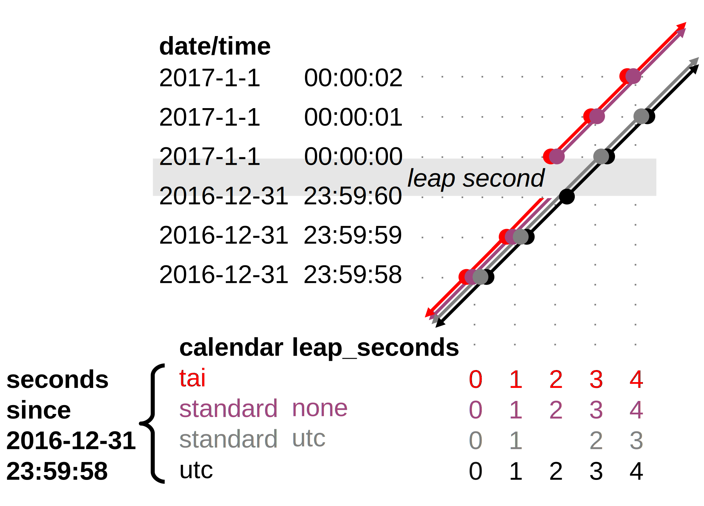

[[coordinate-types, Chapter 4, Coordinate Types]]
==  Coordinate Types
:doc-part: 4
:figure: 0

The commonest use of coordinate variables is to locate the data in space and time, but coordinates may be provided for any other continuous geophysical quantity (e.g. density, temperature, radiation wavelength, zenith angle of radiance, sea surface wave frequency) or discrete category (see <<discrete-axis>>, e.g. area type, model level number, ensemble member number) on which the data variable depends.

Four types of coordinates receive special treatment by these conventions: latitude, longitude, vertical, and time.
We continue to support the special role that the **`units`** and **`positive`** attributes play in the COARDS convention to identify coordinate type.
As an extension to COARDS, we strongly recommend that a parametric (usually dimensionless) vertical coordinate variable should be associated, via **`standard_name`** and **`formula_terms`** attributes, with its explicit definition, which provides a mapping between its values and dimensional vertical coordinate values that can be uniquely located with respect to a point on the earth's surface.

Because identification of a coordinate type by its units is complicated by requiring the use of an external package <<UDUNITS>>, we provide two optional methods that yield a direct identification.
The attribute **`axis`** may be attached to a coordinate variable and given one of the values **`X`**, **`Y`**, **`Z`** or **`T`** which stand for a longitude, latitude, vertical, or time axis respectively.
Alternatively the **`standard_name`** attribute may be used for direct identification.
But note that these optional attributes are in addition to the required COARDS metadata.

To identify generic spatial coordinates we recommend that the **`axis`** attribute be attached to these coordinates and given one of the values **`X`**, **`Y`** or **`Z`**.
The values **`X`** and **`Y`** for the axis attribute should be used to identify horizontal coordinate variables.
If both X- and Y-axis are identified, **`X-Y-up`** should define a right-handed coordinate system, i.e. rotation from the positive X direction to the positive Y direction is anticlockwise if viewed from above.
We strongly recommend that coordinate variables be used for all coordinate types whenever they are applicable.

The methods of identifying coordinate types described in this section apply both to coordinate variables and to auxiliary coordinate variables named by the **`coordinates`** attribute (see <<coordinate-system>>).

The values of a coordinate variable or auxiliary coordinate variable indicate the locations of the gridpoints.
The locations of the boundaries between cells are indicated by bounds variables (see <<cell-boundaries>>).
If bounds are not provided, an application might reasonably assume the gridpoints to be at the centers of the cells, but we do not require that in this standard.

[[latitude-coordinate, Section 4.1, "Latitude Coordinate"]]
=== Latitude Coordinate

Variables representing latitude must always explicitly include the **`units`** attribute; there is no default value.
The recommended value of the **`units`** attribute is the string **`degrees_north`**. Also accepted are **`degree_north`**, **`degree_N`**, **`degrees_N`**, **`degreeN`**, and **`degreesN`**.

[[latitude-axis-ex]]
[caption="Example 4.1. "]
.Latitude axis
====

----

float lat(lat) ;
  lat:long_name = "latitude" ;
  lat:units = "degrees_north" ;
  lat:standard_name = "latitude" ;

----

====

Application writers should note that the UDUNITS package does not recognize the directionality implied by the "north" part of the unit specification.
It only recognizes its size, i.e., 1 degree is defined to be pi/180 radians.
Hence, determination that a coordinate is a latitude type should be done via a string match between the given unit and one of the acceptable forms of **`degrees_north`**.

Optionally, the latitude type may be indicated additionally by providing the **`standard_name`** attribute with the value **`latitude`**, and/or the **`axis`** attribute with the value **`Y`**.

Coordinates of latitude with respect to a rotated pole should be given units of **`degrees`**, not **`degrees_north`** or equivalents, because applications which use the units to identify axes would have no means of distinguishing such an axis from real latitude, and might draw incorrect coastlines, for instance.

[[longitude-coordinate, Section 4.2, "Longitude Coordinate"]]
=== Longitude Coordinate

Variables representing longitude must always explicitly include the **`units`** attribute; there is no default value.
The recommended value of the **`units`** attribute is the string **`degrees_east`**. Also accepted are **`degree_east`**, **`degree_E`**, **`degrees_E`**, **`degreeE`**, and **`degreesE`**.

[[longitude-axis-ex]]
[caption="Example 4.2. "]
.Longitude axis
====

----

float lon(lon) ;
  lon:long_name = "longitude" ;
  lon:units = "degrees_east" ;
  lon:standard_name = "longitude" ;

----

====

Application writers should note that the UDUNITS package has limited recognition of the directionality implied by the "east" part of the unit specification.
It defines **`degrees_east`** to be pi/180 radians, and hence equivalent to **`degrees_north`**.
We recommend the determination that a coordinate is a longitude type should be done via a string match between the given unit and one of the acceptable forms of **`degrees_east`**.

Optionally, the longitude type may be indicated additionally by providing the **`standard_name`** attribute with the value **`longitude`**, and/or the **`axis`** attribute with the value **`X`**.

Coordinates of longitude with respect to a rotated pole should be given units of **`degrees`**, not **`degrees_east`** or equivalents, because applications which use the units to identify axes would have no means of distinguishing such an axis from real longitude, and might draw incorrect coastlines, for instance.

[[vertical-coordinate, Section 4.3, "Vertical Coordinate"]]
=== Vertical (Height or Depth) Coordinate

Variables representing dimensional height or depth axes must always explicitly include the **`units`** attribute; there is no default value.

The direction of positive (i.e., the direction in which the coordinate values are increasing), whether up or down, cannot in all cases be inferred from the units.
The direction of positive is useful for applications displaying the data.
For this reason the attribute **`positive`** as defined in the COARDS standard is required if the vertical axis units are not a valid unit of pressure (as determined by the UDUNITS package <<UDUNITS>>) -- otherwise its inclusion is optional.
The **`positive`** attribute may have the value **`up`** or **`down`** (case insensitive).
This attribute may be applied to either coordinate variables or auxiliary coordinate variables that contain vertical coordinate data.

For example, if an oceanographic netCDF file encodes the depth of the surface as 0 and the depth of 1000 meters as 1000 then the axis would use attributes as follows: 

----
axis_name:units = "meters" ; 
axis_name:positive = "down" ; 	
----

If, on the other hand, the depth of 1000 meters were represented as -1000 then the value of the **`positive`** attribute would have been **`up`**.
If the **`units`** attribute value is a valid pressure unit the default value of the **`positive`** attribute is **`down`**.

A vertical coordinate will be identifiable by:

* units of pressure; or
* the presence of the **`positive`** attribute with a value of **`up`** or **`down`** (case insensitive).

Optionally, the vertical type may be indicated additionally by providing the **`standard_name`** attribute with an appropriate value, and/or the **`axis`** attribute with the value **`Z`**. 
If both **`positive`** and **`standard_name`** are provided, it is recommended that they should be consistent. 
For instance, if a depth of 1000 metres is represented by -1000 and **`positive`** is **`up`**, it would be inconsistent to give the **`standard_name`** as **`depth`**, whose definition (vertical distance below the surface) implies positive down. 
If an application detects such an inconsistency, the user should be warned, and the **`positive`** attribute should be used to determine the sign convention.

Recommendations:  The **`positive`** attribute should be consistent with the sign convention implied by the definition of the **`standard_name`**, if both are provided.

==== Dimensional Vertical Coordinate

Variables representing dimensional vertical coordinates for or height must always explicitly include the  **`units`** attribute.
The acceptable units for a vertical (depth or height) coordinate variable must a UDUNITS <<UDUNITS>> representation of one of the following:

* units of pressure.
For vertical axes the most commonly used of these include **`bar`**, **`millibar`**, **`decibar`**, **`atmosphere (atm)`**, **`pascal (Pa)`**, and **`hPa`**.
* units of length.
For vertical axes the most commonly used of these include **`meter (metre, m)`**, and **`kilometer (km)`**.
* other units that may under certain circumstances reference vertical position such as units of density or temperature.

Plural forms are also acceptable.

[[dimensionless-vertical-coordinate, Section 4.3.2, "Dimensionless Vertical Coordinate"]]
==== Dimensionless Vertical Coordinate

The **`units`** attribute is not required for dimensionless coordinates.
For backwards compatibility with COARDS we continue to allow the **`units`** attribute to take one of the values: **`level`**, **`layer`**, or **`sigma_level`**.
These values are not recognized by the UDUNITS package, and are considered a deprecated feature in the CF standard.

[[parametric-vertical-coordinate, Section 4.3.3, "Parametric Vertical Coordinate"]]
==== Parametric Vertical Coordinate

In some cases dimensional vertical coordinates are a function of horizontal location as well as parameters which depend on vertical location, and therefore cannot be stored in the one-dimensional vertical coordinate variable, which is in most of these cases is dimensionless.
The `standard_name` of the parametric (usually dimensionless) vertical coordinate variable can be used to find the definition of the associated computed (always dimensional) vertical coordinate in <<parametric-v-coord>>.
The definition provides a mapping between the parametric vertical coordinate values and computed values that can positively and uniquely indicate the location of the data.
The `formula_terms` attribute can be used to associate terms in the definitions with variables in a netCDF file, and the `computed_standard_name` attribute can be used to supply the `standard_name` of the computed vertical coordinate values computed according to the definition.
To maintain backwards compatibility with COARDS the use of these attributes is not required, but is strongly recommended.
Some of the definitions may be supplemented with information stored in the `grid_mapping` variable about the datum used as a vertical reference (e.g. geoid, other geopotential datum or reference ellipsoid; see <<grid-mappings-and-projections>> and <<appendix-grid-mappings>>).

[[atm-sigma-coord-ex]]
[caption="Example 4.3. "]
.Atmosphere sigma coordinate
====

----
float lev(lev) ;
  lev:long_name = "sigma at layer midpoints" ;
  lev:positive = "down" ;
  lev:standard_name = "atmosphere_sigma_coordinate" ;
  lev:formula_terms = "sigma: lev ps: PS ptop: PTOP" ;
  lev:computed_standard_name = "air_pressure" ;
----

====

In this example the **`standard_name`** value **`atmosphere_sigma_coordinate`** identifies the following definition from <<parametric-v-coord>> which specifies how to compute pressure at gridpoint **`(n,k,j,i)`** where **`j`** and **`i`** are horizontal indices, **`k`** is a vertical index, and **`n`** is a time index:

----
p(n,k,j,i) = ptop + sigma(k)*(ps(n,j,i)-ptop)
----

The **`formula_terms`** attribute associates the variable **`lev`** with the term **`sigma`**, the variable **`PS`** with the term **`ps`**, and the variable **`PTOP`** with the term **`ptop`**.
Thus the pressure at gridpoint **`(n,k,j,i)`** would be calculated by 

----
p(n,k,j,i) = PTOP + lev(k)*(PS(n,j,i)-PTOP)
----

The `computed_standard_name` attribute indicates that the values in variable
`p` would have a `standard_name` of `air_pressure`.

[[time-coordinate, Section 4.4, "Time Coordinate"]]
=== Time Coordinate

A time coordinate is a number which identifies an instant along the continuous physical dimension of time, whether in reality or in a model.
The instant can equivalently be identified by its datetime, which is a set of numbers comprising year, month, day, hour, minute and second, where the second may have a fraction but the others are all integer.
The time coordinate and the datetime are interconvertible given the **`calendar`** attribute of the time coordinate variable (<<calendar>>) and its **`units`** attribute (containing the time unit of the coordinate values and the reference datetime, <<time-coordinate-units>>).

Variables containing time coordinates must always explicitly include the **`units`** attribute, formatted as described in <<time-coordinate-units>>.
There is no default value for the **`units`**.
A coordinate variable is identifiable as a time coordinate variable from its **`units`** alone.
Optionally, a time coordinate variable may be indicated additionally by providing the **`standard_name`** attribute with an appropriate value, and/or the **`axis`** attribute with the value **`T`**.

[[time-axis-ex]]
[caption="Example 4.4. "]
.Example of a time coordinate variable
====

----
double time(time) ;
  time:axis = "T"; // optional
  time:standard_name = "time" ; // optional
  time:units = "days since 1990-1-1 0:0:0" ; // mandatory
----

====

[[time-coordinate-units, Section 4.4.1, "Time Coordinate Units"]]
==== Time Coordinate Units

The **`units`** attribute of a time coordinate variable takes a string value that follows the formatting requirements of the <<UDUNITS>> package (e.g. <<time-axis-ex>>).
It must comprise a unit of measure that is physically equivalent to the SI base unit of time (i.e. the second), followed by the word **`since`** and a reference datetime.
The format of the **`units`** string implies that the time coordinate equals the length of the time interval from the instant identified by the reference datetime to the instant identified by the time coordinate.
This is exactly true in all cases except when leap seconds occur between the two intervals in the **`standard`**, **`proleptic_gregorian`**, and **`julian`** calendars.
See <<leap-seconds>>.

The acceptable units of measure for time are given by UDUNITS.
The most commonly used of these strings (and their abbreviations) are **`day`** (**`d`**), **`hour`** (**`hr`**, **`h`**), **`minute`** (**`min`**) and **`second`** (**`sec`**, **`s`**).
Plural forms are also acceptable.

UDUNITS defines a **`year`** to be exactly 365.242198781 days (the interval between 2 successive passages of the sun through vernal equinox).
__It is not a calendar year.__ UDUNITS defines a  **`month`** to be exactly **`year/12`**, which is __not a calendar month__.
The CF standard follows UDUNITS in the definition of units, but we recommend that **`year`** and **`month`** should not be used, because of the potential for mistakes and confusion.

UDUNITS defines a **`minute`** as 60 **`seconds`**, an **`hour`** as 3600 **`seconds`** and a **`day`** as 86400 **`seconds`**.
These are not calendar units.
When a leap second is inserted into UTC, the minute, hour and day affected differ by one second from their usual durations according to clock time, but the UDUNITS and CF **`minute`**, **`hour`** and **`day`** do not; they are fixed units of measure.
See also <<leap-seconds>>.

UDUNITS permits a number of alternatives to the word **`since`** in the units of time coordinates.
All the alternatives have exactly the same meaning in UDUNITS.
For compatibility with other software, CF strongly recommends that `since` should be used.

The reference datetime string (appearing after the identifier **`since`**) is required.
It may include date alone, or date and time, or date, time and time zone offset.
Its format is __y__-__m__-__d__ [__H__:__M__:__S__ [__Z__]], where [...] indicates an optional element,

* _y_ is year, _m_ month, _d_ day, _H_ hour and _M_ minute, which are all integers of one or more digits, and _y_ may be prefixed with a sign (but note that some CF calendars do not permit negative years; see <<calendar>>),

* _S_ is second, which may be integer or floating point (see <<leap-seconds>> regarding __S__>59),

* _Z_ is the time zone offset with respect to UTC.
This is an interval of time, specified in one of the formats described below.
Only numbers (digits, `+`, `-` and `:`) are allowed in _Z_, not time zone names or acronyms.

The default time zone offset is zero.
In a time zone with zero offset, time (approximately) equals mean solar time for 0 `degrees_east` of longitude.
(Although this may be exact in a model, in reality the time with zero time zone offset differs by some seconds from mean solar time; see the discussion of UTC and leap seconds in <<calendar>>.)
If both time and time zone offset are omitted the time is 00:00:00 (the beginning of the day i.e. midnight at 0 `degrees_east`).
Thus, **`units = "days since 1990-1-1"`** means the same as **`units = "days since 1990-1-1 0:0:0"`**.

The time zone offset _Z_ must be in one of the following four formats, any of which may be prefixed with a sign:

** _H_, the hour alone, of one or two digits e.g. **`-6`**, **`2`**, **`+11`**, which is sufficient for many time zones.

** __H__:__M__, where _H_ is hour and _M_ minute, each of one or two digits, e.g. **`5:30`**.

** four digits, of which the first pair are the hours and the second the minutes e.g. **`0530`**.

** three digits, of which the first is the hour (0--9) e.g. **`530`**.

For example, **`seconds since 1992-10-8 15:15:42.5 -6:00`** indicates seconds since October 8th, 1992 at 3 hours, 15 minutes and 42.5 seconds in the afternoon, in a time zone where the datetime is six hours behind the default.
Subtracting the time zone offset from a given datetime converts it to the equivalent datetime with zero time zone offset e.g. **`1989-12-31 18:00:00 -6`** identifies the same instant as **`1990-1-1 0:0:0`**.

[[calendar, Section 4.4.2, "Calendar"]]
==== Calendar

The calendar defines the set of valid datetimes and their order.
Note that the CF meaning of "calendar" refers to datetimes, not to dates alone.
Datetimes which are not permitted in a given calendar are prohibited both in the time coordinate values and in the reference datetime string in the **`units`**.
It is recommended that the calendar be specified by the **`calendar`** attribute of the time coordinate variable.
The values currently defined for **`calendar`** are listed below.

Because the calendars have different sets of valid dates, and different treatments of leap seconds (see below in this section, and <<leap-seconds>>), a given time coordinate value with given **`units`** can represent different datetimes in different calendars; conversely, a given datetime is represented by different time coordinate values in different calendars.
Moreover, in different calendars a given datetime can identify a different instant in the continuous physical dimension of time.
// Examples of these situations are shown in the table of *Appendix ???*.

The lengths of the months in the Gregorian calendar are used in all calendars except **`360_day`**, **`none`** (see <<none-calendar>>) and explicitly defined calendars (see <<explicit-calendar>>).
The calendars differ in their treatment of leap years (when there are 29 days in February instead of 28).

Leap seconds are adjustments made at irregular and unpredictable intervals in Coordinated Universal Time (link:$$https://en.wikipedia.org/wiki/Coordinated_Universal_Time$$[UTC]).
In response to slight variations in the Earth's rotation speed, positive or negative leap seconds are inserted in order to keep UTC close to mean solar time at 0 `degrees_east` i.e. the time zone with the default (zero) time zone offset in UDUNITS and CF (see <<time-coordinate-units>>).
When a single positive leap second is introduced at the end of a minute, that minute contains 61 seconds.
The net number of leap seconds added to UTC between 1958-1-1 and 2025-1-1 is 37.
The CF calendars differ in their treatment of leap seconds (see <<leap-seconds>>).

In the **`julian`** and the default **`standard`** calendar, dates in years before year 0 (i.e. before 0-1-1 0:0:0) are not allowed, and the year in the reference datetime of the units must not be negative.
In these calendars, year zero has a special use to indicate a climatology (see <<climatological-statistics>>), but this use of year zero is deprecated.
In other calendars, year 0 is the year before year 1, and negative years are allowed.

**`standard`**:: Mixed Gregorian/Julian calendar as defined by UDUNITS.
This is the default.
A deprecated alternative name for this calendar is **`gregorian`**.
The Gregorian and Julian calendars have the same lengths of their months; they differ only in respect of the rules that decide which years are leap years.
In the **`standard`** calendar, datetimes after and including 1582-10-15 0:0:0 are in the Gregorian calendar, in which a year is a leap year if either (i) it is divisible by 4 but not by 100 or (ii) it is divisible by 400.
Datetimes before (and excluding) 1582-10-5 0:0:0 are in the Julian calendar, in which any year that is divisible by 4 is a leap year.
Year 1 AD or CE in the **`standard`** calendar is also year 1 of the **`julian`** calendar.
Negative years are invalid in time coordinates and reference datetimes in the **`standard`** calendar.
In the **`standard`** calendar, 1582-10-15 0:0:0 is exactly 1 day later than 1582-10-4 0:0:0.
Therefore datetimes in the range from (and including) 1582-10-5 0:0:0 until (but excluding) 1582-10-15 0:0:0 are invalid, and must not be used as reference in **`units`**.
It is recommended that a reference datetime before the discontinuity should not be used for datetimes after the discontinuity, and vice-versa.
See also <<leap-seconds>>.

**`proleptic_gregorian`**:: A calendar with the Gregorian rules for leap years extended to dates before 1582-10-15.
All dates consistent with these rules are allowed, both before and after 1582-10-15 0:0:0.
See also <<leap-seconds>>.

**`julian`**:: Julian calendar, in which a year is a leap year if it is divisible by 4, even if it is also divisible by 100.
Year 1 AD or CE in the **`julian`** calendar is also year 1 of the **`standard`** calendar.
Negative years are invalid in time coordinates and reference datetimes in the **`julian`** calendar.
See also <<leap-seconds>>.

**`utc`**:: A Gregorian calendar __with__ leap seconds as prescribed by UTC.
Datetimes before 1958-01-01 0:0:0 are not allowed in this calendar.
Datetimes in the future are not allowed in this calendar, because it is unknown when future leap seconds will occur.
When a datetime is converted to a time coordinate value or vice-versa in this calendar, any leap seconds (positive or negative) must be counted that occurred in the interval between the datetime and the reference datetime in the **`units`**.
For any given instant, the **`utc`** datetime is behind the **`tai`** datetime, where "behind" means the same as it does when describing a timezone to the west as being behind one to the east.
The difference between the two datetimes for a given instant of time is the net number of leap seconds introduced since 1958-01-01.
The difference was zero on that instant, when both calendars began.
This means that a given datetime in the **`utc`** calendar represents an instant that is earlier than the same datetime in the **`tai`** calendar.
See also <<leap-seconds>>.

**`tai`**:: A Gregorian calendar __without__ leap seconds that is based on International Atomic Time (TAI).
Datetimes before 1958-01-01 0:0:0 are not allowed in this calendar.
For any given instant, the **`tai`** datetime is ahead of the **`utc`** datetime, where "ahead" means the same as it does when describing a timezone to the east as being ahead of one to the west.
The difference between the two datetimes for a given instant of time is the net number of leap seconds introduced since 1958-01-01.
The difference was zero on that instant, when both calendars began.
This means that a given datetime in the **`tai`** calendar represents an instant that is later than the same datetime in the **`utc`** calendar.
See also <<leap-seconds>>.

**`noleap`** or **`365_day`**:: A calendar with no leap years, i.e., all years are 365 days long, and there are no leap seconds.

**`all_leap`** or **`366_day`**:: A calendar in which every year is a leap year, i.e., all years are 366 days long, and there are no leap seconds.

**`360_day`**:: A calendar in which all years are 360 days, and divided into 30 day months, and there are no leap seconds.

**`none`**:: To be used when there is no annual cycle. See <<none-calendar>>.

Any other value may be given to the **`calendar`** attribute to describe an explicitly defined calendar. See <<explicit-calendar>>.

[[leap-seconds, Section 4.4.3, "Leap Seconds"]]
==== Leap Seconds

This section describes how to deal properly with leap seconds.
Most people ignore the existence of leap seconds, including many data producers and the CF standard before version 1.12.
As a result, the time coordinates of two real-world observational datasets could disagree by some number of seconds if one has taken leap seconds into account and the other has not.
Practically speaking, this means that if you are working with real-world data, and if it's important for your time coordinates to be accurate to the second, you need to care about leap seconds.
Otherwise, you need only to be aware that the difference between two time coordinates might not exactly equal the duration of the time interval between the two instants, but could be inaccurate by a number of seconds, if leap seconds are involved.
Relatedly, two instants with the same time of day on different days, which would always be separated by a multiple of 86400 seconds if there were no leap seconds, will have a few more seconds between them if leap seconds intervene.

Each calendar defines a set of valid combinations of the six numbers year-month-day-hour-minute-second.
We refer to this set as the calendar's "set of datetimes".
Fractions of seconds are allowed in all calendars in addition to the integer number of seconds.
In this section, we use the word _timeline_ to mean "continuous physical dimension of time".
The valid datetimes identify discrete instants along the timeline, in that sense.

You need to know the set of datetimes defined by the calendar in order to compute time coordinate values from datetimes and vice-versa.
Ignoring fractional seconds in datetimes, a time coordinate value expressed in seconds equals the number of valid (integer-second) datetimes _after_ (not including) the reference datetime in the **`units`** _up to_ (and including) the datetime that the time coordinate represents.
For instance, in **`units`** of **`seconds since 2024-9-14 11:12:00`**, the time coordinate for the datetime **`2024-9-14 11:12:03`** is **`3`**, because there are three datetimes (**`2024-9-14 11:12:01`**, **`2024-9-14 11:12:02`**, **`2024-9-14 11:12:03`**) following **`2024-9-14 11:12:00`** up to and including **`2024-9-14 11:12:03`**.
The coordinate for **`2024-9-14 11:11:58`** is **`-2`**, because there are two valid datetimes (**`2024-9-14 11:11:59`**, **`2024-9-14 11:11:58`**) from **`2024-9-14 11:12:00`** to (and including) **`2024-9-14 11:11:58`**, and the count is negative because it goes backwards.
The signed difference between the fractional seconds of the datetime and the reference is added to the time coordinate after counting the seconds.
This paragraph may appear to be excessively elaborate in describing a usually obvious procedure, but it is necessary to be very careful about it when there are leap seconds.

The **`utc`** calendar is the _only_ calendar which includes leap seconds in its set of datetimes.
In all other calendars, datetimes within leap seconds are not valid.
Therefore reference datetimes in the **`units`** attribute must not contain seconds equal to or greater than 60 unless the **`calendar`** is **`utc`**.

The **`standard`**, **`proleptic_gregorian`**, and **`julian`** calendars each have two variants.
In one variant the timeline does not include leap seconds.
In the other variant, the timeline includes leap seconds, even though they are _not_ included in the valid set of datetimes.
To resolve the ambiguity between the variants of these calendars, the **`units_metadata`** attribute should be defined as well as the **`calendar`** attribute, as described later in this section.

For **`standard`**, **`proleptic_gregorian`**, and **`julian`** calendars, there are the following cases:

1. **The calendar is being used for a timeline in which leap seconds do not exist.**
   This is the case for a model simulation that defines every day as having a constant length of 86400 seconds.

2. **The calendar is being used for a timeline in which leap seconds exist, and they are correctly accounted for in the datetimes represented by the time coordinates.**
   This could be the case for observations from a platform with equipment which records UTC datetimes and has prior knowledge of when new leap seconds are to be introduced, so that it is able to apply a new leap second at the appropriate time.
   It could equally be the case for model whose timesteps include leap seconds.

3. **The calendar is being used for a timeline in which leap seconds exist, but some or all leap seconds might not have not been correctly accounted for in the datetimes.**
   This could be the case for observations from a platform whose time recording equipment has a delay in applying a new leap second.

4. **It may be unknown whether leap seconds exist in the timeline.**

Except in the **`utc`** calendar, when a time coordinate value is calculated from a datetime, or the reverse, it is assumed that the coordinate value increases by exactly 60 seconds from the start of any minute (identified by year, month, day, hour, minute, all being integers) to the start of the next minute, because leap seconds are not valid datetimes.
In other words, leap seconds (positive or negative) are never counted in the **`standard`**, **`proleptic_gregorian`**, and **`julian`** calendars.
When these calendars are being be used for timelines _with_ leap seconds (i.e. cases 2 and 3 and perhaps case 4), the assumption of 60-second minutes has the following consequences:

* It is impossible to identify any instant during a leap second (i.e. between the end of the 60th second of the last minute of one hour and the start of the first second of the next hour) by a time coordinate e.g. **`2016-12-31 23:59:60.5`** cannot be represented by a time coordinate value.
  
* A datetime in the excluded range must not be used as a reference datetime e.g. **`seconds since 2016-12-31 23:59:60`** is not a permitted value for **`units`**.

* The coordinate value does not count any leap seconds which occurred between the reference datetime and the datetime represented by the coordinate.
  For instance, 60 **`seconds after 23:59:00`** always means 00:00:00 on the next day, even if there is a leap second at 23:59:60, which makes the actual interval 61 seconds between 23:59:00 and 00:00:00 on the next day.

Because of the last point, the difference between two coordinate values with the same **`units`** string does not exactly equal the length of the interval between instants they represent if there were any leap seconds between them.
This discrepancy can happen in cases 2, 3 and 4 of the **`standard`**, **`proleptic_gregorian`**, and **`julian`** calendars.
By contrast, in case 1 of those calendars (i.e. a timeline without leap seconds), and in all other calendars, the difference between two time coordinate values  with the same **`units`** string is always equal to the length of time between the instants they represent.
Furthermore, an inaccuracy results from converting a time coordinate to a datetime if the interval includes leap seconds which were _not_ known when the time coordinate was calculated (possible in case 3 or 4).
It is important to be aware of these disadvantages of the **`standard`**, **`proleptic_gregorian`** and **`julian`** calendars when used with timelines including leap seconds.

If it is essential for leap seconds to be counted in time coordinates, so that they exactly equal time intervals, you must use the **`utc`** calendar.
For many applications of the **`standard`**, **`proleptic_gregorian`**, and **`julian`** calendars, these inaccuracies are too small to matter, but there are some applications where it is necessary to know about them.
Therefore it is recommended that for the **`standard`**, **`proleptic_gregorian`**, and **`julian`** calendars the appropriate treatment of leap seconds should be indicated by giving the time coordinate variable a **`units_metadata`** attribute containing a **`leap_seconds`** keyword with one of the permitted values **`none`**, **`utc**` or **`unknown`**.
**`none`** means that leap seconds do not exist in the timeline (i.e. case 1), **`utc`** means that leap seconds exist in the timeline and the time coordinates correctly represent the datetimes (i.e. case 2), and **`unknown`** means that the data-writer did not know or did not record whether the leap seconds exist in the timeline, nor how they are treated if they did exist (i.e. cases 3 and 4).
If the **`units_metadata`** attribute is not present, or does not contain the `leap_seconds` keyword, the data-reader should assume **`leap_seconds: unknown`**.
A variable's **`units_metadata`** attribute may only contain the **`leap_seconds`** keyword if the variable's calendar is one of **`standard`** , **`proleptic_gregorian`**, or **`julian`**.

[[units-metadata-leap-seconds-ex]]
[caption="Example 4.5. "]
.Use of **`units_metadata`** and **`calendar`** to define the treatment of leap seconds
====

----
variables:
  float time_tai ;
    time_tai:standard_name = "time" ;
    time_tai:long_name = "Satellite data" ;
    time_tai:calendar = "tai" ;
    time_tai:units = "seconds since 2016-12-31 23:59:58" ;
  float time_stdnone ;
    time_stdnone:standard_name = "time" ;
    time_stdnone:long_name = "Model data with no leap seconds" ;
    time_stdnone:calendar = "standard" ;
    time_stdnone:units = "seconds since 2016-12-31 23:59:58" ;
    time_stdnone:units_metadata = "leap_seconds: none" ;
  float time_stdutc ;
    time_stdutc:standard_name = "time" ;
    time_stdutc:long_name = "Model data with leap seconds or obs data with accurate UTC" ;
    time_stdutc:calendar = "standard" ;
    time_stdutc:units = "seconds since 2016-12-31 23:59:58" ;
    time_stdutc:units_metadata = "leap_seconds: utc" ;
  float time_utc ;
    time_utc:standard_name = "time" ;
    time_utc:long_name = "Time signal from UK National Physical Laboratory" ;
    time_utc:calendar = "utc" ;
    time_utc:units = "seconds since 2016-12-31 23:59:58" ;
  float time_unknown ;
    time_unknown:standard_name = "time" ;
    time_unknown:long_name = "Obs data with unreliable information on leap seconds" ;
    time_unknown:calendar = "standard" ;
    time_unknown:units = "seconds since 2016-12-31 23:59:58" ;
    time_unknown:units_metadata = "leap_seconds: unknown" ;
data: // time coordinate variable and the datetime it represents
  time_tai = 2; // 2017-1-1 0:0:0 because no leap seconds in the timeline
  time_stdnone = 2; // 2017-1-1 0:0:0 because no leap seconds in the timeline
  time_stdutc = 2; // 2017-1-1 0:0:0 because the leap second is not counted
  time_utc = 2; // leap second 2016-12-31 23:59:60
  time_unknown = 2; // unknown whether 2016-12-31 23:59:60 or 2017-1-1 0:0:0
----

This example shows five scalar time coordinate variables.
Although they all have the value 2 and the same **`units`** attribute, they do not all refer to the same datetime, as shown in the comments on their data values, because they have different treatments of the leap second that was added to the UTC calendar at the end of 2016.
The first four of them correspond to the instants marked 2 **`seconds since 2016-12-31 23:59:58`** in <<leap-second-timelines>>.

The value of **`2`** seconds for **`time_stdnone`**, **`time_utc`** and **`time_tai`** can be correctly interpreted as the length of the interval from the reference datetime 2016-12-31 23:59:58 to the datetime indicated in the comment.
In both **`time_stdnone`** and **`time_stdutc`**, the time coordinate represents 2017-1-1 0:0:0, because 2016-12-31 23:59:60 is not permitted in the **`standard`** calendar, hence only two valid datetimes with integer seconds are counted (2016-12-31 23:59:59 and 2017-1-1 0:0:0).
However, the _timeline_ for **`time_stdutc`** _does_ include the leap second, so the time interval from the reference datetime 2016-12-31 23:59:58 to 2017-1-1 0:0:0 is actually three seconds, not two as indicated by the time coordinate value.
This is an example of the **`standard`** calendar not counting a leap second in the coordinate value, with the consequence that the difference between time coordinates does not exactly equal the duration of the interval.
An application may choose either to ignore this inaccuracy or to correct for it when calculating the length of intervals which include the leap second.
In the case of **`time_unknown`**, we cannot convert the time coordinate to a datetime with certainty, because we do not know whether 2017-1-1 0:0:0 is two or three seconds after 2016-12-31 23:59:58.
====

[[leap-second-timelines]]
[caption="Figure {doc-part}.{counter:figure}. ", reftext=Figure {doc-part}.{figure}]
.Illustration of the equivalence between datetimes and time coordinate values with **`units="seconds since 2016-12-31 23:59:58"`** for various choices of the **`calendar`** attribute and **`leap_seconds`** keyword.
====

This illustration shows that a given time coordinate value (the numbers in columns at the bottom right) can represent different datetimes in different calendars.
However, the illustration cannot show another important point to keep in mind, that a given datetime may identify different instants in different calendars.

The diagonal lines depict the timelines of the calendars.
Along each line, a filled circle marks the instant on the timeline that begins each second in the set of datetimes allowed by the calendar.
There is no meaning in the slight left-right displacement of the circles at each second, which is done only so they can all be seen; they are supposed to be exactly coincident.
As explained in the text of this section, the time coordinate in seconds is the count of valid datetimes (= the number of circles) that occur along the timeline _after_ the reference datetime **`2016-12-31 23:59:58`** (which is the first circle on the line in every case, hence with a count of zero as shown in the column below its group of circles), up to and including the datetime represented.
The instants marked 2 **`seconds since 2016-12-31 23:59:58`** are the ones represented by the first four time coordinate variables of Example 4.5.

A leap second was added to the UTC calendar at the end of 2016.
The duration of the leap second is shown by the shading.
The **`utc`** calendar is the only one in which datetimes in the leap second are valid; hence the black circle is the only marker of **`2016-12-31 23:59:60`**.
The grey timeline of the **`utc`** variant of the **`standard`** calendar includes the the leap second as well, but datetimes in the leap second are not valid in that calendar, so there is no grey circle for it.
The leap second does not appear in the timelines of the **`tai`** calendar and the *`none`* variant of the *`standard`* calendar.
Their timelines (red and purple) skip over the leap second, and they have no circle for it.
For those timelines, please imagine the digram having the shaded rectangle cut out, and the cut edges joined, making the red and purple lines continuous, passing smoothly from 2016-12-31 23:59:00 to 2017-1-1 00:00:00 as for all the other seconds.
====

[[none-calendar, Section 4.4.4, "Time Coordinates with no Annual Cycle"]]
==== Time Coordinates with no Annual Cycle

The **`calendar`** attribute may be set to **`none`** in climate experiments that simulate a fixed time of year.
The time of year is indicated by the date in the reference time of the **`units`** attribute.
The time coordinates that might apply in a perpetual July experiment are given in the following example.

[[perpetual-time-axis-ex]]
[caption="Example 4.6. "]
.Perpetual time axis
====

----
variables:
  double time(time) ;
    time:long_name = "time" ;
    time:units = "days since 1-7-15 0:0:0" ;
    time:calendar = "none" ;
data:
  time = 0., 1., 2., ...;
----

====

Here, all days simulate the conditions of 15th July, so it does not make sense to give them different dates.
The time coordinates are interpreted as 0, 1, 2, etc. days since the start of the experiment.

[[explicit-calendar, Section 4.4.5, "Explicitly Defined Calendar"]]
==== Explicitly Defined Calendar

If none of the calendars defined in <<calendar>> applies (e.g., calendars appropriate to a different paleoclimate era), a calendar can be explicitly defined, in terms of permissible year-month-day combinations.
To do this, the lengths of each month are explicitly defined with the **`month_lengths`** attribute of the time axis:

**`month_lengths`**:: A vector of size 12, specifying the number of days in the months from January to December (in a non-leap year).

If leap years are included, then two other attributes of the time axis must also be defined:

**`leap_year`**:: An example of a leap year.
It is assumed that all years that differ from this year by a multiple of four are also leap years.
If this attribute is absent, it is assumed there are no leap years.

**`leap_month`**:: A value in the range 1-12, specifying which month is lengthened by a day in leap years (1=January).
If this attribute is not present, February (2) is assumed.
This attribute is ignored if **`leap_year`** is not specified.

When an explicitly defined calendar is being used, the calendar may be described by giving a value not defined in <<calendar>> to the **`calendar`** attribute; alternatively, the attribute may be omitted.

[[paleoclimate-time-axis-ex]]
[caption="Example 4.7. "]
.Paleoclimate time axis
====

----
double time(time) ;
  time:long_name = "time" ;
  time:units = "days since 1-1-1 0:0:0" ;
  time:calendar = "126 kyr B.P." ;
  time:month_lengths = 34, 31, 32, 30, 29, 27, 28, 28, 28, 32, 32, 34 ;
----

====

[[discrete-axis, Section 4.5, "Discrete Axis"]]
=== Discrete Axis

The spatiotemporal coordinates described in sections 4.1-4.4 are continuous variables, and other geophysical quantities may likewise serve as continuous coordinate variables, for instance density, temperature or radiation wavelength.
By contrast, for some purposes there is a need for an axis of a data variable which indicates either an ordered list or an unordered collection, and does not correspond to any continuous coordinate variable.
Consequently such an axis may be called {ldquo}discrete{rdquo}.
A discrete axis has a dimension but might not have a coordinate variable.
Instead, there might be one or more auxiliary coordinate variables with this dimension (see preamble to section 5).
Following sections define various applications of discrete axes, for instance section 6.1.1 {ldquo}Geographical regions{rdquo}, section 7.3.3 {ldquo}Statistics applying to portions of cells{rdquo}, section 9.3 {ldquo}Representation of collections of features in data variables{rdquo}.
