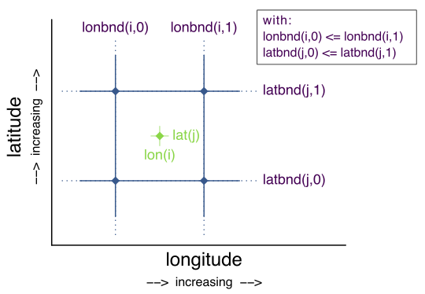
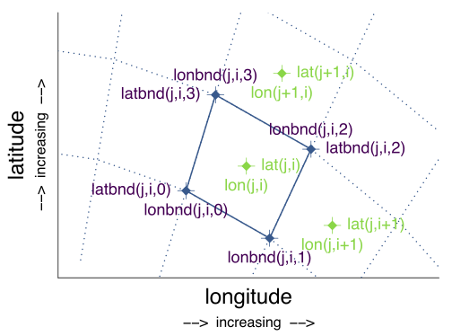

==  Data Representative of Cells 
:doc-part: 7
:figure: 0

When gridded data does not represent the point values of a field but instead represents some characteristic of the field within cells of non-zero size, a complete description of the variable should include metadata that describes the domain or extent of each cell, and the characteristic of the field that the cell values represent.
The commonest cases have one-dimensional cells along spatiotemporal axes, for instance cells along a time axis for consecutive months whose values contain monthly means.
The conventions presented in <<cell-boundaries>>, <<cell-measures>> and <<cell-methods>> describe cases in which each grid point is associated with a cell consisting of a single one-dimensional interval, a single two-dimensional polygonal area, or in general a single _n_-dimensional volume in the _n_-dimensional space described by its coordinate variables.
As an alternative to _n_-dimensional volumes with bounds, we provide <<geometries>>, for the case of geospatial applications in which each data value pertains to a single real-world feature, such as a river, watershed or country, represented by one or more points, lines or polygons.

It is possible for a single data value to be the result of an operation whose domain is a disjoint set of intervals or areas.
This is true for many types of climatological statistic; for example, the mean January temperature for the years 1971-2000 is computed from the 30 individual months of January, which are a set of discontiguous time-intervals.
Climatological statistics are of such importance that we provide special methods for describing their associated computational domains in <<climatological-statistics>>.
Climatological statistics and other kinds of statistic, e.g. zonal means, may be used as a reference with respect to which anomalies are computed.
<<anomalies>> gives conventions for relating an anomaly data variable to its reference statistic, and for describing how the latter was computed.

[[cell-boundaries, Section 7.1, "Cell Boundaries"]]
=== Cell Boundaries

To delimit the cells, the **`bounds`** attribute may be added to the appropriate coordinate variable(s).
The value of **`bounds`** is the name of the variable that contains the vertices of the cell boundaries.
We refer to this type of variable as a "boundary variable."
If cell boundaries are provided, it is recommended that each gridpoint should lie somewhere within or upon the boundaries of its own cell.

If cell boundaries are not provided (using the **`bounds`** attribute), an application can make no assumption about the location or extent of the cells.
Without a boundary variable, it is unknown whether adjacent cells are contiguous, separated by a gap, or overlapping.
If the data value pertains to the gridpoint alone, rather than to an interval, area or _n_-dimensional volume of non-zero size, it is recommended to indicate this with a **`cell_methods`** entry of **`point`** (<<cell-methods>>).
In that case, the cell is irrelevant to the data and the bounds are arbitrary.
Nonetheless, the bounds may still be included, for instance because the grid is shared by other data variables that pertain to cells, or to provide some indication of cells to generic applications for graphical purposes.
A cell of truly zero size can be indicated by giving it coincident boundaries.

A boundary variable must have one more dimension than its associated coordinate or auxiliary coordinate variable.
We refer to the additional dimension as the "vertex dimension".
The vertex dimension must be the most rapidly varying dimension (the last dimension in CDL order), and its size is the maximum number of cell vertices.

The vertex dimension must be of size two if the associated variable is one-dimensional (<<bounds-one-d>>), and of size greater than two if the associated variable has more than one dimension (<<bounds-lat-lon>>).
For grids constructed from cells that do not all have the same number of sides (e.g., a grid with some rectangular cells and some triangular cells), the vertex dimension must be at least as large as the maximum number of cell vertices (<<bounds-two-d>>).
For cells with fewer vertices than the size of vertex dimension, the unneeded elements must appear as the last elements in the vertex dimension and must be assigned the **`_FillValue`**.
CF can currently describe boundaries for cells which have one or two spatial dimensions, but does not provide conventions to describe the boundaries of cells with three spatial dimensions.
Such conventions are under consideration in <<UGRID>>.

A boundary variable inherits the values of some attributes from its parent coordinate variable.
If a coordinate variable has any of the attributes marked "BI" (for "inherit") in the "Use" column of <<attribute-appendix>>, they are assumed to apply to its bounds variable as well.
It is recommended that BI attributes not be included on a boundary variable.
If a BI attribute is included, it must also be present in the parent variable, and it must exactly match the parent attribute's data type and value.
A bounds variable may have any of the attributes marked "BO" for ("own") in the "Use" column of <<attribute-appendix>>.
These attributes take precedence over any corresponding attributes of the parent variable.
In these cases, the parent variable's attribute does not apply to the bounds variable, regardless of whether the latter has its own attribute.

[[bounds-one-d, Section 7.1.2, "Bounds for one-dimensional coordinate variables"]]
==== Bounds for one-dimensional coordinate variables

For a one-dimensional coordinate variable of size _N_, the boundary variable is an array of shape (_N_,2).
The bounds for cell _i_ are the elements _B_(_i_,0) and _B_(_i_,1) of the boundary variable _B_.
Element _C_(_i_) of the coordinate variable _C_ should lie between the boundaries of the cell, or upon one of them i.e. _B_(_i_,0) - _C_(_i_) and _B_(_i_,1) - _C_(_i_) should not have the same sign, though one of them could be zero (<>).

If _N_ &gt; 1, the bounds of each cell must be ordered consistently with the coordinates i.e. _B_(_i_,0) &lt; _B_(_i_,1) for all _i_ if _C_(_i_) &lt; _C_(_i_ + 1), and _B_(_i_,0) &gt; _B_(_i_,1) for all _i_ if _C_(_i_) &gt; _C_(_i_ + 1).

If any two cells are contiguous, their shared boundary must be represented identically in each instance where it occurs in the boundary variable.
This means that in the common case of _N_ non-overlapping contiguous intervals, _N_ - 1 of the boundaries are duplicated, because they are shared by adjacent intervals.
This representation has the advantage that it is general enough to handle, without modification, non-contiguous intervals, as well as intervals on an axis using the unlimited dimension.

[[cells-on-a-time-axis-ex]]
[caption="Example 7.1. "]
.Cells on a time axis
====
----
dimensions:
  time = 60;
  nv = 2;    // number of vertices
variables:
  float time(time);
    time:standard_name = "time";
    time:units = "days since 2024-11-8 09:00:00Z";
    time:bounds = "time_bnds";
  float time_bnds(time,nv);
----
The boundary variable **`time_bnds`** associates a time point **`i`** with the time interval whose boundaries are **`time_bnds(i,0)`** and **`time_bnds(i,1)`**.
The instant **`time(i)`** should be contained within the interval, or be at one end of it.
For instance, with **`i=2`** we might have **`time(2)=10.5`**, **`time_bnds(2,0)=10.0`**, **`time_bnds(2,1)=11.0`**.
If the times are increasing e.g. **`time(3)`** = **`11.5`** &gt; **`10.5`** = **`time(2)`**, which implies **`time(i+1)`** &gt; **`time(i)`** for all **`i`** because coordinates must be monotonic, the bounds must also be increasing for all **`i`**, e.g. **`timebnd(2,1)`** &gt;= **`timebnd(2,0)`**.
If adjacent intervals are contiguous, the shared endpoint must be identical.
For example, if the interval **`i=3`** begins at **`11.0`** days, when interval **`i=2`** ends, the values in **`timebnd(3,0)`** and **`timebnd(2,1)`** must be _exactly_ the same.
====

[[img-bnd_1d_coords]]
[caption="Figure {doc-part}.{counter:figure}. ", reftext=Figure {doc-part}.{figure}]
[.text-center]
.Order of **`lonbnd(i,0)`** and **`lonbnd(i,1)`** as well as of **`latbnd(i,0)`** and **`latbnd(i,1)`** in the case of one-dimensional horizontal coordinate axes. Tuples **`(lon(i),lat(j))`** represent grid cell centers. The four grid cell vertices are given by **`(lonbnd(i,0),latbnd(j,0))`**, **`(lonbnd(i,1),latbnd(j,0))`**, **`(lonbnd(i,1),latbnd(j,1))`** and **`(lonbnd(i,0),latbnd(j,1))`**.

[[bounds-lat-lon, Section 7.1.1, "Bounds for horizontal coordinate variables with four-sided cells"]]
==== Bounds for horizontal coordinate variables with four-sided cells

There is a common case of a rectangular horizontal grid, with four-sided cells, whose two axes are not latitude and longitude (e.g. it uses a map projection from <<grid-mappings-and-projections>> or a curvilinear grid, such as the tripolar ocean grid).
In that case, two-dimensional auxiliary coordinate variables in latitude **`lat(n,m)`** and longitude **`lon(n,m)`** may be provided as well.
Since the sides of the cells do not generally have constant latitude or longitude, all four vertices must be specified individually.
Therefore the boundary variables for the two-dimensional auxiliary coordinate variables are given in the form **`latbnd(n,m,4)`** and **`lonbnd(n,m,4)`**, where the trailing index runs over the four vertices of the cells.

[[cells-in-a-non-rectangular-grid-ex]]
[caption="Example 7.2. "]
.Cells in a non-latitude-longitude horizontal grid
====
----
dimensions:
  imax = 128;
  jmax = 64;
  nv = 4;
variables:
  float lat(jmax,imax);
    lat:long_name = "latitude";
    lat:units = "degrees_north";
    lat:bounds = "lat_bnds";
  float lon(jmax,imax);
    lon:long_name = "longitude";
    lon:units = "degrees_east";
    lon:bounds = "lon_bnds";
  float lat_bnds(jmax,imax,nv);
  float lon_bnds(jmax,imax,nv);
----
The boundary variables **`lat_bnds`** and **`lon_bnds`** associate a gridpoint **`(j,i)`** with the cell determined by the vertices **`(lat_bnds(j,i,n),lon_bnds(j,i,n))`**, **`n=0,..,3`**.
The gridpoint location, **`(lat(j,i),lon(j,i))`**, should be contained within this region.
====

The vertices must be ordered such that, when visiting the vertices in order, the four-sided perimeter of the cell is traversed anticlockwise on the lon-lat surface as seen from above.
If i-j-upward is a right-handed coordinate system (like lon-lat-upward), this can be arranged as in <>.
Let us call the side of cell **`(j,i)`** facing cell **`(j,i-1)`** the "**`i-1`**" side, the side facing cell **`(j,i+1)`** the "**`i+1`**" side, and similarly for "**`j-1`**" and "**`j+1`**".
Then we can refer to the vertex formed by sides **`i-1`** and **`j-1`** as **`(j-1,i-1)`**.
With this notation, the four vertices are indexed as follows: **`0=(j-1,i-1)`**, **`1=(j-1,i+1)`**, **`2=(j+1,i+1)`**, **`3=(j+1,i-1)`**.

[[img-bnd_2d_coords]]
[caption="Figure {doc-part}.{counter:figure}. ", reftext=Figure {doc-part}.{figure}]
[.text-center]
.Order of **`lonbnd(j,i,0)`** to **`lonbnd(j,i,3)`** and of **`latbnd(j,i,0)`** and **`latbnd(j,i,3)`** in the case of two-dimensional horizontal coordinate axes. Tuples **`(lon(j,i),lat(j,i))`** represent grid cell centers and tuples **`(lonbnd(j,i,n),latbnd(j,i,n))`** represent the grid cell vertices.

The bounds can be used to decide whether cells are contiguous via the following relationships.
In these equations the variable **`bnd`** is used generically to represent either the latitude or longitude boundary variable. 

----
For 0 < j < n and 0 < i < m,
	If cells (j,i) and (j,i+1) are contiguous, then
		bnd(j,i,1)=bnd(j,i+1,0) 
		bnd(j,i,2)=bnd(j,i+1,3)
	If cells (j,i) and (j+1,i) are contiguous, then	
		bnd(j,i,3)=bnd(j+1,i,0) and bnd(j,i,2)=bnd(j+1,i,1)
----

[[bounds-two-d, Section 7.1.3, "Bounds for coordinate variables with p-sided cells in two spatial dimensions"]]
==== Bounds for coordinate variables with p-sided cells in two spatial dimensions

In the general case of a grid composed of polygonal cells in two spatial dimensions with **`p`** sides and vertices, or a mixture of polygons where **`p`** is the maximum number of sides and vertices, the grid could have one, two or more dimensions, depending on how it is organised logically (e.g. as a 1-D list or a 2-D rectangular arrangement).
The boundary variables for the auxiliary coordinate variables are dimensioned **`(...,m,p)`**, giving coordinates for the **`p`** vertices of each cell, where **`(...,m)`** are the dimensions of the auxiliary coordinate variables.
 If the cells are in a horizontal plane, the vertices must be traversed anticlockwise in the lon-lat plane as viewed from above.
The starting vertex is not specified.

The case of a 2-D horizontal coordinate variables with 4-sided cells (<<bounds-lat-lon>>) is a particular case, with **`p=4`** for boundary variables dimensioned **`(n,m,p)**`, where **`n`** and **`m`** are horizontal dimensions.
See also <<geometries>> for conventions describing horizontal cells with more complicated geometry and topology.

[[boundaries-and-formula-terms, Section 7.1.4, "Boundaries and Formula Terms"]]
==== Boundaries and Formula Terms

If a parametric coordinate variable with a **`formula_terms`** attribute (section 4.3.2) also has a **`bounds`** attribute, its boundary variable must have a **`formula_terms`** attribute too.
In this case the same terms would appear in both (as specified in Appendix D), since the transformation from the parametric coordinate values to physical space is realized through the same formula.
For any term that depends on the vertical dimension, however, the variable names appearing in the formula terms would differ from those found in the **`formula_terms`** attribute of the coordinate variable itself because the boundary variables for formula terms are two-dimensional while the formula terms themselves are one-dimensional.

Whenever a **`formula_terms`** attribute is attached to a boundary variable, the formula terms may additionally be identified using a second method: variables appearing in the vertical coordinates' **`formula_terms`** may be declared to be coordinate, scalar coordinate or auxiliary coordinate variables, and those coordinates may have **`bounds`** attributes that identify their boundary variables.
In that case, the **`bounds`** attribute of a formula terms variable must be consistent with the **`formula_terms`** attribute of the boundary variable.
Software digesting legacy datasets (constructed prior to version 1.7 of this standard) may have to rely in some cases on the first method of identifying the formula term variables and in other cases, on the second.
Starting from version 1.7, however, the first method will be sufficient.

[[specifying-formula_terms-ex]]
[caption="Example 7.3. "]
.Specifying **`formula_terms`** when a parametric coordinate variable has bounds.
====
----
float eta(eta) ;
   eta:long_name = "eta at full levels" ;
   eta:positive = "down" ;
   eta:standard_name = " atmosphere_hybrid_sigma_pressure_coordinate" ;
   eta:formula_terms = "a: A b: B ps: PS p0: P0" ;
   eta:bounds="eta_bnds" ;
 float eta_bnds(eta, 2) ;
   eta_bnds:formula_terms = "a: A_bnds b: B_bnds ps: PS p0: P0" ; // This attribute is mandatory
 float A(eta) ;
   A:long_name = "'a' coefficient for vertical coordinate at full levels" ;
   A:units = "Pa" ;
   A:bounds = "A_bnds" ; // This attribute is included for the optional second method
 float B(eta) ;
   B:long_name = "'b' coefficient for vertical coordinate at full levels" ;
   B:units = "1" ;
   B:bounds = "B_bnds" ; // This attribute is included for the optional second method
 float A_bnds(eta, 2) ;
 float B_bnds(eta, 2) ;
 float PS(lat, lon) ;
   PS:units = "Pa" ;
 float P0 ;
   P0:units = "Pa" ;
 float temp(eta, lat, lon) ;
   temp:standard_name = "air_temperature" ;
   temp:units = "K";
   temp:coordinates = "A B" ; // This attribute is included for the optional second method
----
====

[[cell-measures, Section 7.2, "Cell Measures"]]
=== Cell Measures

For some calculations, information is needed about the size, shape or location of the cells that cannot be deduced from the coordinates and bounds without special knowledge that a generic application cannot be expected to have.
For instance, in computing the mean of several cell values, it is often appropriate to "weight" the values by area.
When computing an area-mean each grid cell value is multiplied by the grid-cell area before summing, and then the sum is divided by the sum of the grid-cell areas.
Area weights may also be needed to map data from one grid to another in such a way as to preserve the area mean of the field.
The preservation of area-mean values while regridding may be essential, for example, when calculating surface heat fluxes in an atmospheric model with a grid that differs from the ocean model grid to which it is coupled.

In many cases the areas can be calculated from the cell bounds, but there are exceptions.
Consider, for example, a spherical geodesic grid composed of contiguous, roughly hexagonal cells.
The vertices of the cells can be stored in the variable identified by the **`bounds`** attribute, but the cell perimeter is not uniquely defined by its vertices (because the vertices could, for example, be connected by straight lines, or, on a sphere, by lines following a great circle, or, in general, in some other way).
Thus, given the cell vertices alone, it is generally impossible to calculate the area of a grid cell.
This is why it may be necessary to store the grid-cell areas in addition to the cell vertices.

In other cases, the grid cell-volume might be needed and might not be easily calculated from the coordinate information.
In ocean models, for example, it is not uncommon to find "partial" grid cells at the bottom of the ocean.
In this case, rather than (or in addition to) indicating grid cell area, it may be necessary to indicate volume.

To indicate extra information about the spatial properties of a variable's grid cells, a **`cell_measures`** attribute may be defined for a variable.
This is a string attribute comprising a list of blank-separated pairs of words of the form "**`measure: name`**".
For the moment, "**`area`**" and "**`volume`**" are the only defined measures, but others may be supported in future.
The "name" is the name of the variable containing the measure values, which we refer to as a "measure variable".
The dimensions of a measure variable must be the same as or a subset of the dimensions of the variable to which it is related, but their order is not restricted, and with one exception:
If a cell measure variable of a data variable that has been compressed by gathering (<<compression-by-gathering>>) does not span the compressed dimension, then its dimensions may be any subset of the data variable's uncompressed dimensions, i.e. any of the dimensions of the data variable except the compressed dimension, and any of the dimensions listed by the **`compress`** attribute of the compressed coordinate variable.
In the case of area, for example, the field itself might be a function of longitude, latitude, and time, but the variable containing the area values would only include longitude and latitude dimensions (and the dimension order could be reversed, although this is not recommended).
The variable must have a **`units`** attribute and may have other attributes such as a **`standard_name`**.

For rectangular longitude-latitude grids, the area of grid cells can be calculated from the bounds: the area of a cell is proportional to the product of the difference in the longitude bounds of the cell and the difference between the sine of each latitude bound of the cell.
In this case supplying grid-cell areas via the **`cell_measures`** attribute is unnecessary because it may be assumed that applications can perform this calculation, using their own value for the radius of the Earth.

A variable referenced by **`cell_measures`** is not required to be present in the file containing the data variable.
If the **`cell_measures`** variable is located in another file (an "external file"), rather than in the file where it is referenced, it must be listed in the **`external_variables`** attribute of the referencing file (Section 2.6.3).

[[cell-areas-for-a-spherical-geodesic-grid]]
[caption="Example 7.4. "]
.Cell areas for a spherical geodesic grid
====
----
dimensions:
  cell = 2562 ;  // number of grid cells
  time = 12 ;
  nv = 6 ;       // maximum number of cell vertices
variables:
  float PS(time,cell) ;
    PS:units = "Pa" ;
    PS:coordinates = "lon lat" ;
    PS:cell_measures = "area: cell_area" ;
  float lon(cell) ;
    lon:long_name = "longitude" ;
    lon:units = "degrees_east" ;
    lon:bounds="lon_vertices" ;
  float lat(cell) ;
    lat:long_name = "latitude" ;
    lat:units = "degrees_north" ;
    lat:bounds="lat_vertices" ;
  float time(time) ;
    time:long_name = "time" ;
    time:units = "days since 1979-01-01 0:0:0" ;
  float cell_area(cell) ;
    cell_area:long_name = "area of grid cell" ;
    cell_area:standard_name="cell_area";
    cell_area:units = "m2"
  float lon_vertices(cell,nv) ;
  float lat_vertices(cell,nv) ;
----
====

[[cell-methods, Section 7.3, "Cell Methods"]]
=== Cell Methods

To describe the characteristic of a field that is represented by cell values, we define the **`cell_methods`** attribute of the variable.
This is a string attribute comprising a list of blank-separated words of the form "__name: method__".
Each "__name: method__" pair indicates that for an axis identified by __name__, the cell values representing the field have been determined or derived by the specified __method__.
For example, if data values have been generated by computing time means, then this could be indicated with **`cell_methods="t: mean"`**, assuming here that the name of the time dimension variable is "t".

In the specification of this attribute, __name__ can be a dimension of the variable, a scalar coordinate variable, a valid standard name, or the word "**`area`**".
(See <<cell-methods-no-coordinates>> concerning the use of standard names in cell_methods.)
The values of __method__ should be selected from the list in <<appendix-cell-methods>>, which includes `point`, `sum`, `mean`, among others.
Case is not significant in the method name.
Some methods (e.g., `variance`) imply a change of units of the variable, as is indicated in <<appendix-cell-methods>>.

It must be remembered that the method applies only to the axis designated in **`cell_methods`** by __name__, and different methods may apply to other axes.
If, for instance, a precipitation value in a longitude-latitude cell is given the method **`maximum`** for these axes, it means that it is the maximum within these spatial cells, and does not imply that it is also the maximum in time.
Furthermore, it should be noted that if any __method__ other than "**`point`**" is specified for a given axis, then **`bounds`** should also be provided for that axis (except for the relatively rare exceptions described in <<cell-methods-no-coordinates>>).

The default interpretation for variables that do not have the **`cell_methods`** attribute specified depends on whether the quantity is extensive (which depends on the size of the cell) or intensive (which does not).
Suppose, for example, the quantities "accumulated precipitation" and "precipitation rate" each have a time axis.
A variable representing accumulated precipitation is extensive in time because it depends on the length of the time interval over which it is accumulated.
For correct interpretation, it therefore requires a time interval to be completely specified via a boundary variable (i.e., via a **`bounds`** attribute for the time axis).
In this case the default interpretation is that the cell method is a sum over the specified time interval.
This can be (optionally) indicated explicitly by setting the cell method to **`sum`**.
A precipitation rate on the other hand is intensive in time and could equally well represent either an instantaneous value or a mean value over the time interval specified by the cell.
In this case the default interpretation for the quantity would be "instantaneous" (which, optionally, can be indicated explicitly by setting the cell method to **`point`**).
More often, however, cell values for intensive quantities are means, and this should be indicated explicitly by setting the cell method to **`mean`** and specifying the cell bounds.

Because the default interpretation for an intensive quantity differs from that of an extensive quantity and because this distinction may not be understood by some users of the data, it is recommended that every data variable include for each of its dimensions and each of its scalar coordinate variables the **`cell_methods`** information of interest (unless this information would not be meaningful).
It is especially recommended that **`cell_methods`** be explicitly specified for each spatio-temporal dimension and each spatio-temporal scalar coordinate variable.

[[methods-applied-to-a-timeseries-ex]]
[caption="Example 7.5. "]
.Methods applied to a timeseries
====
Consider 12-hourly timeseries of pressure, temperature and precipitation from a number of stations, where pressure is measured instantaneously, maximum temperature for the preceding 12 hours is recorded, and precipitation is accumulated in a rain gauge.
For a period of 48 hours from 6 a.m. on 19 April 1998, the data is structured as follows: 

----
dimensions:
  time = UNLIMITED; // (5 currently)
  station = 10;
  nv = 2;
variables:
  float pressure(time,station);
    pressure:long_name = "pressure";
    pressure:units = "kPa";
    pressure:cell_methods = "time: point";
  float maxtemp(time,station);
    maxtemp:long_name = "temperature";
    maxtemp:units = "K";
    maxtemp:cell_methods = "time: maximum";
  float ppn(time,station);
    ppn:long_name = "depth of water-equivalent precipitation";
    ppn:units = "mm";
    ppn:cell_methods = "time: sum";
  double time(time);
    time:long_name = "time";
    time:units = "h since 1998-4-19 6:0:0 Z";
    time:bounds = "time_bnds";
  double time_bnds(time,nv);
data:
  time = 0., 12., 24., 36., 48.;
  time_bnds = -12.,0., 0.,12., 12.,24., 24.,36., 36.,48.;
----
Note that in this example the time axis values coincide with the end of each interval.
It is sometimes desirable, however, to use the midpoint of intervals as coordinate values for variables that are representative of an interval.
An application may simply obtain the midpoint values by making use of the boundary data in `time_bnds`.
====

[[statistics-more-than-one-axis]]
==== Statistics for more than one axis

If more than one cell method is to be indicated, they should be arranged in the order they were applied.
The left-most operation is assumed to have been applied first.
Suppose, for example, that within each grid cell a quantity varies in both longitude and time and that these dimensions are named "lon" and "time", respectively.
Then values representing the time-average of the zonal maximum are labeled **`cell_methods="lon: maximum time: mean"`** (i.e. find the largest value at each instant of time over all longitudes, then average these maxima over time); values of the zonal maximum of time-averages are labeled **`cell_methods="time: mean lon: maximum"`**.
If the methods could have been applied in any order without affecting the outcome, they may be put in any order in the **`cell_methods`** attribute.

If a data value is representative of variation over a combination of axes, a single method should be prefixed by the names of all the dimensions involved (listed in any order, since in this case the order must be immaterial).
Dimensions should be grouped in this way only if there is an essential difference from treating the dimensions individually.
For instance, the standard deviation of topographic height within a longitude-latitude gridbox could   have **`cell_methods="lat: lon: standard_deviation"`**.
(Note also, that in accordance with the recommendation of the following paragraph, this could be equivalently and preferably indicated by **`cell_methods="area: standard_deviation"`**.)
This is not the same as **`cell_methods="lon: standard_deviation lat: standard_deviation"`**, which would mean finding the standard deviation along each parallel of latitude within the zonal extent of the gridbox, and then the standard deviation of these values over latitude.

To indicate variation over horizontal area, it is recommended that instead of specifying the combination of horizontal dimensions, the special string "**`area`**" be used.
The common case of an area-mean can thus be indicated by **`cell_methods="area: mean"`** (rather than, for example, "**`lon: lat: mean`**").
The horizontal coordinate variables to which "**`area`**" refers are in this case not explicitly indicated in **`cell_methods`** but can be identified, if necessary, from attributes attached to the coordinate variables, scalar coordinate variables, or auxiliary coordinate variables, as described in <<coordinate-types>>.

[[recording-spacing-original-data]]
==== Recording the spacing of the original data and other information

To indicate more precisely how the cell method was applied, extra information may be included in parentheses **`( )`** at the end of the word list describing the method, after the operation and any **`where`**, **`over`** and **`within`** phrases.
This information includes standardized and non-standardized parts.
Currently the only standardized information is to provide the typical interval between the original data values to which the method was applied, in the situation where the present data values are statistically representative of original data values which had a finer spacing.
The syntax is (**`interval`**: __value unit__), where __value__ is a numerical value and __unit__ is a string that can be recognized by UNIDATA's UDUNITS package <<UDUNITS>>.
The __unit__ will usually be dimensionally equivalent to the unit of the corresponding dimension, but this is not required (which allows, for example, the interval for a standard deviation calculated from points evenly spaced in distance along a parallel to be reported in units of length even if the zonal coordinate of the cells is given in degrees).
Recording the original interval is particularly important for standard deviations.
For example, the standard deviation of daily values could be indicated by **`cell_methods="time: standard_deviation (interval: 1 day)"`** and of annual values by **`cell_methods="time: standard_deviation (interval: 1 year)"`**.

If the cell method applies to a combination of axes, they may have a common original interval e.g. **`cell_methods="lat: lon: standard_deviation (interval: 10 km)"`**.
Alternatively, they may have separate intervals, which are matched to the names of axes by position e.g. **`cell_methods="lat: lon: standard_deviation (interval: 0.1 degree_N interval: 0.2 degree_E)"`**, in which 0.1 degree applies to latitude and 0.2 degree to longitude.

If there is both standardized and non-standardized information, the non-standardized follows the standardized information and the keyword **`comment:`**.
If there is no standardized information, the keyword **`comment:`** should be omitted.
For instance, an area-weighted mean over latitude could be indicated as **`lat: mean (area-weighted)`** or **`lat: mean (interval: 1 degree_north comment: area-weighted)`**.

A dimension of size one may be the result of "collapsing" an axis by some statistical operation, for instance by calculating a variance from time series data.
We strongly recommend that dimensions of size one be retained (or scalar coordinate variables be defined) to enable documentation of the method (through the **`cell_methods`** attribute) and its domain (through the **`bounds`** attribute).

[[surface-air-temperature-variance-ex]]
[caption="Example 7.6. "]
.Surface air temperature variance
====
The variance of the diurnal cycle on 1 January 1990 has been calculated from hourly instantaneous surface air temperature measurements.
The time dimension of size one has been retained.
----
dimensions:
  lat=90;
  lon=180;
  time=1;
  nv=2;
variables:
  float TS_var(time,lat,lon);
    TS_var:long_name="surface air temperature variance"
    TS_var:units="K2";
    TS_var:cell_methods="time: variance (interval: 1 hr comment: sampled instantaneously)";
  float time(time);
    time:units="days since 1990-01-01 00:00:00 Z";
    time:bounds="time_bnds";
  float time_bnds(time,nv);
data:
  time=.5;
  time_bnds=0.,1.;
----
Notice that a parenthesized comment in the `cell_methods` attribute provides the nature of the samples used to calculate the variance.
====

[[statistics-applying-portions]]
==== Statistics applying to portions of cells

By default, the statistical method indicated by **`cell_methods`** is assumed to have been evaluated over the entire horizontal area of the cell.
Sometimes, however, it is useful to limit consideration to only a portion of a cell (e.g. a mean over the sea-ice area).
Cell portions are referred to by means of standardised **`area_type`** strings, maintained in the link:$$https://cfconventions.org/Data/area-type-table/current/build/area-type-table.html$$[area-type table], using one of two conventions.

The first convention is a method that can be used for the common case of a single area-type.
In this case, the **`cell_methods`** attribute may include a string of the form "__name: method__  **`where`**  __type__".
Here __name__ could, for example, be **`area`** and __type__ may be any of the standardised **`area_type`** strings.
As an example, if the method were **`mean`** and the **`area_type`** were **`sea_ice`**, then the data would represent a mean over only the sea ice portion of the grid cell.
If the data writer expects __type__ to be interpreted as one of the standard **`area_type`** strings, then none of the variables in the netCDF file should be given a name identical to that of the string (because the second convention, described in the next paragraph, takes precedence).

The second convention is the more general.
In this case, the **`cell_methods`** entry is of the form "__name: method__  **`where`**  __typevar__".
Here __typevar__ is a string-valued auxiliary coordinate variable or string-valued scalar coordinate variable (see <<labels>>) with a **`standard_name`** of **`area_type`**.
The variable __typevar__ contains the name(s) of the selected portion(s) of the grid cell to which the __method__ is applied.
These name(s) must be a subset of the standardised **`area_type`** strings.
This convention can accommodate cases in which a method is applied to more than one area type and the result is stored in a single data variable (with a dimension which ranges across the various area types).
It provides a convenient way to store output from land surface models, for example, since they deal with many area types within each surface gridbox (e.g., **`vegetation`**, **`bare_ground`**, **`snow`**, etc.).

[[mean-surface-temperature-sensible-heat-flux]]
[caption="Example 7.7. "]
.Mean surface temperature over land and sensible heat flux averaged separately over land and sea.
====
----
dimensions:
  lat=73;
  lon=96;
  maxlen=20;
  ls=2;
variables:
  float surface_temperature(lat,lon);
    surface_temperature:cell_methods="area: mean where land";
  float surface_upward_sensible_heat_flux(ls,lat,lon);
    surface_upward_sensible_heat_flux:coordinates="land_sea";
    surface_upward_sensible_heat_flux:cell_methods="area: mean where land_sea";
  char land_sea(ls,maxlen);
    land_sea:standard_name="area_type";
data:
  land_sea="land","sea";
----
If the _method_ is `mean`, various ways of calculating the mean can be distinguished in the `cell_methods` attribute with a string of the form "mean where  _type1_ [over _type2_]".
Here, _type1_ can be any of the possibilities allowed for _typevar_ or _type_ (as specified in the two paragraphs preceding above Example).
The same options apply to _type2_, except it is not allowed to be the name of an auxiliary coordinate variable with a dimension greater than one (ignoring the possible dimension accommodating the maximum string length).
A `cell_methods` attribute with a string of the form "mean where _type1_ over _type2_" indicates the mean is calculated by summing over the _type1_ portion of the cell and dividing by the area of the _type2_ portion.
In particular, a `cell_methods` string of the form "mean where all_area_types over _type2_" indicates the mean is calculated by summing over all types of area within the cell and dividing by the area of the _type2_ portion.
(Note that `all_area_types` is one of the valid strings permitted for a variable with the `standard_name` `area_type`.)
If "over _type2_" is omitted, the mean is calculated by summing over the _type1_ portion of the cell and dividing by the area of this portion.
====

[[thickness-over-sea-area-ex]]
[caption="Example 7.8. "]
.Thickness of sea-ice and snow on sea-ice averaged over sea area.
====
----
variables:
  float sea_ice_thickness(lat,lon);
    sea_ice_thickness:cell_methods="area: mean where sea_ice over sea";
    sea_ice_thickness:standard_name="sea_ice_thickness";
    sea_ice_thickness:units="m";
  float snow_thickness(lat,lon);
    snow_thickness:cell_methods="area: mean where sea_ice over sea";
   snow_thickness:standard_name="lwe_thickness_of_surface_snow_amount";
    snow_thickness:units="m";
----
In the case of sea-ice thickness, the phrase "`where sea_ice`" could be replaced by "`where all_area_types`" without changing the meaning since the integral of sea-ice thickness over all area types is obviously the same as the integral over the sea-ice area only.
In the case of snow thickness, "`where sea_ice`" differs from "`where all_area_types`" because "`where sea_ice`" excludes snow on land from the average.
====

[[cell-methods-no-coordinates, Section 7.3.4, "Cell methods when there are no coordinates"]]
==== Cell methods when there are no coordinates

To provide an indication that a particular cell method is relevant to the data without having to provide a precise description of the corresponding cell, the "__name__" that appears in a "__name__: __method__" pair may be an appropriate **`standard_name`** (which identifies the dimension) or the string, "__area__" (rather than the name of a scalar coordinate variable or a dimension with a coordinate variable).
This convention cannot be used, however, if the name of a dimension or scalar coordinate variable is identical to __name__.
There are two situations where this convention is useful.

First, it allows one to provide some indication of the method when the cell coordinate range cannot be precisely defined.
For example, a climatological mean might be based on any data that exists, and, in general, the data might not be available over the same time periods everywhere.
In this case, the time range would not be well defined (because it would vary, depending on location), and it could not be precisely specified through a time dimension's bounds.
Nevertheless, useful information can be conveyed by a **`cell_methods`** entry of "**`time: mean`**" (where **`time`**, it should be noted, is a valid **`standard_name`**).
(As required by this convention, it is assumed here that for the data referred to by this **`cell_methods`** attribute, "time" is not a dimension or coordinate variable.)

Second, for a few special dimensions, this convention allows one to indicate (without explicitly defining the coordinates) that the method applies to the domain covering the entire permitted range of those dimensions.
This is allowed only for longitude, latitude, and area (indicating a combination of horizontal coordinates).
For longitude, the domain is indicated according to this provision by the string "longitude" (rather than the name of a longitude coordinate variable), and this implies that the method applies to all possible longitudes (i.e., from 0E to 360E).
For latitude, the string "latitude" is used and implies the method applies to all possible latitudes (i.e., from 90S to 90N).
For area, the string "area" is used and implies the method applies to the whole world.

In the second case if, in addition, the data variable has a dimension with a corresponding labeled axis that specifies a geographic region (<<geographic-regions>>), the implied range of longitude and latitude is the valid range for each specified region, or in the case of **`area`** the domain is the geographic region.
For example, there could be a **`cell_methods`** entry of "**`longitude: mean`**", where **`longitude`** is __not__ the name of a dimension or coordinate variable (but is one of the special cases given above).
That would indicate a mean over all longitudes.
Note, however, that if in addition the data variable had a scalar coordinate variable with a **`standard_name`** of **`region`** and a value of **`atlantic_ocean`**, it would indicate a mean over longitudes that lie within the Atlantic Ocean, not all longitudes.

We recommend that whenever possible, cell bounds should be supplied by giving the variable a dimension of size one and attaching bounds to the associated coordinate variable.

[[climatological-statistics, Section 7.4, "Climatological Statistics"]]
=== Climatological Statistics

Climatological statistics may be derived from corresponding portions of the annual cycle in a set of years, e.g., the average January temperatures in the climatology of 1961-1990, where the values are derived by averaging the 30 Januarys from the separate years.
Portions of the climatological cycle are specified by references to dates within the calendar year.
However, a calendar year is not a well-defined unit of time, because it differs between leap years and other years, and among calendars.
Nonetheless for practical purposes we wish to compare statistics for months or seasons from different calendars, and to make climatologies from a mixture of leap years and other years.
Hence we provide special conventions for indicating dates within the climatological year.
Climatological statistics may also be derived from corresponding portions of a range of days, for instance the average temperature for each hour of the average day in April 1997.
In addition the two concepts may be used at once, for instance to indicate not April 1997, but the average April of the five years 1995-1999.

Climatological variables have a climatological time axis.
Like an ordinary time axis, a climatological time axis may have a dimension of unity (for example, a variable containing the January average temperatures for 1961-1990), but often it will have several elements (for example, a climatological time axis with a dimension of 12 for the climatological average temperatures in each month for 1961-1990, a dimension of 3 for the January mean temperatures for the three decades 1961-1970, 1971-1980, 1981-1990, or a dimension of 24 for the hours of an average day).
Intervals of climatological time are conceptually different from ordinary time intervals; a given interval of climatological time represents a set of subintervals which are not necessarily contiguous.
To indicate this difference, a climatological time coordinate variable does not have a **`bounds`** attribute, instead it has a **`climatology`** attribute which names the climatological boundary variable.
The climatological boundary variable must have dimensions (n,2), n being the dimension of the climatological time axis.
The rules and recommendations for attributes of the climatological boundary variable are the same as those for boundary variables in general, as described in <<cell-boundaries>>.
Using the units and calendar of the time coordinate variable, element (i,0) of the climatology boundary variable specifies the beginning of the first subinterval and element (i,1) the end of the last subinterval used to evaluate the climatological statistics with index i in the time dimension.
The time coordinates should be values that are representative of the climatological time intervals, such that an application which does not recognise climatological time will nonetheless be able to make a reasonable interpretation.

For compatibility with the COARDS standard, a climatological time coordinate in the default **`standard`** and **`julian`** calendars may be indicated by setting the datetime reference string in the time coordinate's **`units`** attribute to midnight at 0 `degrees_east` on 1 January in year 0 (i.e., **`since 0-1-1`**).
This convention is deprecated because it does not provide any information about the intervals used to compute the climatology, and there may be inconsistencies among software packages in the interpretation of the time coordinates with a reference time of year 0.
Use of year 0 for this purpose is impossible in all other calendars, because year 0 is a valid year.

A climatological axis may use different statistical methods to represent variation among years, within years and within days.
For example, the average January temperature in a climatology is obtained by averaging both within years and over years.
This is different from the average January-maximum temperature and the maximum January-average temperature.
For the former, we first calculate the maximum temperature in each January, then average these maxima; for the latter, we first calculate the average temperature in each January, then find the largest one.
As usual, the statistical operations are recorded in the **`cell_methods`** attribute, which may have two or three entries for the climatological time dimension.

Valid values of the **`cell_methods`** attribute must be in one of the forms from the following list.
The intervals over which various statistical methods are applied are determined by decomposing the date and time specifications of the climatological time bounds of a cell, as recorded in the variable named by the **`climatology`** attribute.
(The date and time specifications must be calculated from the time coordinates expressed in units of "time interval since reference date and time".)
In the descriptions that follow we use the abbreviations __y__, __m__, __d__, __H__, __M__, and __S__ for year, month, day, hour, minute, and second respectively.
The suffix __0__ indicates the earlier bound and __1__ the latter.

time: method1 **`within years`**   time: method2 **`over years`**:: __method1__ is applied to the time intervals (mdHMS0-mdHMS1) within individual years and __method2__ is applied over the range of years (y0-y1).

time: method1 **`within days`**   time: method2 **`over days`**:: __method1__ is applied to the time intervals (HMS0-HMS1) within individual days and __method2__ is applied over the days in the interval (ymd0-ymd1).

time: method1 **`within days`**   time: method2 **`over days`**   time: method3 **`over years`**:: __method1__ is applied to the time intervals (HMS0-HMS1) within individual days and __method2__ is applied over the days in the interval (md0-md1), and __method3__ is applied over the range of years (y0-y1).

The methods which can be specified are those listed in <<appendix-cell-methods>> and each entry in the **`cell_methods`** attribute may also, as usual, contain non-standardised information in parentheses after the method.
For instance, a mean over ENSO years might be indicated by "**`time: mean over years (ENSO years)`**".

When considering intervals within years, if the earlier climatological time bound is later in the year than the later climatological time bound, it implies that the time intervals for the individual years run from each year across January 1 into the next year e.g. DJF intervals run from December 1 0:00 to March 1 0:00.
Analogous situations arise for daily intervals running across midnight from one day to the next.

When considering intervals within days, if the earlier time of day is equal to the later time of day, then the method is applied to a full 24 hour day.

__We have tried to make the examples in this section easier to understand by translating all time coordinate values to date and time formats.
This is not currently valid CDL syntax.__

[[climatological-seasons-ex]]
[caption="Example 7.9. "]
.Climatological seasons
====
This example shows the metadata for the average seasonal-minimum temperature for the four standard climatological seasons MAM JJA SON DJF, made from data for March 1960 to February 1991.
----
dimensions:
  time=4;
  nv=2;
variables:
  float temperature(time,lat,lon);
    temperature:long_name="surface air temperature";
    temperature:cell_methods="time: minimum within years time: mean over years";
    temperature:units="K";
  double time(time);
    time:climatology="climatology_bounds";
    time:units="days since 1960-1-1";
  double climatology_bounds(time,nv);
data:  // time coordinates translated to datetime format
  time="1960-4-16", "1960-7-16", "1960-10-16", "1961-1-16" ;
  climatology_bounds="1960-3-1",  "1990-6-1",
                     "1960-6-1",  "1990-9-1",
                     "1960-9-1",  "1990-12-1",
                     "1960-12-1", "1991-3-1" ;
----
====
[[decadal-averages-for-january-ex]]
[caption="Example 7.10. "]
.Decadal averages for January
====
Average January precipitation totals are given for each of the decades 1961-1970, 1971-1980, 1981-1990.
----
dimensions:
  time=3;
  nv=2;
variables:
  float precipitation(time,lat,lon);
    precipitation:long_name="precipitation amount";
    precipitation:cell_methods="time: sum within years time: mean over years";
    precipitation:units="kg m-2";
  double time(time);
    time:climatology="climatology_bounds";
    time:units="days since 1901-1-1";
  double climatology_bounds(time,nv);
data:  // time coordinates translated to datetime format
  time="1965-1-15", "1975-1-15", "1985-1-15" ;
  climatology_bounds="1961-1-1", "1970-2-1",
                     "1971-1-1", "1980-2-1",
                     "1981-1-1", "1990-2-1" ;
----
====

[[temperature-each-hour-of-average-day-ex]] 
[caption="Example 7.11. "]
.Temperature for each hour of the average day
====
Hourly average temperatures are given for April 1997.
----
dimensions:
  time=24;
  nv=2;
variables:
  float temperature(time,lat,lon);
    temperature:long_name="surface air temperature";
    temperature:cell_methods="time: mean within days time: mean over days";
    temperature:units="K";
  double time(time);
    time:climatology="climatology_bounds";
    time:units="hours since 1997-4-1";
  double climatology_bounds(time,nv);
data:  // time coordinates translated to datetime format
  time="1997-4-1 0:30", "1997-4-1 1:30", ... "1997-4-1 23:30" ;
  climatology_bounds="1997-4-1 0:00",  "1997-4-30 1:00",
                     "1997-4-1 1:00",  "1997-4-30 2:00",
                      ...
                      "1997-4-1 23:00", "1997-5-1 0:00" ;
----
====

[[extreme-statistics-and-spell-lengths-ex]]
[caption="Example 7.12. "]
.Extreme statistics and spell-lengths
====
Number of frost days during NH winter 2007-2008, and maximum length of spells of consecutive frost days.
A "frost day" is defined as one during which the minimum temperature falls below freezing point (0 degC).
This is described as a climatological statistic, in which the minimum temperature is first calculated within each day, and then the number of days or spell lengths meeting the specified condition are evaluated.
In this operation, the standard name is also changed; the original data are `air_temperature`.
----
variables:
  float n1(lat,lon);
    n1:standard_name="number_of_days_with_air_temperature_below_threshold";
    n1:coordinates="threshold time";
    n1:cell_methods="time: minimum within days time: sum over days";
  float n2(lat,lon);
    n2:standard_name="spell_length_of_days_with_air_temperature_below_threshold";
    n2:coordinates="threshold time";
    n2:cell_methods="time: minimum within days time: maximum over days";
  float threshold;
    threshold:standard_name="air_temperature";
    threshold:units="degC";
  double time;
    time:climatology="climatology_bounds";
    time:units="days since 2000-6-1";
  double climatology_bounds(time,nv);
data: // time coordinates translated to datetime format
  time="2008-1-16 6:00";
  climatology_bounds="2007-12-1 6:00", "2008-3-1 6:00";
  threshold=0.;
----
====

[[temperature-each-hour-of-climatological-day-ex]]
[caption="Example 7.13. "]
.Temperature for each hour of the typical climatological day
====
This is a modified version of the previous example, "Temperature for each hour of the average day".
It now applies to April from a 1961-1990 climatology.
----
variables:
  float temperature(time,lat,lon);
    temperature:long_name="surface air temperature";
    temperature:cell_methods="time: mean within days time: mean over days time: mean over years";
    temperature:units="K";
  double time(time);
    time:climatology="climatology_bounds";
    time:units="days since 1961-1-1";
  double climatology_bounds(time,nv);
data:  // time coordinates translated to datetime format
  time="1961-4-1 0:30", "1961-4-1 1:30", ..., "1961-4-1 23:30" ;
  climatology_bounds="1961-4-1 0:00", "1990-4-30 1:00",
                     "1961-4-1 1:00", "1990-4-30 2:00",
                     ...
                     "1961-4-1 23:00", "1990-5-1 0:00" ;
----
====

[[monthly-max-daily-precip-totals-ex]]
[caption="Example 7.14. "]
.Monthly-maximum daily precipitation totals
====
Maximum of daily precipitation amounts for each of the three months June, July and August 2000 are given.
The first daily total applies to 6 a.m. on 1 June to 6 a.m. on 2 June, the 30th from 6 a.m. on 30 June to 6 a.m. on 1 July.
The maximum of these 30 values is stored under time index 0 in the precipitation array.
----
dimensions:
  time=3;
  nv=2;
variables:
  float precipitation(time,lat,lon);
    precipitation:long_name="Accumulated precipitation";
    precipitation:cell_methods="time: sum within days time: maximum over days";
    precipitation:units="kg";
  double time(time);
    time:climatology="climatology_bounds";
    time:units="days since 2000-6-1";
  double climatology_bounds(time,nv);
data:  // time coordinates translated to datetime format
  time="2000-6-16", "2000-7-16", "2000-8-16" ;
  climatology_bounds="2000-6-1 6:00:00", "2000-7-1 6:00:00",
                     "2000-7-1 6:00:00", "2000-8-1 6:00:00",
                     "2000-8-1 6:00:00", "2000-9-1 6:00:00" ;
----
====

[[anomalies, Section 7.5, "Anomaly data"]]
=== Anomaly data

An "anomaly" is the difference between a physical quantity and its statistical norm.
For example, a commonly-used anomaly is the current temperature at a specific location minus the long-term average temperature there.

CF offers two conventions for describing anomaly data.
In the remainder of this section and the following two (<<anomalies-norm-data>> and <<anomalies-norm-metadata>>), we describe a general convention for anomalies over any type of coordinate, including details about how the norm was calculated.
In <<temporal-anomalies>>, we describe a legacy convention that depends on special standard names.
It can be used only for simple temporal anomalies, and is insufficiently informative for many use-cases.

The generalized definition of an anomaly value __A__ of some physical quantity __q__ is the difference __P__ − __N__ between a particular value __P__ of __q__ and a normal value or norm __N__ of __q__.
__N__ is some statistic calculated from the values of __q__ that lie within specified ranges of one or more of the variables (usually spatiotemporal coordinates) on which __q__ depends.
We denote this set of variables as {__c__}; usually there is only one variable in the set.
__P__ can be, but is not necessarily, one of the values of __q__ from which __N__ is calculated.

In the same way, a data variable __A__ containing anomalies (an "anomaly data variable") is notionally the difference between a data variable __P__ containing the original data and a data variable __N__ (a "norm data variable") containing the statistical norm.
__P__ is typically not present in the dataset, and __N__ is usually absent as well.

__P__ has all the same netCDF dimensions and coordinate variables as __A__.
__N__ shares all of them except for {__c__}.
Instead of __A__'s dimensions and coordinate variables for {__c__}, __N__ has its own dimensions and coordinate variables for {__c__}.
These dimensions of __N__ are the ones over which the norm is calculated.

The commonest kind of anomaly __A__ is a temporal anomaly, where {__c__} is time.
"Temporal anomaly" means the difference between the value __P__ of a quantity and the mean __N__ of the same quantity over some range of time coordinates, usually called the "climatological normal", the "climate normal", or the "climatology".
__N__ is most often either a time-mean over a continuous period of multiple years or a climatological time-mean (<<climatological-statistics>>).
The time coordinate of the anomaly may or may not lie within the range of times from which __N__ is calculated.
__N__ has all the same dimensions and coordinate variables as __A__ except for time.

In general, a statistical norm can be calculated from any single dimension or combination of dimensions, and the norm statistic does not have to be a mean.
For example, anomalies might be calculated (as a function of longitude) with respect to the zonal mean, or (as a function of horizontal location) with respect to the minimum value in the area.
In these examples, the norm is the zonal mean or the area minimum, respectively.
When temporal anomalies are described following the convention of this section, more information can be recorded about the norm than when following the legacy convention of <<temporal-anomalies>>.

In the convention of this section, a data variable is described as an anomaly by including in its **`cell_methods`** attribute a string of the form "__name__**`:`** [__name__**`:`** ...] **`anomaly_wrt`** __norm__".
This **`cell_methods`** entry tells us:

* that the data variable contains anomalies (__A__ in the notation of the start of this section) calculated from data (__P__) with the same dimensions, as the difference from the normal statistic (__N__) named __norm__.

* at which stage the anomaly __A__ = __P__ − __N__ was calculated.
This is known because the entries in **`cell_methods`** appear in order of application.

* that __N__ was calculated from the variation of __P__ over dimensions identified by the __name__(s).

Each __name__ must identify an "axis" of the anomaly data variable __A__.
By "axis" we mean a dimension and its corresponding coordinate variable, or a scalar coordinate variable.
In either case, we refer to the axis as an "anomaly axis" and to the variable as an "anomaly coordinate variable".
The anomaly coordinate variable of each axis must have a **`standard_name`** attribute.
Usually there is only one anomaly axis, and usually it is a spatiotemporal axis.

For instance, for a data variable containing anomalies with respect to the zonal mean, __name__ identifies longitude as the anomaly axis e.g. "**`longitude: anomaly_wrt`** __norm__".
For an anomaly with respect to the area minimum, we need two __name__s e.g. "**`lat: lon: anomaly_wrt`** __norm__".
As described in <<cell-methods>>, the combination of horizontal axes can alternatively be represented by the word **`area`**, thus "**`area: anomaly_wrt`** __norm__".

For an anomaly with respect to a statistic computed over time or climatological time, __name__ identifies the time axis of the anomaly data variable.

There are two alternatives for __norm__.
In both cases, __norm__ is an ancillary variable of the anomaly data variable (<<ancillary-data>>).

If the norm data variable __N__ is present in the dataset, it can be named as __norm__ in the **`cell_methods`** of the anomaly variable.
Such would be the case in a dataset that contains both zonal means and anomalies relative to those means.
No modification to the metadata of __N__ is required for it to serve as the norm for __A__, and __N__ may still be treated as a data variable in its own right as well.
We describe the use of a norm data variable first (<<anomalies-norm-data>>) because this case is conceptually more obvious, although it is uncommon for __N__ to be present in the dataset.

The second alternative (<<anomalies-norm-metadata>>) is where __norm__ in **`cell_methods`** identifies a "norm metadata variable" instead of the norm data variable.
A norm metadata variable contains information about the norm axes, but no data of its own.
This method can be used regardless of whether the norm data variable is also present in the dataset.
This method must be used, even if the norm data variable is present, for anomalies with respect to a statistic that depends on multivalued climatological time.

For example, the second method must be used for a timeseries of hourly mean anomalies with respect to a climatological hourly mean diurnal cycle, because the climatological time variable is multivalued, and each anomaly value is relative to a different norm value (the one for the appropriate hour).
Note that the anomaly time dimension may be larger than the norm climatological time dimension: in this example, the anomaly timeseries may be several days long, while the norm time dimension spans only one climatological day.

[[anomalies-norm-data, Section 7.5.1, "Anomalies with respect to a norm data variable"]]
==== Anomalies with respect to a norm data variable

In this case, the word __norm__ in **`cell_methods`** is the name of the norm data variable, which must exist in the dataset.
If either the anomaly data variable or the norm data variable has a **`standard_name`** attribute, it must __not__ be a standard name ending in **`_anomaly`**, and if they both have **`standard_name`** attributes, they must contain the same standard name.
The anomaly data variable must name the norm data variable in its **`ancillary_variables`** attribute (<<ancillary-data>>), as well as in **`cell_methods`**, in order to indicate the link between them.

The norm data variable __N__ must have all the same axes as the anomaly data variable __A__, __except__ for the anomaly axes.
For each anomaly axis (although usually there is only one), the norm data variable has a coordinate variable (and dimension of the same name) or a scalar coordinate variable (named in its **`coordinates`** attribute).
In either case, we refer to it as a "norm coordinate variable".
The norm coordinate variable must have the same **`standard_name`** as the anomaly coordinate variable.
It must also have boundary variables to indicate the coordinate range over which __N__ was calculated from __P__.

Norm coordinate variables cannot have a dimension greater than 1, and these dimensions must be included among the dimensions of the anomaly data variable as well as being dimensions of the norm data variable.
Likewise, any scalar norm coordinate variables must be named in the **`coordinates`** attribute of the anomaly data variable as well as the norm data variable.

The norm data variable must have a **`cell_methods`** attribute with an entry for the norm coordinate variable (or the combination of them if more than one) to indicate how __N__ was computed from the variation of __P__.
For instance, the norm data variable for anomalies with respect to a time-mean must have a norm coordinate variable for time, and a **`cell_methods`** attribute containing an entry naming this variable.

A norm data variable for a climatological statistic (in the sense of <<climatological-statistics>>) has a norm coordinate variable that must have

* **`cell_methods`** entries containing **`within`** and **`over`** keywords, and

* a **`climatology`** attribute to identify its boundary variable.

Example 7.15 shows how the **`cell_methods`** of the norm data variable defines the norm.
By contrast, metadata following the simpler convention of <<temporal-anomalies>> does not completely define the norm, as illustrated in Examples 7.20 and 7.21.

In Example 7.15, the norm coordinate variable of time has just one element.
If the climatological time axis is multivalued, a norm metadata variable is required (<<anomalies-norm-metadata>>).

[[reference-epoch-distinguishing-ex]]
[caption="Example 7.15. "]
.Distinguishing temporal anomalies with different kinds of norm
====
The anomaly data variable (__A__, **`delta_tas`**) contains daily maxima (along its **`time`** dimension) for 16th-19th July 2023 of the anomaly in **`air_temperature`** with respect to the climatological mean (__N__, **`climatological_tas`**) of the 30-year period 1990-2019.
In this example, we include the variable **`tas`** (__P__), from which __A__ was calculated, as __P__ − __N__.
The variable **`tas`** has no metadata that formally identifies it as __P__, and __P__ would not usually be included in the dataset; it is shown here for comparison of its metadata with **`delta_tas`** and **`climatological_tas`**:
----
dimensions:
  time=4;
variables:
  float delta_tas(time,latitude,longitude); // anomaly data variable A
    delta_tas:standard_name="air_temperature";
    delta_tas:units="degC";
    delta_tas:units_metadata="temperature: difference";
    delta_tas:cell_methods="time: maximum time: anomaly_wrt climatological_tas";
    delta_tas:coordinates="climatological_time";
    delta_tas:ancillary_variables="climatological_tas";
  float climatological_tas(latitude,longitude); // norm data variable N
    climatological_tas:standard_name="air_temperature";
    climatological_tas:units="degC";
    climatological_tas:units_metadata="temperature: on_scale";
    climatological_tas:coordinates="climatological_time";
    climatological_tas:cell_methods="climatological_time: mean";
  float tas(time,latitude,longitude); // P for comparison, not usually included in dataset
    tas:standard_name="air_temperature";
    tas:units_metadata="temperature: on_scale";
    tas:units="degC";
    tas:cell_methods="time: maximum";
  double time(time); // anomaly coordinate variable
    time:standard_name="time";
    time:units="days since 2023-07-16";
    time:bounds="time_bounds";
    time:calendar="standard";
  double time_bounds(time,two);
  double climatological_time; // norm coordinate variable
    climatological_time:standard_name="time";
    climatological_time:units="days since 1990-01-01";
    climatological_time:bounds="climatological_time_bounds";
    climatological_time:calendar="standard";
  double climatological_time_bounds(two);
data:
  time_bounds=0,1, 1,2, 2,3, 3,4;
  climatological_time_bounds=0,10957; // 1990-01-01, 2020-01-01
// There are 10957 days between 1990-01-01 and 2020-01-01 in the standard calendar
----
The **`cell_methods`** of **`delta_tas`** records that daily maxima were calculated first, then anomalies taken with respect to the long-term mean (although the result would have been the same if the order of operations had been the reverse).

Another possibility is that the daily anomalies are calculated with respect to the 30-year July climatological mean, contained in **`climatological_tas`**.
The metadata of **`delta_tas`** is the same in both cases.
The two possibilities are distinguished by the **`cell_methods`** and time coordinates of **`climatological_tas`**:
----
dimensions:
  time=4;
  climatological_time=1;
variables:
  float delta_tas(time,climatological_time,latitude,longitude);
    delta_tas:standard_name="air_temperature";
    delta_tas:units="degC";
    delta_tas:units_metadata="temperature: difference";
    delta_tas:cell_methods="time: maximum time: anomaly_wrt climatological_tas";
    delta_tas:ancillary_variables="climatological_tas";
  float climatological_tas(climatological_time,latitude,longitude);
    climatological_tas:standard_name="air_temperature";
    climatological_tas:units="degC";
    climatological_tas:units_metadata="temperature: on_scale";
    climatological_tas:cell_methods="climatological_time: mean within years
      climatological_time: mean over years";
  double time(time);
    time:standard_name="time";
    time:units="days since 2023-07-16";
    time:bounds="time_bounds";
    time:calendar="standard";
  double time_bounds(time,two);
  double climatological_time(climatological_time);
    climatological_time:standard_name="time";
    climatological_time:units="days since 1990-01-01";
    climatological_time:climatology="climatological_time_bounds";
    climatological_time:calendar="standard";
  double climatological_time_bounds(climatological_time,two);
data:
  time_bounds=0,1, 1,2, 2,3, 3,4;
  climatological_time_bounds=181,10773; // 1990-07-01, 2019-08-01, i.e. July climatology
----
Equivalently, the **`climatological_time`** dimension could be omitted from **`delta_tas`** and **`climatological_tas`**, with the **`climatological_time`** variable instead being identified as a scalar coordinate variable in the **`coordinates`** attributes of these data variables.
====

[[anomalies-norm-metadata, Section 7.5.2, "Anomalies with respect to a norm metadata variable"]]
==== Anomalies with respect to a norm metadata variable

In this case, the word __norm__ in **`cell_methods`** is the the name of the __norm metadata variable__.
This is a variable in the dataset that is __not__ the norm data variable itself (although the latter may also be present in the dataset), but a variable that records the definition of the norm via the attributes **`cell_methods`** (which is mandatory) and **`coordinates`** (optional).
The norm metadata data variable is a "dummy" variable, of arbitrary type, like a grid mapping variable, for instance.
It does not need attributes describing the __norm__ quantity (standard name, units, etc.), because they must be the same as for the anomaly data variable.
The anomaly data variable must name the norm metadata variable in its **`ancillary_variables`** attribute (<<ancillary-data>>), as well as in **`cell_methods`**, in order to indicate the link between them.

Except in the case where __N__ has a multivalued climatological time axis (e.g., a monthly climatology), the norm metadata variable has a dimension and coordinate variable of size one, or a scalar coordinate variable, for each anomaly axis (although usually there is only one).
Each such norm coordinate variable must have the same **`standard_name`** as the corresponding anomaly coordinate variable.
Scalar norm coordinate variables must be named in the **`coordinates`** attribute of both the norm metadata variable and the anomaly data variable.
Size-one dimensions of the norm metadata variable must also be dimensions of the anomaly data variable.
The norm metadata variable must have no coordinate variables or scalar coordinate variables other than the norm coordinate variables, which are of size one.
Therefore the norm metadata variable has only one element.
It must have a **`_FillValue`** attribute, and its single element must indicate missing data.
(Under some circumstances, this condition alone distinguishes a norm metadata variable from a norm data variable.)

In the case where __N__ has a multivalued climatological time axis (as described in <<climatological-statistics>> and illustrated in Examples 7.9, 7.10, and 7.11), the norm metadata variable has, as its sole dimension, the anomaly time dimension of __A__.
In this case, the norm metadata variable has more than one element, and its values are immaterial.

In all cases, norm coordinate variables must have boundary variables that indicate the coordinate ranges over which __N__ was calculated from __P__.
The norm metadata variable must have a **`cell_methods`** attribute (<<cell-methods>>) to indicate how __N__ was computed from the variation of _P_.
The **`cell_methods`** must contain an entry referring to the norm coordinate variable (or combination thereof, if more than one), or more than one entry if they contain **`within`** and **`over`** keywords, and must have no other entries.

The use of norm metadata variables is illustrated by Examples 7.16, 7.17 and 7.18.
The treatment of multivalued climatological time is described after Example 7.18 and illustrated in Example 7.19.

[[anomalies-wrt-climatology-ex]]
[caption="Example 7.16. "]
.Temporal anomalies with a climatological norm metadata variable
====
This example shows how the metadata of Example 7.15 can be recorded using a norm metadata variable.
The data would be the same as in that example.

A data variable **`delta_tas(time,latitude,longitude)`** contains daily maxima for 16th-19th July 2023 (along the **`time`** dimension) of the anomaly in **`air_temperature`** with respect to the climatological mean of 1990-2019.
----
variables:
  float delta_tas(time,latitude,longitude); // anomaly data variable
    delta_tas:standard_name="air_temperature";
    delta_tas:units="degC";
    delta_tas:units_metadata="temperature: difference";
    delta_tas:cell_methods="time: maximum time: anomaly_wrt climatological_tas";
    delta_tas:coordinates="climatological_time";
    delta_tas:ancillary_variables="climatological_tas";
  int climatological_tas; // norm metadata variable
    climatological_tas:coordinates="climatological_time";
    climatological_tas:cell_methods="climatological_time: mean";
    climatological_tas:_FillValue=-999;
  double time(time); // anomaly coordinate variable
    time:standard_name="time";
    time:units="days since 2023-07-16";
    time:bounds="time_bounds";
    time:calendar="standard";
  double time_bounds(time,two);
  double climatological_time; // norm coordinate variable
    climatological_time:standard_name="time";
    climatological_time:units="days since 1990-01-01";
    climatological_time:bounds="climatological_time_bounds";
    climatological_time:calendar="standard";
  double climatological_time_bounds(two);
----
If the daily anomalies are calculated with respect to the 30-year July climatological mean:
----
  float delta_tas(time,latitude,longitude);
    delta_tas:standard_name="air_temperature";
    delta_tas:units="degC";
    delta_tas:units_metadata="temperature: difference";
    delta_tas:cell_methods="time: maximum time: anomaly_wrt climatological_tas";
    delta_tas:coordinates="climatological_time";
    delta_tas:ancillary_variables="climatological_tas";
  int climatological_tas;
    climatological_tas:coordinates="climatological_time";
    climatological_tas:cell_methods="climatological_time: mean within years
      climatological_time: mean over years";
    climatological_tas:_FillValue=-999;
  double time(time);
    time:standard_name="time";
    time:units="days since 2023-07-16";
    time:bounds="time_bounds";
    time:calendar="standard";
  double time_bounds(time,two);
  double climatological_time;
    climatological_time:standard_name="time";
    climatological_time:units="days since 1990-01-01";
    climatological_time:climatology="climatological_time_bounds";
    climatological_time:calendar="standard";
  double climatological_time_bounds(two);
----
As in Example 7.15, the metadata of **`delta_tas`** is the same in the two cases.
They are distinguished by the **`cell_methods`** and time coordinates of **`climatological_tas`**.
====

[[anomalies-wrt-zonal-mean-ex]]
[caption="Example 7.17. "]
.Anomalies with respect to a zonal mean
====
----
dimensions:
  time=100;
  latitude=180;
  longitude=360;
  zmlongitude=1;
variables:
  float rtoa(time,latitude,longitude,zmlongitude); // anomaly data variable
    rtoa:standard_name="toa_net_downward_radiative_flux";
    rtoa:units="W m-2";
    rtoa:cell_methods="time: mean latitude: mean longitude: anomaly_wrt zm";
    rtoa:ancillary_variables="zm";
  float longitude(longitude); // anomaly coordinate variable
    longitude:standard_name="longitude";
    longitude:units="degrees_E";
  int zm(zmlongitude); // norm data variable
    zm:cell_methods="zmlongitude: mean";
    zm:_FillValue=-999;
  float zmlongitude(zmlongitude); // norm coordinate variable
    zmlongitude:standard_name="longitude";
    zmlongitude:units="degrees_E";
    zmlongitude:bounds="zmbounds";
  float zmbounds(zmlongitude,two);
data:
  zmlongitude=-165; // midpoint of the range
  zmbounds=-240,-90; // eastward, from 120E to 90W
  zm=-999; // _FillValue indicates that the norm metadata variable contains no data
----

The **`zmbounds`** indicate that **`rtoa`** contains anomalies with respect to the zonal mean calculated over longitudes ranging eastward from 120°E to 90°W.
The **`zmlongitude`** should be a value within the range of longitudes covered, but its precise choice is usually arbitrary.
====

[[anomalies-wrt-area-min-ex]]
[caption="Example 7.18. "]
.Anomalies with respect to the minimum within a horizontal area
====
The data variable **`topography`** contains values of the surface altitude relative to the lowest point within a horizontal area delimited by bounds in the horizontal projection coordinates.
----
  float topography(y,x);
    topography:standard_name="surface_altitude";
    topography:units="m";
    topography:cell_methods="area: anomaly_wrt areamin"; // or "x: y: anomaly_wrt areamin"
    topography:coordinates="xrange yrange";
    topography:ancillary_variables="areamin";
    topography:grid_mapping="national_grid";
  float areamin;
    areamin:coordinates="xrange yrange";
    areamin:cell_methods="area: minimum"; // or "xrange: yrange: minimum"
  float xrange;
    xrange:standard_name="projection_x_coordinate";
    xrange:units="km";
    xrange:bounds="xbounds";
  float xbounds(two);
  float yrange;
    yrange:standard_name="projection_y_coordinate";
    yrange:units="km";
    yrange:bounds="ybounds";
  float ybounds(two);
----
====

If the norm has a multivalued climatological time axis, further information must be provided to describe the correspondence between elements of __A__ and __N__.
For example, in the case of an anomaly relative to a monthly climatology, all of the January anomaly values will be relative to the average value for January, all the February anomalies will be relative to the average value for February, and so on.

The norm metadata variable for a multivalued climatological time axis has the time dimension of the anomaly data variable as its sole dimension.
The mapping between the anomaly time axis of the anomaly variable and the climatological time axis of the norm is recorded by an auxiliary coordinate variable of integer type named by the **`coordinates`** attribute of the norm metadata variable.
The auxiliary coordinate variable is one-dimensional and has the same time dimension as the anomaly data variable.
The climatological time axis of __N__ (i.e. its dimension and coordinate variable) must be included in the file, although __N__ itself need not be present.
The auxiliary coordinate variable has a **`select`** attribute naming the climatological time dimension, in order to make the link between them.
The value of element __i__ of the auxiliary coordinate variable is the index (numbering from 0) along the climatological time dimension of the norm corresponding to element __i__ of the anomaly time dimension.
Using this method means that the norm metadata variable can refer to a subset of elements of the climatological time axis if only some of them are relevant, and it can refer repeatedly to elements of climatological time axis if there is more than one anomaly time referring to a given climatological time.

In the following example, by "timestep __i__" we mean the slice of the data variable along its time dimension with index __i__ (recalling that index numbering starts with 0).
Suppose that __A__ contains monthly anomalies for the months of June, July, and August of 2023 and 2024 with respect to __N__, the 30-year climatological monthly means for 1990-2019.
__N__ has a climatological time axis with a dimension of 12, one for each month January through December.
The anomaly axis is time, and __A__ has a time dimension of 6 (two years times three months).
The first time coordinate of __A__ is June 2023, and the first value of the auxiliary coordinate variable is 5, indicating that timestep 0 of __A__ (June 2023) is the anomaly with respect to the timestep 5 of __N__ (climatological June).

Since only June, July, and August climatological means are needed in this example, we could alternatively give the climatological time axis of __N__ a dimension of 3, with elements for those three months alone.
In that case, the first value of the auxiliary coordinate variable would be 0 for climatological June.

In an abstract sense, the norm metadata variable indicates that __A__ is the difference between __P__ and __N'__, where __N'__ is an abstract construction.
__N'__ could exist at an intermediate stage of calculation of __A__, but probably never did.
__N'__ has all same dimensions as __A__ and __P__, including time.
It would be constructed by selecting, with repetition if necessary, the slices of __N__ whose climatological time indices are listed in the auxiliary coordinate variable, then concatenating them.

Example 7.19 illustrates this convention, using the example described above.

[[anomaly-with-multivalued-climatology-ex]]
[caption="Example 7.19. "]
.An anomaly data variable whose norm has a multivalued climatological time coordinate variable
====
The anomaly data variable (**`delta_tas`**, __A__) contains anomalies for the months of June, July and August of 2023 and 2024 with respect to the 30-year climatological means of those months for 1990-2019, as indicated by the norm metadata variable (**`climatological_tas_metadata`**, __N__). 
----
dimensions:
  time=6;
  climatological_time=12;
variables:
  float delta_tas(time,latitude,longitude); // anomaly data variable
    delta_tas:standard_name="air_temperature";
    delta_tas:units="degC";
    delta_tas:units_metadata="temperature: difference";
    delta_tas:cell_methods="time: maximum time: anomaly_wrt climatological_tas_metadata";
    delta_tas:ancillary_variables="climatological_tas_metadata";
  int climatological_tas_metadata(time); // norm metadata variable
    climatological_tas_metadata:coordinates="month_indices";
    climatological_tas_metadata:cell_methods="climatological_time: mean within years
      climatological_time: mean over years";
  int month_indices(time);
    month_indices:select="climatological_time";
  double time(time); // anomaly coordinate variable
    time:standard_name="time";
    time:units="days since 2023-06-01";
    time:bounds="time_bounds";
    time:calendar="standard";
  double time_bounds(time,two);
  double climatological_time(climatological_time);
    climatological_time:standard_name="time";
    climatological_time:units="days since 1990-01-01";
    climatological_time:bounds="climatological_time_bounds";
    climatological_time:calendar="standard";
  double climatological_time_bounds(climatological_time,two);
data:
  time=15, 45, 76, 381, 411, 442;
    // 2023-06-16, 2023-07-16, 2023-08-16, 2024-06-16, 2024-07-16, 2024-08-16
  time_bounds=0,30, 30,61, 61,92, 366,396, 396,427, 427,458;
    // beginning and end of Jun, Jul and Aug of 2023 and 2024
  climatological_time=15, 45, ... 349;  // 1990-01-16, 1990-02-15 ... 1990-12-16
  climatological_time_bounds=0,10623, 31,10651, ... 334,10957;
    // 1990-01-01,2019-02-01, 1990-02-01,2019-03-01 ... 1990-12-01,2020-01-01
  month_indices=5, 6, 7, 5, 6, 7;
----
Element **0** of **`month_indices`** is **5**.

This means that element **0** of **`time`**, which is 2023-06-16 (with bounds of 2023-06-01 and 2023-07-01, i.e. the whole of June 2023) is paired with element **5** of **`climatological_time`**, which is the climatology for June 1991-2000.
It indicates that **`delta_tas(0,:,:)`**, where by **`:`** we mean the entire range of the dimension, is the difference between **`tas(0,:,:)`** and **`climatological_tas(5,:,:)`**.

If we chose instead to show the climatological time axis with only the three months needed in this example (June, July, and August), the following lines would replace the corresponding ones in the example above:

----
dimensions:
  climatological_time=3;
data:
  climatological_time=165, 196, 227;  // 1990-06-15, 1990-07-16, 1990-08-16
  climatological_time_bounds=151,10773, 181,10804, 212,10835;
    // 1990-06-01,2019-07-01, 1990-07-01,2019-08-01, 1990-08-01,2020-09-01
  month_indices=0, 1, 2, 0, 1, 2;
----
====

[[temporal-anomalies, Section 7.5.3, "Temporal anomalies using anomaly standard names"]]
==== Temporal anomalies using anomaly standard names

Several CF standard names (those ending with **`_anomaly`**) have been defined for anomalies with respect to a long-term or climatological time-mean.
The start and end of the climatological normal period may optionally be recorded in the bounds of a variable with a standard name of **`reference_epoch`**.
This variable may be either a scalar coordinate variable, as in Example 7.20, or a coordinate variable with a single size-one dimension.

This convention, using **`_anomaly`** standard names and **`reference_epoch`**, is considered to be a legacy.
It is restricted to those common cases that have such standard names defined.

[[anomaly-with-reference-epoch-ex]]
[caption="Example 7.20. "]
.An anomaly data variable with a reference epoch
====
----
variables:
  float delta_tas(time,latitude,longitude);
    delta_tas:standard_name="air_temperature_anomaly";
    delta_tas:units="degC";
    delta_tas:units_metadata="temperature: difference";
    delta_tas:coordinates="reference_epoch";
    delta_tas:cell_methods="time: maximum";
  double time(time);
    time:standard_name="time";
    time:units="days since 2023-07-16";
    time:bounds="time_bounds";
    time:calendar="standard";
  double time_bounds(time,two);
  double reference_epoch;
    reference_epoch:standard_name="reference_epoch";
    reference_epoch:units="days since 1990-1-1";
    reference_epoch:bounds="reference_epoch_bounds";
    reference_epoch:calendar="standard";
  double reference_epoch_bounds(two);
data:
  time_bounds=0,1, 1,2, 2,3, 3,4;
  reference_epoch_bounds=0,10957; // 1990-01-01, 2020-01-01
----
The data variable **`delta_tas`** contains daily maximum temperatures for 16th-19th July 2023 expressed as anomalies with respect to a long-term time-mean.
Note that **`delta_tas`** has the attribute **`units_metadata="temperature: difference"`** because it is the difference between two temperatures, as recommended in <<temperature-units>>.
The climatological reference period is defined as 1990-2019 by the bounds of **`reference_epoch`** (10957 days since 1st January 1990 in the **`standard`** calendar is 1st January 2020).
The single value of the **`reference_epoch`** coordinate variable should be a representative time within the climatological interval (see <<climatological-statistics>>).

In this example, **`reference_epoch`** is a scalar coordinate variable.
Alternatively, it could be defined with a dimension **`reference_epoch=1`**, a one-dimensional coordinate variable **`reference_epoch(reference_epoch)`** and bounds **`reference_epoch_bounds(reference_epoch,two)`**.
In this case, **`reference_epoch`** must be included among the dimensions of **`delta_tas`** e.g. **`delta_tas(reference_epoch,time,latitude,longitude)`**, but the **`coordinates`** attribute is not needed, unlike in the case of a scalar coordinate variable.
====

This convention, using **`_anomaly`** standard names and **`reference_epoch`**, is simpler than using a norm data or metadata variable, but provides no information about the nature of the norm, which is described by its **`cell_methods`** attribute.
The norm data variable is not necessarily present in the file, and even if it is present, this approach does not provide any link between the anomaly variable and the norm variable.
Hence, interpretation of the anomaly can be unclear.
Example 7.21 illustrates this ambiguity as it manifests in Example 7.20.
Such ambiguities can be resolved by the conventions of <<anomalies-norm-data>> and <<anomalies-norm-metadata>>.

[[reference-epoch-ambiguity-ex]]
[caption="Example 7.21. "]
.Ambiguity in interpreting an anomaly data variable with a reference epoch
====
The standard name **`air_temperature_anomaly`** of Example 7.20 is defined as the difference of air temperature from its climatology, i.e., **`delta_tas`** (__A__) = **`tas`** (__P__) − **`climatological_tas`** (__N__).
 __P__ and __N__ may or may not be contained in the dataset, but __N__ is not fully described by the metadata.

One possibility is that **`delta_tas`** is the difference between daily maxima in **`tas`** and the time-mean of the entire 30-year period 1990-2019 in **`climatological_tas`**:
----
  float tas(time,latitude,longitude);
    tas:standard_name="air_temperature";
    tas:units="degC";
    tas:units_metadata="temperature: on_scale";
    tas:cell_methods="time: maximum";
  float climatological_tas(latitude,longitude);
    climatological_tas:standard_name="air_temperature";
    climatological_tas:units="degC";
    climatological_tas:units_metadata="temperature: on_scale";
    climatological_tas:coordinates="reference_epoch";
    climatological_tas:cell_methods="reference_epoch: mean";
----
Another possibility is that the daily anomalies are calculated with respect to the 30-year July climatological mean:
----
dimensions:
  climonths=1; // for the climatological month of July
variables:
  float tas(time,latitude,longitude);
    tas:standard_name="air_temperature";
    tas:units="degC";
    tas:units_metadata="temperature: on_scale";
    tas:cell_methods="time: maximum";
  float climatological_tas(climmonths,latitude,longitude);
    climatological_tas:standard_name="air_temperature";
    climatological_tas:units="degC";
    climatological_tas:units_metadata="temperature: on_scale";
    climatological_tas:cell_methods="climmonths: mean within years climmonths: mean over years";
----
Without additional information about  _N_, these possibilities (and others) cannot be distinguished using the **`_anomaly`** standard name convention.

Note that **`tas`** and **`climatological_tas`** both have the attribute **`units_metadata="temperature: on_scale"`**, as recommended in <<temperature-units>>.
====

[[geometries, Section 7.6, "Geometries"]]
=== Geometries

For many geospatial applications, data values are associated with a geometry, which is a spatial representation of a real-world feature, for instance a time-series of areal average precipitation over a watershed.
Polygonal cells with an arbitrary number of vertices can be described using <<cell-boundaries>>, but in that case every cell must have the same number of vertices and must be a single polygon ring.
In contrast, each geometry may have a different number of nodes, the geometries may be lines (as alternatives to points and polygons), and they may be __multipart__, i.e., include several disjoint parts.
While line and point geometries don't describe an interval along a dimension as the traditional cell bounds described above do, they do describe the extent of a geometry or real-world feature so are included in this section.
The approach described here specifies how to encode such geometries following the pattern in <<contiguous-ragged>> and attach them to variables in a way that is consistent with the cell bounds approach.

All geometries are made up of one or more nodes.
The geometry type specifies the set of topological assumptions to be applied to relate the nodes (see Table 7.1).
For example, multipoint and line geometries are nearly the same except nodes are interpreted as being connected for lines.
Lines and polygons are also nearly the same except that the first and last nodes are assumed to be connected for polygons.
Note that CF does not require the first and last node to be identical but allows them to be coincident if desired.
Polygons that have holes, such as waterbodies in a land unit, are encoded as a collection of polygon ring parts, each identified as __exterior__ or __interior__ polygons.
Multipart geometries, such as multiple lines representing the same river or multiple islands representing the same jurisdiction, are encoded as collections of unconnected points, lines, or polygons that are logically grouped into a single geometry.

Any data variable can be given a **`geometry`** attribute that indicates the geometry for the quantity held in the variable.
One of the dimensions of the data variable must be the number of geometries to which the data applies.
As shown in Example 7.22, if the data variable has a discrete sampling geometry, the number of geometries is the length of the instance dimension (Section 9.2).

[[timeseries-with-geometry]]
[caption="Example 7.22. "]
.Timeseries with geometry.
====
----
dimensions:
  instance = 2 ;
  node = 5 ;
  time = 4 ;
variables:
  int time(time) ;
    time:units = "days since 2000-01-01" ;
  double lat(instance) ;
    lat:units = "degrees_north" ;
    lat:standard_name = "latitude" ;
    lat:nodes = "y" ;
  double lon(instance) ;
    lon:units = "degrees_east" ;
    lon:standard_name = "longitude" ;
    lon:nodes = "x" ;
  int datum ;
    datum:grid_mapping_name = "latitude_longitude" ;
    datum:longitude_of_prime_meridian = 0.0 ;
    datum:semi_major_axis = 6378137.0 ;
    datum:inverse_flattening = 298.257223563 ;
  int geometry_container ;
    geometry_container:geometry_type = "line" ;
    geometry_container:node_count = "node_count" ;
    geometry_container:node_coordinates = "x y" ;
  int node_count(instance) ;
  double x(node) ;
    x:units = "degrees_east" ;
    x:standard_name = "longitude" ;
    x:axis = "X" ;
  double y(node) ;
    y:units = "degrees_north" ;
    y:standard_name = "latitude" ;
    y:axis = "Y" ;
  double someData(instance, time) ;
    someData:coordinates = "time lat lon" ;
    someData:grid_mapping = "datum" ;
    someData:geometry = "geometry_container" ;
// global attributes:
  :featureType = "timeSeries" ;
data:
  time = 1, 2, 3, 4 ;
  lat = 30, 50 ;
  lon = 10, 60 ;
  someData =
    1, 2, 3, 4,
    1, 2, 3, 4 ;
  node_count = 3, 2 ;
  x = 30, 10, 40, 50, 50 ;
  y = 10, 30, 40, 60, 50 ;
----
The time series variable, someData, is associated with line geometries via the geometry attribute.
The first line geometry is comprised of three nodes, while the second has two nodes.
Client applications unaware of CF geometries can fall back to the lat and lon variables to locate feature instances in space.
In this example, lat and lon coordinates are identical to the first node in each line geometry, though any representative point could be used.
====

A __geometry container__ variable acts as a container for attributes that describe a set of geometries. 
The **`geometry`** attribute of the data variable contains the name of a geometry container variable. 
The geometry container variable must hold **`geometry_type`** and **`node_coordinates`** attributes. 
The **`grid_mapping`** and **`coordinates`** attributes can be carried by the geometry container variable provided they are also carried by the data variables associated with the container.

The **`geometry_type`** attribute indicates the type of geometry present.
Its allowable values are: __point__, __line__, __polygon__.
Multipart geometries are allowed for all three geometry types.
For example, polygon geometries could include single part geometries like the State of Colorado and multipart geometries like the State of Hawaii.

The **`node_coordinates`** attribute contains the blank-separated names of the variables that contain geometry node coordinates (one variable for each spatial dimension).
The geometry node coordinate variables must each have an **`axis`** attribute whose allowable values are __X__, __Y__, and __Z__.

If a **`coordinates`** attribute is carried by the geometry container variable or its parent data variable, then those coordinate variables that have a meaningful correspondence with node coordinates are indicated as such by a **`nodes`** attribute that names the corresponding node coordinates, but only if the **`grid_mapping`** associated with the geometry node variables is the same as that of the coordinate variables.
If a different grid mapping is used, then the provided coordinates must not have the **`nodes`** attribute.

Whether linked to normal CF space-time coordinates with a **`nodes`** attribute or not, inclusion of such coordinates is recommended to maintain backward compatibility with software that has not implemented geometry capabilities.

The geometry node coordinate variables must all have the same single dimension, which is the total number of nodes in all the geometries.
The nodes must be stored consecutively for each geometry and in the order of the geometries, and within each multipart geometry the nodes must be stored consecutively for each part and in the order of the parts.
Polygon exterior rings must be stored before any interior rings they may contain.
Nodes for polygon exterior rings must be ordered using the right-hand rule, e.g., anticlockwise in the lon-lat plane as viewed from above.
Polygon interior rings must be in clockwise order.
They are put in opposite orders to facilitate calculation of area and consistency with the typical implementation pattern.

When more than one geometry instance is present, the geometry container variable must have a **`node_count`** attribute that contains the name of a variable indicating the count of nodes per geometry.
The node count is the total number of nodes in all the parts.
The exception is when all geometries are single part point geometries, in which case a node count is not needed since each geometry contains a single node.
However in that case, the dimension of the node coordinate variables must be one of the dimensions of the data variable (because it serves also as the instance dimension for geometries).

For multipart __lines__, multipart __polygons__, and __polygons__ with holes, the geometry container variable must have a **`part_node_count`** attribute that indicates a variable of the count of nodes per geometry part.
Note that because multipoint geometries always have a single node per part, the **`part_node_count`** is not required for __point__ geometry types.
The single dimension of the part node count variable must equal the total number of parts in all the geometries.

For __polygon__ geometries with holes, the geometry container variable must have an **`interior_ring`** attribute that contains the name of a variable that indicates if the polygon parts are interior rings (i.e., holes) or not.
This interior ring variable must contain the value 0 to indicate an exterior ring polygon and 1 to indicate an interior ring polygon.
The single dimension of the interior ring variable must be the same dimension as that of the part node count variable.
The geometry types included in this convention are listed in Table 7.1.

[[table-geometry-types]]
.Dimensionality, description, and additional required attributes for geometry_types.
[cols="4", options="header",caption="Table 7.1. "]
|===============
| geometry_type | Dimensionality | Description of Geometry Instance | Additional required attributes on geometry container variable

| **point** | 0 | A collection of one or more points, where a point is a single location in space | node_count (if multipart geometries are present)

| **line** | 1 | A collection of one or more lines, where a line is an ordered set of data points connected by linearly interpolating between points | node_count, part_node_count (if multipart geometries are present)

| **polygon** | 2 | A collection of one or more polygons, where a polygon is a planar surface comprised of an exterior ring and zero or more interior rings (i.e., holes), where a ring is a closed line (i.e., the last point in the line is assumed to be connected to the first point) | node_count, part_node_count (if holes or multipart geometries are present), interior_ring (if holes are present)
|===============

[[complete-multipolygon-example]]
[caption="Example 7.23. "]
.Polygons with holes
====
This example demonstrates all potential attributes and variables for encoding geometries.
----
dimensions:
  node = 12 ;
  instance = 2 ;
  part = 4 ;
  time = 4 ;
variables:
  int time(time) ;
    time:units = "days since 2000-01-01" ;
  double x(node) ;
    x:units = "degrees_east" ;
    x:standard_name = "longitude" ;
    x:axis = "X" ;
  double y(node) ;
    y:units = "degrees_north" ;
    y:standard_name = "latitude" ;
    y:axis = "Y" ;
  double lat(instance) ;
    lat:units = "degrees_north" ;
    lat:standard_name = "latitude" ;
    lat:nodes = "y" ;
  double lon(instance) ;
    lon:units = "degrees_east" ;
    lon:standard_name = "longitude" ;
    lon:nodes = "x" ;
  float geometry_container ;
    geometry_container:geometry_type = "polygon" ;
    geometry_container:node_count = "node_count" ;
    geometry_container:node_coordinates = "x y" ;
    geometry_container:grid_mapping = "datum" ;
    geometry_container:coordinates = "lat lon" ;
    geometry_container:part_node_count = "part_node_count" ;
    geometry_container:interior_ring = "interior_ring" ;
  int node_count(instance) ;
  int part_node_count(part) ;
  int interior_ring(part) ;
  float datum ;
    datum:grid_mapping_name = "latitude_longitude" ;
    datum:semi_major_axis = 6378137. ;
    datum:inverse_flattening = 298.257223563 ;
    datum:longitude_of_prime_meridian = 0. ;
  double someData(instance, time) ;
    someData:coordinates = "time lat lon" ;
    someData:grid_mapping = "datum" ;
    someData:geometry = "geometry_container" ;
// global attributes:
  :featureType = "timeSeries" ;
data:
 time = 1, 2, 3, 4 ;
 x = 20, 10, 0, 5, 10, 15, 20, 10, 0, 50, 40, 30 ;
 y = 0, 15, 0, 5, 10, 5, 20, 35, 20, 0, 15, 0 ;
 lat = 25, 7 ;
 lon = 10, 40 ;
 node_count = 9, 3 ;
 part_node_count = 3, 3, 3, 3 ;
 interior_ring = 0, 1, 0, 0 ;
 someData =
   1, 2, 3, 4,
   1, 2, 3, 4 ;
----
====

