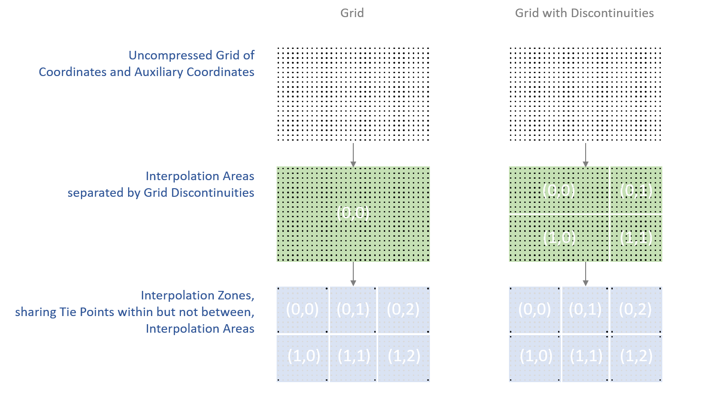

==  Reduction of Dataset Size 

There are two methods for reducing dataset size: packing and compression. By packing we mean altering the data in a way that reduces its precision. By compression we mean techniques that store the data more efficiently and result in no precision loss. Compression only works in certain circumstances, e.g., when a variable contains a significant amount of missing or repeated data values. In this case it is possible to make use of standard utilities, e.g., UNIX **`compress`** or GNU **`gzip`** , to compress the entire file after it has been written. In this section we offer an alternative compression method that is applied on a variable by variable basis. This has the advantage that only one variable need be uncompressed at a given time. The disadvantage is that generic utilities that don't recognize the CF conventions will not be able to operate on compressed variables.

[[packed-data, Section 8.1, "Packed Data"]]
=== Packed Data

At the current time the netCDF interface does not provide for packing data. However a simple packing may be achieved through the use of the optional NUG defined attributes **`scale_factor`** and **`add_offset`** . After the data values of a variable have been read, they are to be multiplied by the **`scale_factor`** , and have **`add_offset`** added to them. If both attributes are present, the data are scaled before the offset is added. When scaled data are written, the application should first subtract the offset and then divide by the scale factor. The units of a variable should be representative of the unpacked data.

This standard is more restrictive than the NUG with respect to the use of the **`scale_factor`** and **`add_offset`** attributes; ambiguities and precision problems related to data type conversions are resolved by these restrictions. If the **`scale_factor`** and **`add_offset`** attributes are of the same data type as the associated variable, the unpacked data is assumed to be of the same data type as the packed data. However, if the **`scale_factor`** and **`add_offset`** attributes are of a different data type from the variable (containing the packed data) then the unpacked data should match the type of these attributes, which must both be of type **`float`** or both be of type **`double`** . An additional restriction in this case is that the variable containing the packed data must be of type **`byte`** , **`short`** or **`int`** . It is not advised to unpack an **`int`** into a **`float`** as there is a potential precision loss.

When data to be packed contains missing values the attributes that indicate missing values ( **`_FillValue`** , **`valid_min`** , **`valid_max`** , **`valid_range`** ) must be of the same data type as the packed data. See <<missing-data>> for a discussion of how applications should treat variables that have attributes indicating both missing values and transformations defined by a scale and/or offset.

[[compression-by-gathering, Section 8.2, "Compression by Gathering"]]
=== Compression by Gathering

To save space in the netCDF file, it may be desirable to eliminate points from data arrays that are invariably missing. Such a compression can operate over one or more adjacent axes, and is accomplished with reference to a list of the points to be stored. The list is constructed by considering a mask array that only includes the axes to be compressed, and then mapping this array onto one dimension without reordering. The list is the set of indices in this one-dimensional mask of the required points. In the compressed array, the axes to be compressed are all replaced by a single axis, whose dimension is the number of wanted points. The wanted points appear along this dimension in the same order they appear in the uncompressed array, with the unwanted points skipped over. Compression and uncompression are executed by looping over the list.

The list is stored as the coordinate variable for the compressed axis of the data array. Thus, the list variable and its dimension have the same name. The list variable has a string attribute **`compress`** , __containing a blank-separated list of the dimensions which were affected by the compression in the order of the CDL declaration of the uncompressed array__ . The presence of this attribute identifies the list variable as such. The list, the original dimensions and coordinate variables (including boundary variables), and the compressed variables with all the attributes of the uncompressed variables are written to the netCDF file. The uncompressed variables can be reconstituted exactly as they were using this information.

[[horiz-compression-of-three-d-array-ex]]
[caption="Example 8.1. "]
.Horizontal compression of a three-dimensional array
====
We eliminate sea points at all depths in a longitude-latitude-depth array of soil temperatures. In this case, only the longitude and latitude axes would be affected by the compression. We construct a list `landpoint(landpoint)` containing the indices of land points. 
----
dimensions:
  lat=73;
  lon=96;
  landpoint=2381;
  depth=4;
variables:
  int landpoint(landpoint);
    landpoint:compress="lat lon";
  float landsoilt(depth,landpoint);
    landsoilt:long_name="soil temperature";
    landsoilt:units="K";
  float depth(depth);
  float lat(lat);
  float lon(lon);
data:
  landpoint=363, 364, 365, ...;
----
Since `landpoint(0)=363` , for instance, we know that `landsoilt(*,0)` maps on to point 363 of the original data with dimensions `(lat,lon)` . This corresponds to indices `(3,75)` , i.e., `363 = 3*96 + 75` .
====
 
[[compression-of-three-d-field-ex]]
[caption="Example 8.2. "]
.Compression of a three-dimensional field
====
We compress a longitude-latitude-depth field of ocean salinity by eliminating points below the sea-floor. In this case, all three dimensions are affected by the compression, since there are successively fewer active ocean points at increasing depths. 
----
variables:
  float salinity(time,oceanpoint);
  int oceanpoint(oceanpoint);
    oceanpoint:compress="depth lat lon";
  float depth(depth);
  float lat(lat);
  float lon(lon);
  double time(time);
----
This information implies that the salinity field should be uncompressed to an array with dimensions `(depth,lat,lon)` .
====

[[compression-by-coordinate-interpolation, Section 8.3, "Compression by Coordinate Interpolation"]]
=== Compression by Coordinate Interpolation

For some applications the coordinates of a data variable can require considerably more storage than the data itself. Space may be saved in the netCDF file by the storing coordinates at a lower resolution than the data which they describe. The uncompressed coordinate and auxiliary coordinate variables can be reconstituted by interpolation, from the lower resolution coordinate values to the domain of the data (i.e. the target domain). This process will likely result in a loss in accuracy (as opposed to precision) in the uncompressed variables, due to rounding and approximation errors in the interpolation calculations, but it is assumed that these errors will be small enough to not be of concern to user of the uncompressed dataset.

The lower resolution coordinates are stored in __tie point variables__. This terminology is chosen to acknowledge that, whilst the values of a tie point variable may be a subset of the uncompressed coordinate values, they can also be different to some or all of them.

In addition to the tie point variables themselves, metadata definging the coordinate interpolation method is stored in attributes of the data variable and of the associated __interpolation variable__. The partitioning of metadata between the data variable and the interpolation variable has been designed to minimise redundancy and maximise the reusability of the interpolation variable within a dataset.

The data variable coordinate interpolation attributes may also be used on a domain variable (<<domain-variables>>) with the same effect.

[[compression-by-coordinate-tie-points, Section 8.3.1, "Tie Points and Interpolation Zones"]]
==== Tie Points and Interpolation Zones

Reconstitution of the uncompressed coordinate and auxiliary coordinate variables is based on interpolation. To accomplish this, the target domain is segmented into smaller __interpolation zones__, for each of which the interpolation method is applied independently. For one dimensional interpolation, an interpolation zone is defined by two tie points, one at each end of the interpolation zone; for two-dimensional interpolation, an interpolation zone is defined by four tie points, one at each corner of a rectangular area aligned with the domain axes; etc. For the reconstitution of the uncompressed coordinate and auxiliary coordinate variables within an interpolation zone, the interpolation method is permitted to access the coordinates of the defining tie points, but not the coordinates of any other tie points.  

Although the coordinate and auxiliary coordinate variables are stored in orthogonal multidimensional array representation, the actual coordinate values may contain discontinuities. A discontinuity could be an overlap or a gap in the coordinates, or a change in cell size or cell alignment. As an example, such discontinuities are common in remote sensing data and may be caused by combinations of the instrument scan motion, the motion of the sensor platform and changes in the instrument scan mode.  

As the interpolation methods rely on a certain regularity and continuity of the coordinate values within each interpolation zone, special attention must be given to the discontinuities in the process of defining the interpolation zones. When discontinuities are present, the grid is first divided into multiple __interpolation areas__, each of which is free of grid discontinuities. When no discontinuities are present, the whole grid is a single interpolation area. Following this step, each interpolation area is segmented into interpolation zones. The processes of generating interpolation zones for a grid without discontinuities and for a grid with discontinuities is illustrated in Figure <<interpolation_zone_generation>>.

Within an interpolation area, interpolation zones must share tie points with neighbouring interpolation zones. Between interpolation areas, interpolation zones are not permitted to share tie points. This results in a different number of tie points in the two cases shown in Figure <<interpolation_zone_generation>>.

For each interpolation dimension, the location of the tie points is defined by a corresponding __tie point index variable__ (<<compression-by-coordinate-interpolation-tie-point-indices>>)

For each interpolation dimension, the number interpolation zones is equal to the number of tie points minus the number of interpolation areas.

[[interpolation_zone_generation, figure 3]]
[.text-center]
.Process for generating the interpolation zones for a grid without discontinuities and for a grid with discontinuities.

[[compression-by-coordinate-tie-points-attribute, Section 8.3.2, "Tie Points Attribute"]]
==== Tie Points Attribute

To indicate that coordinate interpolation is required, a **`tie_points`** attribute must be defined for a data variable. This is a string attribute that both identifies the tie point variables, and maps non-overlapping subsets of them to their corresponding interpolation variables. It is a blank-separated list of words of the form "__tie_point_variable: [tie_point_variable: ...] interpolation_variable [tie_point_variable: [tie_point_variable: ...] interpolation_variable ...]__". For example, to specify that the tie point variables **`lat`** and **`lon`** are to be interpolated according to the interpolation variable **`bi_linear`** could be indicated with **`lat: lon: bi_linear`**.

[[compression-by-coordinate-interpolation-dimensions,Section 8.3.3, "Data Variable Attributes"]]
==== Interpolation and Non-Interpolation Dimensions

For each interpolation variable identified in the **`tie_points`** attribute, all corresponding tie point variables must share the same set of one or more dimensions. This set of dimensions must contain at least one __tie point interpolation dimension__ that corresponds to an __interpolation dimension__, i.e. a target domain dimension for which coordinate interpolation is required; and may additionally contain one or more __non-interpolation dimensions__, i.e. those of the target domain for which no coordinate interpolation is required.

An interpolation dimension typically differs in size from the corresponding tie point interpolation dimension. For example, if the target domain dimensions are **`xc = 30`** and **`yc = 10`**,  interpolation could be applied in both of these dimensions, based on tie point variables for the dimensions **`tp_xc = 4`** and **`tp_yc = 2`**. Here, **`tp_xc`** is the tie point interpolation dimension related to the interpolation dimension **`xc`**, and **`tp_yc`** is the tie point interpolation dimension related to the interpolation dimension **`yc`**.

The presence of non-interpolation dimensions in the tie point variable impacts the interpolation process in that there must be a separate application of the interpolation method for each combination of indices of the non-interpolation dimensions. For example, if the target domain dimensions are **`xc = 30`** and **`yc = 10`**, interpolation could be applied in the **`xc`** dimension only, based on tie point variables of the dimensions **`tp_xc = 4`** and **`yc = 10`**. The interpolation in the **`xc`** dimension would then be repeated for each of the 10 indices of the **`yc`** dimension.

[[compression-by-coordinate-interpolation-tie-point-indices, Section 8.3.4, "Tie Point Indices"]]
==== Tie Point Indices

The relationship between a tie point interpolation dimension and its corresponding interpolation dimension is defined with a __tie point index variable__. This contains zero-based indices that map each element of a tie point interpolation dimension to its related location in the corresponding interpolation dimension. The tie point index variable is a one-dimensional integer variable that spans a tie point interpolation dimension. The values must be strictly monotonically increasing. For example, the tie point index variable **`int x_indices(tp_xc)`** could contain the following indices **`x_indices = 0, 9, 19, 29`** of the target domain.

In the tie point index variable, two adjacent indices where the value of the second is the equal to the value of the first incremented by one indicates the location of a interpolation area boundary.

To indicate which tie point index variable applies to each interpolation dimension, a **`tie_point_indices`** attribute must be defined for the data variable. This is a string attribute that maps the interpolation dimensions to the corresponding tie point index variables. It is a blank-separated list of words of the form "__interpolation_dimension: tie_point_index_variable [interpolation_dimension: tie_point_index_variable] ...]__". Continuing the above example, specifying that the target dimension **`xc`** and **`yc`** are associated with the tie point index variables **`x_indices`** and **`y_indices`** respectively, could be indicated with **`xc: x_indices yc: y_indices`**.

The **`tie_point_indices`** attribute also serves to identify the corresponding tie point interpolation dimensions, as each tie point index variable spans a unique tie point interpolation dimension. In the example, interpolation dimension **`xc`** references tie point index variable **`x_indices`**, which in turn identifies tie point interpolation dimension **`tp_xc`**.

The reference of non-interpolation dimensions in the **`tie_point_indices`** attribute is not permitted.

If there is a tie point index for every element of an interpolation dimension, then the tie point index variable need not be included in the dataset, as its contents must be the integers 0 to [size of tie point interpolation dimension minus one], and therefore do not need to be stored in a variable. Instead, the **`tie_point_indices`** attribute may associate the interpolation dimension with the tie point dimension dimension, rather than a tie point index variable. In this case, if there is a coordinate variable with the same name as the tie point dimension then the variable is not to be used as a tie point index variable.

### Only commented up to here

(To Do: Add text on super-sampling)

[caption="Example 8.3. "]
.Two-dimensional tie point interpolation
====
----
dimensions:
  xc = 30;
  yc = 10;
  tp_xc = 4 ; 
  tp_yc = 2 ;

variables:
  // Interpolation variables
  char bi_linear ;
    interpolation:interpolation_name = "bi_linear" ;

  // Tie point variables
  double lat(tp_yc, tp_xc) ;
    lat:units = "degrees_north" ;
    lat:standard_name = "latitude" ;
  double lon(tp_yc, tp_xc) ;
    lon:units = "degrees_east" ;
    lon:standard_name = "longitude" ;
 
  // Tie point index variables
  int y_indices(tp_yc) ;
  int x_indices(tp_xc) ;

  // Data variable    	       
  float Temperature(yc, xc) ;
    Temperature:standard_name = "air_temperature" ;
    Temperature:units = "K" ;
    Temperature:tie_points = "lat: lon: bi_linear" ;
    Temperature:tie_point_indices = "yc: y_indices xc: x_indices" ;

data:
  x_indices = 0, 9, 19, 29 ;
  y_indices = 0, 9 ;
  ...
----
====

[caption="Example 8.4. "]
.One-dimensional tie point interpolation
====
----
dimensions:
  xc = 30;
  yc = 10;
  tp_xc = 4 ; 

variables:
  // Interpolation variables
  char linear ;
    interpolation:interpolation_name = "linear" ;

  // Tie point variables
  double lat(yc, tp_xc) ;
    lat:units = "degrees_north" ;
    lat:standard_name = "latitude" ;
  double lon(yc, tp_xc) ;
    lon:units = "degrees_east" ;
    lon:standard_name = "longitude" ;
 
  // Tie point index variables
  int x_indices(tp_xc) ;

  // Data variable    	       
  float Temperature(yc, xc) ;
    Temperature:standard_name = "air_temperature" ;
    Temperature:units = "K" ;
    Temperature:tie_points = "lat: lon: linear" ;
    Temperature:tie_point_indices = "xc: x_indices" ;

data:
  x_indices = 0, 9, 19, 29 ;
  ...
----
====

[[compression-by-coordinate-interpolation-tie-point-indices, Section 8.3.5, "Tie Point Offsets Attribute"]]
==== Tie Point Offsets Attribute

Additionally to the **`tie_points`** and **`tie_point_indices`** attributes, which are always required for coordinate interpolation, a **`tie_point_offsets`** attribute is required if the tie point coordinate values are not a subset of the target domain coordinate values, but are offset with respect to these.

The **`tie_point_offsets`** is a string attribute that, limited to horizontal interpolation dimensions, maps target domain dimensions to the corresponding tie point offsets variables. It is a blank-separated list of words of the form "__target_domain_dimension: tie_point_offsets_variable [target_domain_dimension: tie_point_offsets_variable] ...]__". 

This mapping is not part of the interpolation variable because different data variables may apply the same interpolation method, with the same tie points, but with different offsets.

A tie point offset is a spatial offset, in terms of fraction of target domain grid cell size in the named dimension, between the tie point cells and the corresponding target domain cells. The corresponding target domain cell is defined through the **`tie_point_indices`** attribute. A tie point offset variable may be a scalar, or else its dimensions may include the tie point dimension corresponding to the named target domain dimension, as well as any subset of the non-interpolation dimensions. No other dimensions may be spanned by a tie point offset variable.

For example, to specify that for both of the target dimensions **`track`** and **`scan`** the offset is contained in the scalar variable **`offset`**, could be indicated with  **`track: offset  scan: offset`**, where the offset variable is declared as **`double offset`** and could have the value **`offset = -0.5`**.

[[compression-by-coordinate-interpolation-interpolation-variable, Section 8.3.6, "Interpolation Variable"]]
==== Interpolation Variable

The method used to uncompress the tie point variables is described by an interpolation variable that acts as a container for the attributes that define the interpolation technique and the parameters that should be used. The variable should be a scalar (i.e. it has no dimensions) of arbitrary type, and the value of its single element is immaterial.

To indicate that a standard interpolation method should be used, the interpolation variable must have a **`interpolation_name`** attribute defined, containing one of the valid values described in Appendix <?>. This appendix also describes the interpolation technique and the interpolation variable attributes for configuring the interpolation process.
     
If an interpolation name is not given, the interpolation variable must have a **`description`** attribute defined instead, containing a description of the non-standardised interpolation (in a similar manner to a long name being used instead of a standard name). This description is free text that can take any form (including a URI, for example). Whilst it is recommended that a standardised interpolation is provided, the alternative is provided to promote interoperability in cases where a well defined user community needs to use sophisticated interpolation techniques that may also be under development.

The definition of a standard or a non-standard interpolation method may include instructions to treat groups of particular physically related coordinates simultaneously, if such tie points are present. For example, there are cases where longitudes cannot be interpolated without considering the corresponding latitudes. It is up to the interpolation description to describe how such coordinates are to be identified (e.g. it may be that such tie point variables require particular standard names).

In addition to the **`interpolation_name`** or the **`description`** attribute, only two other interpolation variable attributes are permitted, the **`interpolation_coefficients`** and the **`interpolation_flags`** attributes.   

The **`interpolation_coefficients`** attribute is a string attribute that lists the __interpolation coefficients variables__. The variables referenced must contain numeric data. It is a blank-separated list of words of the form "__interpolation_coefficients [interpolation_coefficients] ...]__".

The **`interpolation_flags`** attribute is a string attribute that lists the __interpolation flags variables__. The variables referenced must be flag variables (<<flags>>). It is a blank-separated list of words of the form "__interpolation_flags [interpolation_flags] ...]__".

The interpolation coefficients variables and the interpolation flags variables must either be scalar, or else their dimensions may include any of the tie point dimensions that are being interpolated, as well as the interpolation zone dimensions corresponding to each tie point dimension. The size of an interpolation zone dimension is equal the number of tie points, minus the number of interpolation areas. 

No other dimensions may be spanned by an interpolation coefficients variable or an interpolation flags variable.

[caption="Example 8.5. "]
.Example demonstrating the use of multiple interpolation variables, the reusability of the interpolation variable between data variables of different dimensions and the use of the interpolation coefficients and interpolation flags attributes.
====
----
dimensions :
  // VIIRS M-Band (750 m resolution imaging) 
  m_track = 768 ;
  m_scan = 3200 ;
  m_channel = 16 ;

  // VIIRS I-Band (375 m resolution imaging)
  i_track = 1536 ;
  i_scan = 6400 ; 
  i_channel = 5 ;

  // Tie points and interpolation zones (shared between VIIRS M-Band and I-Band)
  tp_track = 96 ;  // 48 VIIRS scans
  tp_scan = 205 ;
  track_interpolation_zone = 48 ;
  scan_interpolation_zone = 200 ;

  // Time, stored at scan-start and scan-end of each scan
  time_scan = 2;

variables:
  // VIIRS M-Band 
  float m_radiance(m_track, m_scan, m_channel) ;
    m_radiance:tie_points = "lat: lon: sen_azi_ang: sen_zen_ang: sol_azi_ang: sol_zen_ang: tp_interpolation  t: time_interpolation" ;
    m_radiance:tie_point_indices = "m_track: m_track_indices  m_scan: m_scan_indices  time_scan: m_time_scan_indices" ;
    m_radiance:tie_point_offsets = "m_track: offset  m_scan: offset" ;

  // VIIRS I-Band 
  float i_radiance(i_track, i_scan, i_channel) ;
    i_radiance:tie_points = "lat: lon: sen_azi_ang: sen_zen_ang: sol_azi_ang: sol_zen_ang: tp_interpolation  t: time_interpolation" ;
    i_radiance:tie_point_indices = "i_track: i_track_indices  i_scan: i_scan_indices  time_scan: i_time_scan_indices" ;
    i_radiance:tie_point_offsets = "i_track: offset  i_scan: offset" ;

  double offset;   // = -0.5

  // Tie point index variables
  int m_track_indices(tp_track) ;   // shared by tp_interpolation and time_interpolation 
  int m_scan_indices(tp_scan) ;     
  int m_time_scan_indices(time_scan) 
  int i_track_indices(tp_track) ;   // shared by tp_interpolation and time_interpolation 
  int i_scan_indices(tp_scan) ;     
  int i_time_scan_indices(time_scan) 

  // Tie points
  float lat(tp_track, tp_scan) ;
    lat : standard_name = "latitude" ;
    lat : units = "degrees_north" ;
  float lon(tp_track, tp_scan) ;
    lon : standard_name = "longitude" ;
    lon : units = "degrees_east" ;
  float sen_azi_ang(tp_track, tp_scan) ;
    sen_azi_ang : standard_name = "sensor_azimuth_angle" ;
    sen_azi_ang : units = "degrees" ;
  float sen_zen_ang(tp_track, tp_scan) ;
    sen_zen_ang : standard_name = "sensor_zenith_angle" ;
    sen_zen_ang : units = "degrees" ;
  float sol_azi_ang(tp_track, tp_scan) ;
    sol_azi_ang : standard_name = "solar_azimuth_angle" ;
    sol_azi_ang : units = "degrees" ;
  float sol_zen_ang(tp_track, tp_scan) ;
    sol_zen_ang : standard_name = "solar_zenith_angle" ;
    sol_zen_ang : units = "degrees" ;

  // Interpolation variable
  char tp_interpolation ;
    tp_interpolation:interpolation_name = "bi_quadratic_1" ;
    tp_interpolation:interpolation_coefficients = "expansion_coefficient_track alignment_coefficient_track expansion_coefficient_scan alignment_coefficient_scan" ;
    tp_interpolation:interpolation_flags = "interpolation_zone_flags" ;

  // Interpolation coefficients and flags
  short expansion_coefficient_track(track_interpolation_zone, tp_scan) ;
  short alignment_coefficient_track(track_interpolation_zone, tp_scan) ;
  short expansion_coefficient_scan(tp_track, scan_interpolation_zone) ;
  short alignment_coefficient_scan(tp_track, scan_interpolation_zone) ;
  byte interpolation_zone_flags(track_interpolation_zone, scan_interpolation_zone) ;
    interpolation_zone_flags : valid_range = "1b, 7b" ;
    interpolation_zone_flags : flag_masks = "1b, 2b, 4b" ;
    interpolation_zone_flags : flag_meanings = "location_use_cartesian  sensor_direction_use_cartesian  solar_direction_use_cartesian" ;

  // Time tie points
  double t(tp_track, time_scan) ;
    t : long_name = "time" ;
    t : units = "days since 1990-1-1 0:0:0" ;

  // Time interploation variable
  char time_interpolation ;
    time_interpolation : interpolation_name = "bi_linear" ;
----
====

[caption="Example 8.6. "]
.Example demonstrating the combination of grid mapping and coordinate interpolation with time as a non-interpolation dimension. The projection coordinates are 2-D, but are only linearly interpolated in one of their dimensions - the one which is given by the tie_point_indices attribute.
====
----
dimensions:
  y = 228;
  x = 306;
  time = 41;

  // Tie point dimensions
  tp_y = 58;
  tp_x = 52;

variables:
  int lambert_conformal ;
    lambert_conformal:grid_mapping_name = "lambert_conformal_conic" ;
    lambert_conformal:standard_parallel = 25.0 ;
    lambert_conformal:longitude_of_central_meridian = 265.0 ;
    lambert_conformal:latitude_of_projection_origin = 25.0 ;

  // Interpolation variables
  char spherical_bilinear ;
    spherical_bilinear:interpolation_name = "spherical_bilinear" ;
  char linear ;			
    linear:interpolation_name = "linear" ;

  // Tie point variables
  double time(time) ;
    time:standard_name = "time" ;
    time:units = "days since 2021-03-01" ;
  double y(time, tp_y) ;
    y:units = "km" ;
    y:standard_name = "projection_y_coordinate" ;
  double x(time, tp_x) ;
    x:units = "km" ;
    x:standard_name = "projection_x_coordinate" ;
  double lat(time, tp_y, tp_x) ;
    lat:units = "degrees_north" ;
    lat:standard_name = "latitude" ;
  double lon(time, tp_y, tp_x) ;
    lon:units = "degrees_east" ;
    lon:standard_name = "longitude" ;
 
  // Tie point index variables
  int y_indices(tp_y) ;
    y_indices.long_name	= "Mapping of y dimension to its ",
                          "corresponding tie point dimension" ;
  int x_indices(tp_x) ;
    x_indices.long_name = "Mapping of x dimension to its ",
                          "corresponding tie point dimension" ;

  // Data variable    	       
  float Temperature(time, y, x) ;
    Temperature:standard_name = "air_temperature" ;
    Temperature:units = "K" ;
    Temperature:grid_mapping = "lambert_conformal" ;
    Temperature:tie_points = "lat: lon: spherical_bilinear y: x: linear" ;
    Temperature:tie_point_indices = "y: y_indices x: x_indices" ;
----
====
