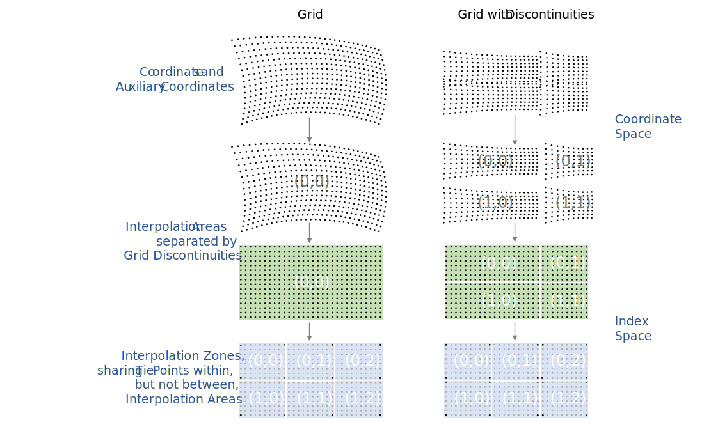

==  Reduction of Dataset Size 

There are three methods for reducing dataset size: packing, lossless compression, and lossy compression. By packing we mean altering the data in a way that reduces its precision. By lossless compression we mean techniques that store the data more efficiently and result in no precision loss. By lossy compression we mean techniques that store the data more efficiently but result in some loss in accuracy. Lossless compression only works in certain circumstances, e.g., when a variable contains a significant amount of missing or repeated data values. In this case it is possible to make use of standard utilities, e.g., UNIX **`compress`** or GNU **`gzip`** , to compress the entire file after it has been written. In this section we offer an alternative compression method that is applied on a variable by variable basis. This has the advantage that only one variable need be uncompressed at a given time. The disadvantage is that generic utilities that don't recognize the CF conventions will not be able to operate on compressed variables.

[[packed-data, Section 8.1, "Packed Data"]]
=== Packed Data

At the current time the netCDF interface does not provide for packing data. However a simple packing may be achieved through the use of the optional NUG defined attributes **`scale_factor`** and **`add_offset`** . After the data values of a variable have been read, they are to be multiplied by the **`scale_factor`** , and have **`add_offset`** added to them. If both attributes are present, the data are scaled before the offset is added. When scaled data are written, the application should first subtract the offset and then divide by the scale factor. The units of a variable should be representative of the unpacked data.

This standard is more restrictive than the NUG with respect to the use of the **`scale_factor`** and **`add_offset`** attributes; ambiguities and precision problems related to data type conversions are resolved by these restrictions. If the **`scale_factor`** and **`add_offset`** attributes are of the same data type as the associated variable, the unpacked data is assumed to be of the same data type as the packed data. However, if the **`scale_factor`** and **`add_offset`** attributes are of a different data type from the variable (containing the packed data) then the unpacked data should match the type of these attributes, which must both be of type **`float`** or both be of type **`double`** . An additional restriction in this case is that the variable containing the packed data must be of type **`byte`** , **`short`** or **`int`** . It is not advised to unpack an **`int`** into a **`float`** as there is a potential precision loss.

When data to be packed contains missing values the attributes that indicate missing values ( **`_FillValue`** , **`valid_min`** , **`valid_max`** , **`valid_range`** ) must be of the same data type as the packed data. See <<missing-data>> for a discussion of how applications should treat variables that have attributes indicating both missing values and transformations defined by a scale and/or offset.

[[compression-by-gathering, Section 8.2, "Lossless Compression by Gathering"]]
=== Lossless Compression by Gathering

To save space in the netCDF file, it may be desirable to eliminate points from data arrays that are invariably missing. Such a compression can operate over one or more adjacent axes, and is accomplished with reference to a list of the points to be stored. The list is constructed by considering a mask array that only includes the axes to be compressed, and then mapping this array onto one dimension without reordering. The list is the set of indices in this one-dimensional mask of the required points. In the compressed array, the axes to be compressed are all replaced by a single axis, whose dimension is the number of wanted points. The wanted points appear along this dimension in the same order they appear in the uncompressed array, with the unwanted points skipped over. Compression and uncompression are executed by looping over the list.

The list is stored as the coordinate variable for the compressed axis of the data array. Thus, the list variable and its dimension have the same name. The list variable has a string attribute **`compress`** , __containing a blank-separated list of the dimensions which were affected by the compression in the order of the CDL declaration of the uncompressed array__ . The presence of this attribute identifies the list variable as such. The list, the original dimensions and coordinate variables (including boundary variables), and the compressed variables with all the attributes of the uncompressed variables are written to the netCDF file. The uncompressed variables can be reconstituted exactly as they were using this information.

[[horiz-compression-of-three-d-array-ex]]
[caption="Example 8.1. "]
.Horizontal compression of a three-dimensional array
====
We eliminate sea points at all depths in a longitude-latitude-depth array of soil temperatures. In this case, only the longitude and latitude axes would be affected by the compression. We construct a list `landpoint(landpoint)` containing the indices of land points. 
----
dimensions:
  lat=73;
  lon=96;
  landpoint=2381;
  depth=4;
variables:
  int landpoint(landpoint);
    landpoint:compress="lat lon";
  float landsoilt(depth,landpoint);
    landsoilt:long_name="soil temperature";
    landsoilt:units="K";
  float depth(depth);
  float lat(lat);
  float lon(lon);
data:
  landpoint=363, 364, 365, ...;
----
Since `landpoint(0)=363` , for instance, we know that `landsoilt(*,0)` maps on to point 363 of the original data with dimensions `(lat,lon)` . This corresponds to indices `(3,75)` , i.e., `363 = 3*96 + 75` .
====
 
[[compression-of-three-d-field-ex]]
[caption="Example 8.2. "]
.Compression of a three-dimensional field
====
We compress a longitude-latitude-depth field of ocean salinity by eliminating points below the sea-floor. In this case, all three dimensions are affected by the compression, since there are successively fewer active ocean points at increasing depths. 
----
variables:
  float salinity(time,oceanpoint);
  int oceanpoint(oceanpoint);
    oceanpoint:compress="depth lat lon";
  float depth(depth);
  float lat(lat);
  float lon(lon);
  double time(time);
----
This information implies that the salinity field should be uncompressed to an array with dimensions `(depth,lat,lon)` .
====

[[compression-by-coordinate-sampling, Section 8.3, "Lossy Compression by Coordinate Sampling"]]
=== Lossy Compression by Coordinate Sampling

For some applications the coordinates of a data variable can require considerably more storage than the data itself. Space may be saved in the netCDF file by storing coordinates at a lower resolution than the data which they describe. The uncompressed coordinate and auxiliary coordinate variables can be reconstituted by interpolation, from the lower resolution coordinate values to the domain of the data (i.e. the target domain). This process will likely result in a loss in accuracy (as opposed to precision) in the uncompressed variables, due to rounding and approximation errors in the interpolation calculations, but it is assumed that these errors will be small enough to not be of concern to users of the uncompressed dataset. The creator of the compressed dataset can control the accuracy of the reconstituted coordinates through the degree of subsambling and the choice of interpolation method, see <<Appendix J>>.

The lower resolution coordinates are called __tie points__ and are stored in __tie point variables__.

In addition to the tie point variables themselves, metadata defining the coordinate interpolation method is stored in attributes of the data variable and of the associated __interpolation variable__. The partitioning of metadata between the data variable and the interpolation variable has been designed to minimise redundancy and maximise the reusability of the interpolation variable within a dataset.

The metadata that define the interpolation formula and its inputs are complete, so that the results of the coordinate reconstitution process are well defined and of a predictable accuracy.

The data variable coordinate interpolation attribute may also be used on a domain variable (domain-variables) with the same effect.

[[compression-by-coordinate-sampling-tie-points-and-interpolation-zones, Section 8.3.1, "Tie Points and Interpolation Zones"]]
==== Tie Points and Interpolation Zones

Reconstitution of the uncompressed coordinate and auxiliary coordinate
variables is based on interpolation. To accomplish this, the target
domain is segmented into smaller __interpolation zones__, for each of
which the interpolation method is applied independently. For
one-dimensional interpolation, an interpolation zone is defined by two
tie points, one at each end of the interpolation zone; for
two-dimensional interpolation, an interpolation zone is defined by
four tie points, one at each corner of a rectangular area aligned with
the domain axes; etc. For the reconstitution of the uncompressed
coordinate and auxiliary coordinate variables within an interpolation
zone, the interpolation method is permitted to access its defining tie
points, and no others.

As an interpolation method relies on the regularity and continuity of
the coordinate values within each interpolation zone, special
attention must be given to the case when uncompressed coordinates
contain discontinuities. A discontinuity could be an overlap or a gap
in the coordinates' coverage, or a change in cell size or cell
alignment. As an example, such discontinuities are common in remote
sensing data and may be caused by combinations of the instrument scan
motion, the motion of the sensor platform and changes in the
instrument scan mode. When discontinuities are present, the domain is
first divided into multiple __interpolation areas__, each of which is
free of discontinuities. When no discontinuities are present, the
whole domain is a single interpolation area. Following this step, each
interpolation area is segmented into interpolation zones. The
processes of generating interpolation zones for a domain without
discontinuities and for a domain with discontinuities is illustrated
in <<interpolation_zone_generation>>, and described in more detail in
<<Appendix J>>.

Within an interpolation area, interpolation zones must share tie points with neighbouring interpolation zones. Between interpolation areas, interpolation zones are not permitted to share tie points. This results in a different number of tie points in the two cases shown in <<interpolation_zone_generation>>.

For each interpolation dimension, the location of the tie points is defined by a corresponding __tie point index variable__, which also indicates the location of the interpolation areas (<<compression-by-coordinate-sampling-tie-point-indices>>).

For each interpolation dimension, the number of interpolation zones is equal to the number of tie points minus the number of interpolation areas.

[[interpolation_zone_generation, figure 1]]
[.text-center]
.Process for generating the interpolation zones for a grid without discontinuities and for a grid with discontinuities.
 

[[compression-by-coordinate-sampling-tie-points-attribute, Section 8.3.2, "Tie Points Attribute"]]
==== Tie Points Attribute

To indicate that coordinate interpolation is required, a **`tie_points`** attribute must be defined for a data variable. This is a string attribute that both identifies the tie point variables, and maps non-overlapping subsets of them to their corresponding interpolation variables. It is a blank-separated list of words of the form "__tie_point_variable: [tie_point_variable: ...] interpolation_variable [tie_point_variable: [tie_point_variable: ...] interpolation_variable ...]__". For example, to specify that the tie point variables `lat` and `lon` are to be interpolated according to the interpolation variable `bi_linear` could be indicated with `lat: lon: bi_linear`.

[[compression-by-coordinate-sampling-interpolation-variable, Section 8.3.3, "Interpolation Variable"]]
==== Interpolation Variable

The method used to uncompress the tie point variables is described by
an interpolation variable that acts as a container for the attributes
that define the interpolation technique and the parameters that should
be used. The variable should be a scalar (i.e. it has no dimensions)
of arbitrary type, and the value of its single element is immaterial.

The interpolation method must be identified in one of two ways. Either
by the **`interpolation_name`** attribute, which takes a string value
that contains the method's name, or else by the
**`interpolation_description`** attribute, which takes a string value
that contains a non-standardized description of the method. These
attributes must not be both set.

The valid values of **`interpolation_name`** are given in <<Appendix
J>>. This appendix describes the interpolation technique for each
method, and optional interpolation variable attributes for configuring
the interpolation process.

If a standardized interpolation name is not given, the interpolation
variable must have a **`interpolation_description`** attribute defined
instead, containing a description of the non-standardised
interpolation (in a similar manner to a long name being used instead
of a standard name). This description is free text that can take any
form (including a URI, for example). Whilst it is recommended that a
standardised interpolation is provided, the alternative is provided to
promote interoperability in cases where a well defined user community
needs to use sophisticated interpolation techniques that may also be
under development.

The definition of the interpolation method, however it is specified,
may include instructions to treat groups of physically related
coordinates simultaneously, if such tie points are present. For
example, there are cases where longitudes cannot be interpolated
without considering the corresponding latitudes. It is up to the
interpolation description to describe how such coordinates are to be
identified (e.g. it may be that such tie point variables require
particular units or standard names).

Note that the interpolation method is always applied on a per
interpolation zone basis, for which the construction of the
uncompressed coordinates may only access those tie points that define
the extent of the of the interpolation zone.

In addition to the **`interpolation_name`** and **`interpolation_description`** attributes described in this section, further attributes of the interpolation variable are described in <<compression-by-coordinate-sampling-tie-point-dimensions-attribute>>, <<compression-by-coordinate-sampling-tie-point-indices>> and <<compression-by-coordinate-sampling-interpolation-parameters>>.

[[compression-by-coordinate-sampling-dimensions,Section 8.3.4, "Interpolation and Non-Interpolation Dimensions"]]
==== Interpolation and Non-Interpolation Dimensions

For each interpolation variable identified in the **`tie_points`** attribute, all corresponding tie point variables must share the same set of one or more dimensions. This set of dimensions must contain at least one __tie point interpolation dimension__ that corresponds to an __interpolation dimension__, i.e. a target domain dimension for which coordinate interpolation is required; and may additionally contain one or more __non-interpolation dimensions__, i.e. those of the target domain for which no coordinate interpolation is required. The size of a tie point interpolation dimension must be less than or equal to the size of its corresponding interpolation dimension. 

An interpolation dimension typically differs in size from the corresponding tie point interpolation dimension. For example, if the target domain dimensions are `xc = 30` and `yc = 10`,  interpolation could be applied in both of these dimensions, based on tie point variables of the dimensions `tp_xc = 4` and `tp_yc = 2`. Here, `tp_xc` is the tie point interpolation dimension related to the interpolation dimension `xc`, and `tp_yc` is the tie point interpolation dimension related to the interpolation dimension `yc`.

The presence of non-interpolation dimensions in the tie point variable impacts the interpolation process in that there must be a separate application of the interpolation method for each combination of indices of the non-interpolation dimensions. For example, if the target domain dimensions are `xc = 30` and `yc = 10`, interpolation could be applied in the `xc` dimension only, based on tie point variables of the dimensions `tp_xc = 4` and `yc = 10`. The interpolation in the `xc` dimension would then be repeated for each of the 10 indices of the `yc` dimension.

[[compression-by-coordinate-sampling-tie-point-dimensions-attribute, Section 8.3.5, "Tie Point Dimensions Attribute"]]
==== Tie Point Dimensions Attribute

Each interpolation dimension must be associated with its corresponding
tie point interpolation dimension and, if required, its corresponding
__interpolation zone dimension__ that defines the number of
interpolation zones which partition the interpolation
dimension. Regardless of its size, an interpolation zone dimension is
only required if it is spanned by an interpolation parameter variable,
as described in
<<compression-by-coordinate-sampling-interpolation-variable>>. The
association is stored in the interpolation variable's
**`tie_point_dimensions`** attribute that contains a blank-separated
list of words of the form __"interpolation_dimension:
tie_point_interpolation_dimension [interpolation_zone_dimension]
[interpolation_dimension: ...]"__. If an interpolation zone dimension
is provided then it must be the second of the two named dimensions
following the interpolation dimension.

An overview of the different dimensions for coordinate interpolation is shown in <<ci_dimensions_overview>>.

Note that an interpolation zone dimension has, by definition, the same size as the corresponding tie point interpolation dimension, minus the number of interpolation areas.

[[ci_dimensions_overview, figure 2]]
[.text-center]
.Overview of the different dimensions for coordinate interpolation.
image::images/ci_dimensions_overview.svg[,80%,pdfwidth=50vw,align="center"]

A single interpolation dimension may be associated with multiple tie
point interpolation dimensions by repeating the interpolation
dimension in the **`tie_point_dimensions`** attribute. For instance,
interpolation dimension `dimension1` could be mapped to two different
tie point interpolation dimensions with `dimension1: tp_dimension1
dimension1: tp_dimension2`. This is necessary when different tie point
variables for a particular interpolation dimension do not contain the
same number of tie points, and therefore define different numbers of
interpolation zones, as is the case in <<example-VIIRS>>. A tie point
variable must span at most one of the tie point interpolation
dimensions associated with a given interpolation dimension.

The same interpolation variable may be multiply mapped from the
different sets of tie point variables. For instance, if tie point
variables lat and lon span dimension `tp_dimension1` and time spans
dimension `tp_dimension2`, and all three are to interpolated according
to interpolation variable `linear`, then the **`tie_points`**
attribute could be `lat: lon: linear time: linear`. In this case it is
not possible to simultaneously map all three tie point variables to
the linear interpolation variable because they do not all span the
same axes.

[[compression-by-coordinate-sampling-tie-point-indices, Section 8.3.6, "Tie Point Indices"]]
==== Tie Point Indices

The relationship between a tie point interpolation dimension and its
corresponding interpolation dimension is defined with a __tie point
index variable__. This contains zero-based indices that relate each
element of a tie point interpolation dimension to its related location
in the corresponding interpolation dimension. The tie point index
variable is a one-dimensional integer variable that must span the tie
point interpolation dimension specified by the
**`tie_point_dimensions`** attribute. The tie point index values must
be strictly monotonically increasing within interpolation areas. An
interpolation zone must span at least two points of each of its
corresponding interpolation dimensions, therefore the tie point
indices that define an interpolation zone must all be different. When
two adjacent values are equal, or differ by one, it indicates the
location (in index space) of an interpolation area boundary relating
to a grid discontinuity
(<<compression-by-coordinate-sampling-tie-points-and-interpolation-zones>>).

Each value of the tie point index variable is the index of the 
interpolation dimension that corresponds to the corresponding 
tie point interpolation dimension.

For instance, in example <<example-Two-dimensional-tie-point-interpolation>>
the tie point variables represent a subset of the target domain and
the tie point index variable `int x_indices(tp_xc)` contains the
indices `x_indices = 0, 9, 19, 29` that identify the location in the
interpolation dimension `xc` of size 30.

To indicate which tie point index variable applies to each
interpolation dimension, a **`tie_point_indices`** attribute must be
defined for the interpolation variable. This is a string attribute that maps
the interpolation dimensions to the corresponding tie point index
variables. It is a blank-separated list of words of the form
"__interpolation_dimension: tie_point_index_variable
[interpolation_dimension: tie_point_index_variable ...]__".
Continuing the above example, specifying that the target dimension
`xc` and `yc` are associated with the tie point index variables
`x_indices` and `y_indices` respectively, could be indicated with `xc:
x_indices yc: y_indices`.

[[example-Two-dimensional-tie-point-interpolation]]
[caption="Example 8.3. "]
.Two-dimensional tie point interpolation
====
----
dimensions:
  xc = 30;
  yc = 10;
  tp_xc = 4 ; 
  tp_yc = 2 ;

variables:
  // Data variable    	       
  float Temperature(yc, xc) ;
    Temperature:standard_name = "air_temperature" ;
    Temperature:units = "K" ;
    Temperature:tie_points = "lat: lon: bl_interpolation" ;

  // Interpolation variable
  char bl_interpolation ;
    bl_interpolation:interpolation_name = "bi_linear" ;
    bl_interpolation:tie_point_dimensions = "xc: tp_xc  yc: tp_y"  ;
    bl_interpolation:tie_point_indices = "yc: y_indices xc: x_indices" ;

  // Tie point variables
  double lat(tp_yc, tp_xc) ;
    lat:units = "degrees_north" ;
    lat:standard_name = "latitude" ;
  double lon(tp_yc, tp_xc) ;
    lon:units = "degrees_east" ;
    lon:standard_name = "longitude" ;
 
  // Tie point index variables
  int y_indices(tp_yc) ;
  int x_indices(tp_xc) ;

data:
  x_indices = 0, 9, 19, 29 ;
  y_indices = 0, 9 ;
  ...
----
====

[[example-1d-interpolation-of-2d-domain]]
[caption="Example 8.4. "]
.One-dimensional tie point interpolation of two-dimensional domain.
====
----
dimensions:
  xc = 30;
  yc = 10;
  tp_xc = 4 ; 

variables:
  // Data variable    	       
  float Temperature(yc, xc) ;
    Temperature:standard_name = "air_temperature" ;
    Temperature:units = "K" ;
    Temperature:tie_points = "lat: lon: l_interpolation" ;

  // Interpolation variables
  char l_interpolation ;
    l_interpolation:interpolation_name = "linear" ;
    l_interpolation:tie_point_dimensions = "xc: tp_xc"  ;
    l_interpolation:tie_point_indices = "xc: x_indices" ;

  // Tie point variables
  double lat(yc, tp_xc) ;
    lat:units = "degrees_north" ;
    lat:standard_name = "latitude" ;
  double lon(yc, tp_xc) ;
    lon:units = "degrees_east" ;
    lon:standard_name = "longitude" ;
 
  // Tie point index variables
  int x_indices(tp_xc) ;

data:
  x_indices = 0, 9, 19, 29 ;
  ...
----
====

[[compression-by-coordinate-sampling-interpolation-parameters, Section 8.3.7, "Interpolation Parameters"]]
==== Interpolation Parameters

The interpolation variable attribute **`interpolation_parameters`**
may be used to provide extra information to the interpolation
process. This attribute names __interpolation parameter variables__
that provide values for coefficent terms in the interpolation
equation, or for any other terms that configure the interpolation
process. The **`interpolation_parameters`** attribute takes a string
value, the string comprising blank-separated elements of the form
`"term: variable"`, where `term` is a case-insensitive keyword that
defines one of the terms in the interpolation method's definition
given in <<Appendix J>>, and `variable` is the name of the
interpolation parameter variable that contains the values for that
term. The order of elements is not significant. A numerical term that
is omitted from the **`interpolation_parameters`** attribute should be
assumed to be zero.

The **`interpolation_parameters`** attribute may only be provided if
allowed by the definition of the interpolation method. Interpolation
parameters may always be provided to non-standardized interpolation
methods.

The dimensions of an interpolation parameter variable must be a subset
of zero or more the tie point variable dimensions, with the
possibility of a tie point interpolation dimension being replaced with
the corresponding interpolation zone dimension. The interpretation of
an interpolation parameter variable depends on which of its dimensions
are tie point interpolation dimensions, and which are interpolation
zone dimensions:

* If no tie point interpolation dimensions are spanned, then the
  variable provides values for every interpolation zone. This case is
  akin to values being defined at the centre of interpolation zones.
  
* If at least one dimension is a tie point interpolation dimension,
  then the variable's values are to be shared by the interpolation
  zones that are adjacent along each of the specified tie point
  interpolation dimensions. This case is akin to the values being
  defined at the interpolation zone boundaries, and therefore equally
  applicable to the interpolation zones that share that boundary
  (<<ci_interpolation_parameters>>).

In both cases, the implementation of the interpolation method should
assume that an interpolation parameter variable is broadcast to any
interpolation zones that it does not span.

[[ci_interpolation_parameters, figure 3]]
[.text-center]
.Through combination of dimensions, interpolation parameter variables may provide values for each interpolation zone, for couples of neighbouring interpolation zones or for multiple interpolation zones sharing a boundary.
image::images/ci_interpolation_coefficients.svg[,100%,pdfwidth=50vw,align="center"]

[[compression-by-coordinate-sampling-bounds, Section 8.3.8, "Interpolation of Tie Point Bounds"]]
==== Interpolation of Tie Point Bounds

If reconstituted coordinates have cell boundaries, then the corresponding tie point variable must also have cell boundaries, specified by the **`bounds`** attribute that names the variable that contains the vertices of the cell boundaries. The bounds of a tie point must be the same as the bounds of the corresponding target grid cells. It is therefore likely that tie point cells will be non-contiguous.

The target domain cell bounds are calculated by interpolating each cell bound position independently of the others, using the same interpolation method and tie point index variables as used for the cell coordinates. In this case, though, the tie point index variables are the identifying target domain cells to which the bounds apply, rather than bounds values themselves. For instance, in the case of a two-dimensional tie point variable with four-sided cells, the target domain cell bounds would be calculated with four separate interpolations, one for each of the bounds positions (following the notation of <<cell-boundaries>>) `(j-1,i-1)`, `(j-1,i+1)`, `(j+1,i+1)`, `(j+1,i-1)`.

Note that an implementation of the interpolation method is free to calculate the uncompressed bounds locations in the manner of its choosing, as a long as the result is formally equivalent to each bounds position being treated independently.

[[example-VIIRS]]
[caption="Example 8.5. "]
.Multiple interpolation variables with interpolation parameter attributes.
====
----
dimensions :
  // VIIRS I-Band (375 m resolution imaging)
  track = 1536 ;
  scan = 6400 ; 
  // Tie points and interpolation zones
  tp_track = 96 ;  // 48 VIIRS scans
  tp_scan = 205 ;
  zone_track = 48 ;   // track interpolation zone 
  zone_scan= 200 ;    // scan interpolation zone 
  // Time, stored at scan-start and scan-end of each scan
  tp_time_scan = 2;

variables:
  // VIIRS I-Band Channel 01 and 04
  float I01_radiance(track, scan) ;
    I01_radiance:tie_points = "lat: lon: tp_interpolation  t: time_interpolation" ;
    I01_radiance:standard_name = "toa_outgoing_radiance_per_unit_wavelength" ;
    I01_radiance:units = "W m-2 sr-1 m-1" ;
  float I01_reflectance(track, scan) ;
    I01_reflectance:tie_points = "lat: lon: tp_interpolation  t: time_interpolation" ;
    I01_reflectance:long_name = "reflectance" ;
    I01_reflectance:units = "1" ;

  float I04_radiance(track, scan) ;
    I04_radiance:tie_points = "lat: lon: tp_interpolation  t: time_interpolation" ;
    I04_radiance:standard_name = "toa_outgoing_radiance_per_unit_wavelength" ;
    I04_radiance:units = "W m-2 sr-1 m-1" ;
  float I04_brightness_temperature(track, scan) ;
    I04_brightness_temperature:tie_points = "lat: lon: tp_interpolation  t: time_interpolation" ;
    I04_brightness_temperature:standard_name = "brightness_temperature" ;
    I04_brightness_temperature:units = "K" ;

  // Interpolation variable
  char tp_interpolation ;
    tp_interpolation:interpolation_name = "bi_quadratic_remote_sensing" ;
    tp_interpolation:tie_point_dimensions = "track: tp_track zone_track
                                             scan: tp_scan zone_scan
;
    tp_interpolation:tie_point_indices = "track: track_indices
                                          scan: scan_indices
;
    tp_interpolation:interpolation_parameters = "ce1: ce1  ca2: ca2  ce3: ce3 flags: interpolation_zone_flags" ;

  // Interpolation parameters
  short ce1(tp_track , zone_scan) ;
  short ca2(zone_track , tp_scan) ;
  short ce3(zone_track, zone_scan) ;
  byte interpolation_zone_flags(zone_track , zone_scan) ;
    interpolation_zone_flags : valid_range = "1b, 7b" ;
    interpolation_zone_flags : flag_masks = "1b, 2b, 4b" ;
    interpolation_zone_flags : flag_meanings =
         "location_use_cartesian
          sensor_direction_use_cartesian
          solar_direction_use_cartesian" ;

  // Tie point index variables
  int track_indices(tp_track) ;   // shared by tp_interpolation and time_interpolation 
  int scan_indices(tp_scan) ;     
  int time_scan_indices(tp_time_scan) 

  // Tie points
  float lat(tp_track, tp_scan) ;
    lat:standard_name = "latitude" ;
    lat:units = "degrees_north" ;
  float lon(tp_track, tp_scan) ;
    lon:standard_name = "longitude" ;
    lon:units = "degrees_east" ;

  // Time interpolation variable
  char time_interpolation ;
    time_interpolation:interpolation_name = "bi_linear" ;
    time_interpolation:tie_point_dimensions = "track: tp_track 
                                               scan: tp_time_scan"  ;
    time_interpolation:tie_point_indices = "track: track_indices 
                                            scan: time_scan_indices" ;

  // Time tie points
  double t(tp_track, tp_time_scan) ;
    t:standard_name = "time" ;  ;
    t:units = "days since 1990-1-1 0:0:0" ;
----

This example demonstrates the use of multiple interpolation variables,
the reusability of the interpolation variable between data variables
of different dimensions and the use of the interpolation parameter
attribute.

====

[[example-grid-mapping-and-interpolation-with-time-not-interpolated]]
[caption="Example 8.6. "]
.Combining a grid mapping and coordinate interpolation, with time as a non-interpolation dimension.
====
----
dimensions:
  y = 228;
  x = 306;
  time = 41;

  // Tie point dimensions
  tp_y = 58;
  tp_x = 52;

variables:	       
  // Data variable    
  float Temperature(time, y, x) ;
    Temperature:standard_name = "air_temperature" ;
    Temperature:units = "K" ;
    Temperature:grid_mapping = "lambert_conformal" ;
    Temperature:tie_points = "lat: lon: bi_linear y: x: linear" ;

  int lambert_conformal ;
    lambert_conformal:grid_mapping_name = "lambert_conformal_conic" ;
    lambert_conformal:standard_parallel = 25.0 ;
    lambert_conformal:longitude_of_central_meridian = 265.0 ;
    lambert_conformal:latitude_of_projection_origin = 25.0 ;

  // Interpolation variables
  char bi_linear ;
    bi_linear:interpolation_name = "bi_linear" ;
    bi_linear:tie_point_dimensions = "y: tp_y  x: tp_x"  ;
    bi_linear:tie_point_indices = "y: y_indices x: x_indices" ;

  char linear ;			
    linear:interpolation_name = "linear" ;
    linear:tie_point_dimensions = "y: tp_y  x: tp_x"  ;
    linear:tie_point_indices = "y: y_indices x: x_indices" ;

  // Tie point variables
  double time(time) ;
    time:standard_name = "time" ;
    time:units = "days since 2021-03-01" ;
  double y(time, tp_y) ;
    y:units = "km" ;
    y:standard_name = "projection_y_coordinate" ;
  double x(time, tp_x) ;
    x:units = "km" ;
    x:standard_name = "projection_x_coordinate" ;
  double lat(time, tp_y, tp_x) ;
    lat:units = "degrees_north" ;
    lat:standard_name = "latitude" ;
  double lon(time, tp_y, tp_x) ;
    lon:units = "degrees_east" ;
    lon:standard_name = "longitude" ;
 
  // Tie point index variables
  int y_indices(tp_y) ;
    y_indices.long_name	= "Mapping of y dimension to its ",
                          "corresponding tie point dimension" ;
  int x_indices(tp_x) ;
    x_indices.long_name = "Mapping of x dimension to its ",
                          "corresponding tie point dimension" ;
----

In this the projection coordinates are two-dimensional, but are only
linearly interpolated in one of their dimensions - the one which is
given by the **`tie_point_indices`** attribute.

====
