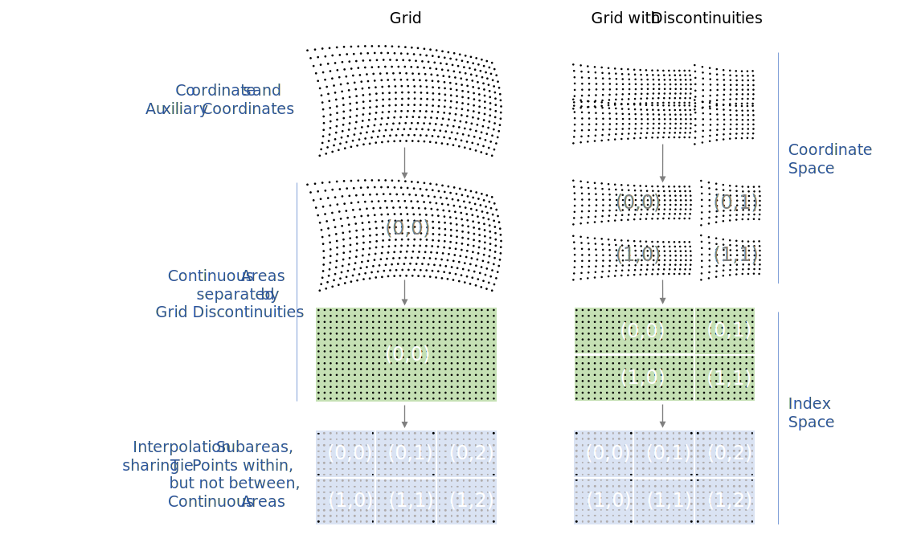
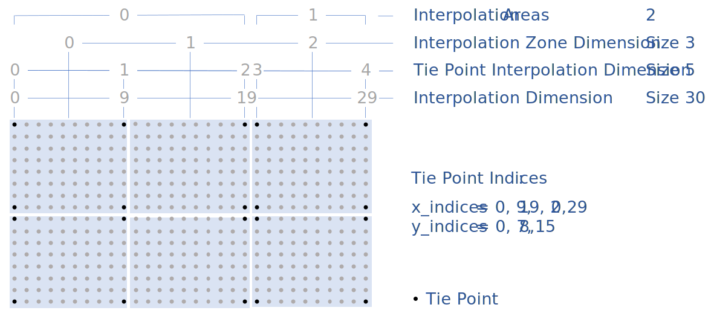
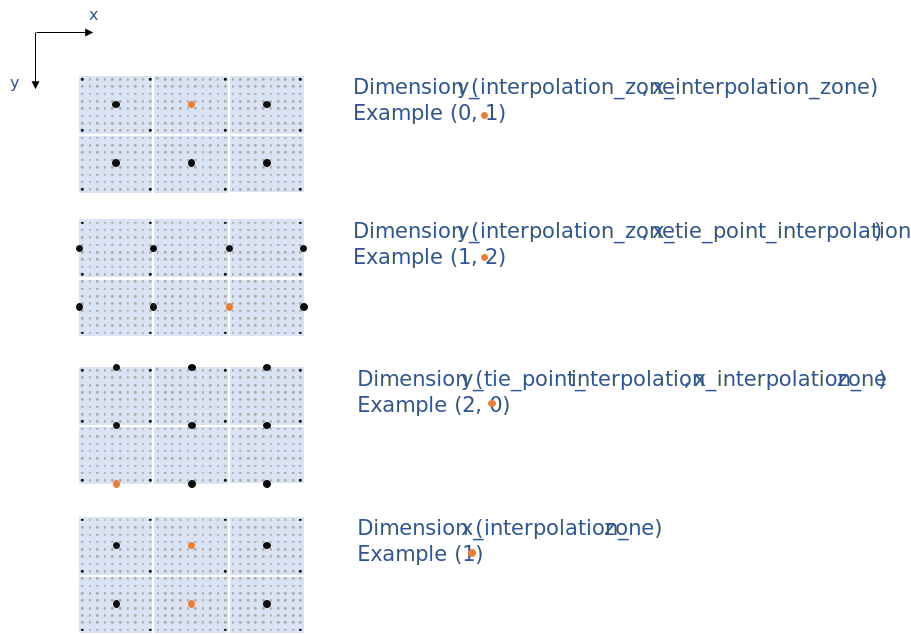
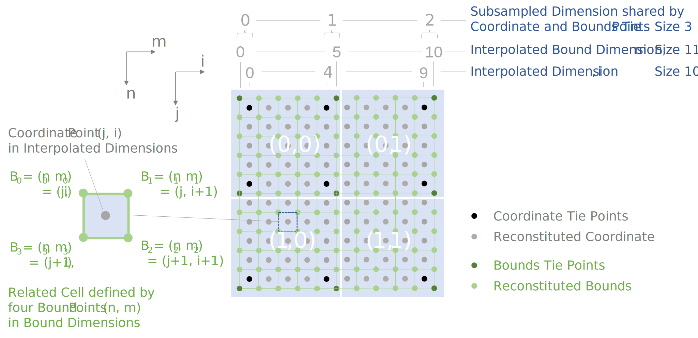

==  Reduction of Dataset Size 
:doc-part: 8
:figure: 0

There are three methods for reducing dataset size: packing, lossless compression, and lossy compression.
By packing we mean altering the data in a way that reduces its precision (but has no other effect on accuracy).
By lossless compression we mean techniques that store the data more efficiently and result in no loss of precision or accuracy.
By lossy compression we mean techniques that either store the data more efficiently and retain its precision but result in some loss in accuracy, or techniques that intentionally reduce data precision to improve the efficiency of subsequent lossless compression.

Lossless compression only works in certain circumstances, e.g., when a variable contains a significant amount of missing or repeated data values.
In this case it is possible to make use of standard utilities, e.g., UNIX **`compress`** or GNU **`gzip`**, to compress the entire file after it has been written.
In this section we offer an alternative compression method that is applied on a variable by variable basis.
This has the advantage that only one variable need be uncompressed at a given time.
The disadvantage is that generic utilities that don't recognize the CF conventions will not be able to operate on compressed variables.

[[packed-data, Section 8.1, "Packed Data"]]
=== Packed Data

At the current time the netCDF interface does not provide for packing data.
However a simple packing may be achieved through the use of the optional NUG defined attributes **`scale_factor`** and **`add_offset`**.
After the data values of a variable have been read, they are to be multiplied by the **`scale_factor`**, and have **`add_offset`** added to them.
If both attributes are present, the data are scaled before the offset is added.
When scaled data are written, the application should first subtract the offset and then divide by the scale factor.
The units of a variable should be representative of the unpacked data.

This standard is more restrictive than the NUG with respect to the use of the **`scale_factor`** and **`add_offset`** attributes; ambiguities and precision problems related to data type conversions are resolved by these restrictions.

When packed data is written, the **`scale_factor`** and **`add_offset`** attributes must be of the same type as the unpacked data, which must be either **`float`** or **`double`**. Data of type **`float`** must be packed into one of these types: **`byte`**, **`unsigned byte`**, **`short`**, **`unsigned short`**. Data of type **`double`** must be packed into one of these types: **`byte`**, **`unsigned byte`**, **`short`**, **`unsigned short`**, **`int`**, **`unsigned int`**.

When packed data is read, it should be unpacked to the type of the **`scale_factor`** and **`add_offset`** attributes, which must have the same type if both are present. For guidance only, we suggest that packed data which does not conform to the rules of this section regarding the types of the data variable and attributes should be unpacked to **`double`** type, in order to minimise the risk of loss of precision.

When data to be packed contains missing values the attributes that indicate missing values (**`_FillValue`**, **`valid_min`**, **`valid_max`**, **`valid_range`**) must be of the same data type as the packed data.
See <<missing-data>> for a discussion of how applications should treat variables that have attributes indicating both missing values and transformations defined by a scale and/or offset.

[[compression-by-gathering, Section 8.2, "Lossless Compression by Gathering"]]
=== Lossless Compression by Gathering

To save space in the netCDF file, it may be desirable to eliminate points from data arrays that are invariably missing.
Such a compression can operate over one or more adjacent axes, and is accomplished with reference to a list of the points to be stored.
The list is constructed by considering a mask array that only includes the axes to be compressed, and then mapping this array onto one dimension without reordering.
The list is the set of indices in this one-dimensional mask of the required points.
In the compressed array, the axes to be compressed are all replaced by a single axis, whose dimension is the number of wanted points.
The wanted points appear along this dimension in the same order they appear in the uncompressed array, with the unwanted points skipped over.
Compression and uncompression are executed by looping over the list.

The list is stored as the coordinate variable for the compressed axis of the data variable.
Thus, the list variable and its dimension have the same name.
If any auxiliary coordinate variable has all the dimensions to be compressed, adjacent and in the same order as in the data variable, and if the auxiliary coordinate variable has missing data at all the points which are to be eliminated from the data variable, then the affected dimensions can optionally be replaced by the list dimension for the auxiliary coordinate variable just as for the data variable.
The list variable has a string attribute **`compress`**, __containing a blank-separated list of the dimensions which were affected by the compression in the order of the CDL declaration of the uncompressed array__.
The presence of this attribute identifies the list variable as such.
The list, the original dimensions and coordinate variables (including boundary variables), and the compressed variables with all the attributes of the uncompressed variables are written to the netCDF file.
The uncompressed variables can be reconstituted exactly as they were using this information.
The list variable must not have an associated boundary variable.

[[horiz-compression-of-three-d-array-ex]]
[caption="Example 8.1. "]
.Horizontal compression of a three-dimensional array
====
We eliminate sea points at all depths in a longitude-latitude-depth array of soil temperatures.
In this case, only the longitude and latitude axes would be affected by the compression.
We construct a list `landpoint(landpoint)` containing the indices of land points. 

----
dimensions:
  lat=73;
  lon=96;
  landpoint=2381;
  depth=4;
variables:
  int landpoint(landpoint);
    landpoint:compress="lat lon";
  float landsoilt(depth,landpoint);
    landsoilt:long_name="soil temperature";
    landsoilt:units="K";
  float depth(depth);
  float lat(lat);
  float lon(lon);
data:
  landpoint=363, 364, 365, ...;
----
Since `landpoint(0)=363`, for instance, we know that `landsoilt(*,0)` maps on to point 363 of the original data with dimensions `(lat,lon)`.
This corresponds to indices `(3,75)`, i.e., `363 = 3*96 + 75`.
====

[[compression-of-three-d-field-ex]]
[caption="Example 8.2. "]
.Compression of a three-dimensional field
====
We compress a longitude-latitude-depth field of ocean salinity by eliminating points below the sea-floor.
In this case, all three dimensions are affected by the compression, since there are successively fewer active ocean points at increasing depths. 

----
variables:
  float salinity(time,oceanpoint);
  int oceanpoint(oceanpoint);
    oceanpoint:compress="depth lat lon";
  float depth(depth);
  float lat(lat);
  float lon(lon);
  double time(time);
----
This information implies that the salinity field should be uncompressed to an array with dimensions `(depth,lat,lon)`.
====

In <<example-h.5>>, two auxiliary coordinate variables are compressed as described in this section, although their data variable is not.

[[compression-by-coordinate-subsampling, Section 8.3, "Lossy Compression by Coordinate Subsampling"]]
=== Lossy Compression by Coordinate Subsampling

For some applications the coordinates of a data variable can require considerably more storage than the data itself.
Space may be saved in the netCDF file by storing a subsample of the coordinates that describe the data.
The uncompressed coordinate and auxiliary coordinate variables can be reconstituted by interpolation, from the subsampled coordinate values to the domain of the data (i.e. the target domain).
This process will likely result in a loss in accuracy (as opposed to precision) in the uncompressed variables, due to rounding and approximation errors in the interpolation calculations, but it is assumed that these errors will be small enough to not be of concern to users of the uncompressed dataset.
The creator of the compressed dataset can control the accuracy of the reconstituted coordinates through the degree of subsampling and the choice of interpolation method, see <<appendix-coordinate-subsampling>>.

The subsampled coordinates are called __tie points__ and are stored in
__tie point coordinate variables__.

In addition to the tie point coordinate variables themselves, metadata defining the coordinate interpolation method is stored in attributes of the data variable and of the associated __interpolation variable__.
The partitioning of metadata between the data variable and the interpolation variable has been designed to minimise redundancy and maximise the reusability of the interpolation variable within a dataset.

The metadata that define the interpolation formula and its inputs are complete, so that the results of the coordinate reconstitution process are well defined and of a predictable accuracy.

[[compression-by-coordinate-subsampling-tie-points-and-interpolation-subareas, Section 8.3.1, "Tie Points and Interpolation Subareas"]]
==== Tie Points and Interpolation Subareas

Reconstitution of the uncompressed coordinate and auxiliary coordinate variables is based on interpolation.
To accomplish this, the target domain is segmented into smaller __interpolation subareas__, for each of which the interpolation method is applied independently.
For one-dimensional interpolation, an interpolation subarea is defined by two tie points, one at each end of the interpolation subarea; for two-dimensional interpolation, an interpolation subarea is defined by four tie points, one at each corner of a rectangular area aligned with the domain axes; etc.
For the reconstitution of the uncompressed coordinate and auxiliary coordinate variables within an interpolation subarea, the interpolation method is permitted to access its defining tie points, and no others.

As an interpolation method relies on the regularity and continuity of the coordinate values within each interpolation subarea, special attention must be given to the case when uncompressed coordinates contain discontinuities.
A discontinuity could be an overlap or a gap in the coordinates' coverage, or a change in cell size or cell alignment.
As an example, such discontinuities are common in remote sensing data and may be caused by combinations of the instrument scan motion, the motion of the sensor platform and changes in the instrument scan mode.
When discontinuities are present, the domain is first divided into multiple __continuous areas__, each of which is free of discontinuities.
When no discontinuities are present, the whole domain is a single continuous area.
Following this step, each continuous area is segmented into interpolation subareas.
The processes of generating interpolation subareas for a domain without discontinuities and for a domain with discontinuities is illustrated in <<interpolation_subarea_generation>>, and described in more detail in <<appendix-coordinate-subsampling>>.

For each __interpolated dimension__, i.e. a target domain dimension for which coordinate interpolation is required, the locations of the tie point coordinates are defined by a corresponding __tie point index variable__, which also indicates the locations of the continuous areas (<<compression-by-coordinate-subsampling-tie-point-index-mapping>>).

The interpolation subareas within a continuous area do not overlap, ensuring that each coordinate of an interpolated dimension is computed from a unique interpolation subarea.
These interpolation subareas, however, share the tie point coordinates that define their common boundaries.
Such a shared tie point coordinate can only be located in one of a pair of adjacent interpolation subareas, which is always the first of the pair in index space.
For instance, in <<interpolation_subarea_generation>>, the interpolation subarea labelled `(0,0)` contains all four of its tie point coordinates, and the interpolation subarea `(0,1)` only contains two of them.
When applied for a given interpolation subarea, interpolation methods (such as those described in <<appendix-coordinate-subsampling>>) must ensure that reconstituted coordinate points are only generated inside the interpolation subarea being processed, even if some of the tie point coordinates lie outside of that interpolation subarea.

Adjacent interpolation subareas that are in different continuous areas never share tie point coordinates, as consequence of the grid discontinuity between them.
This results in a different number of tie point coordinates in the two cases shown in <<interpolation_subarea_generation>>.

For each interpolated dimension, the number of interpolation subareas is equal to the number of tie points minus the number of continuous areas.

Tie point coordinate variables for both coordinate and auxiliary coordinate variables must be defined as numeric data types and are not allowed to have missing values.

[[interpolation_subarea_generation]]
[caption="Figure {doc-part}.{counter:figure}. ", reftext=Figure {doc-part}.{figure}]
[.text-center]
.Process for generating the interpolation subareas for a grid without discontinuities and for a grid with discontinuities.

[[compression-by-coordinate-subsampling-coordinate-interpolation-attribute, Section 8.3.2, "Coordinate Interpolation Attribute"]]
==== Coordinate Interpolation Attribute

To indicate that coordinate interpolation is required, a **`coordinate_interpolation`** attribute must be defined for a data variable.
This is a string attribute that both identifies the tie point coordinate variables, and maps non-overlapping subsets of them to their corresponding interpolation variables.
It is a blank-separated list of words of the form "__tie_point_coordinate_variable: [tie_point_coordinate_variable: ...] interpolation_variable [tie_point_coordinate_variable: [tie_point_coordinate_variable: ...] interpolation_variable ...]__".
For example, to specify that the tie point coordinate variables `lat` and `lon` are to be interpolated according to the interpolation variable `bi_linear` could be indicated with `lat: lon: bi_linear`.

[[compression-by-coordinate-subsampling-interpolation-variable, Section 8.3.3, "Interpolation Variable"]]
==== Interpolation Variable

The method used to uncompress the tie point coordinate variables is described by an interpolation variable that acts as a container for the attributes that define the interpolation technique and the parameters that should be used.
The variable should be a scalar (i.e. it has no dimensions) of arbitrary type, and the value of its single element is immaterial.

The interpolation method must be identified in one of two ways.
Either by the **`interpolation_name`** attribute, which takes a string value that contains the method's name, or else by the **`interpolation_description`** attribute, which takes a string value that contains a non-standardized description of the method.
These attributes must not be both set.

The valid values of **`interpolation_name`** are given in <<appendix-coordinate-subsampling>>.
This appendix describes the interpolation technique for each method, and optional interpolation variable attributes for configuring the interpolation process.

If a standardized interpolation name is not given, the interpolation variable must have an **`interpolation_description`** attribute defined instead, containing a description of the non-standardised interpolation (in a similar manner to a long name being used instead of a standard name).
This description is free text that can take any form (including fully qualified URLs, for example).
Whilst it is recommended that a standardised interpolation is provided, the alternative is provided to promote interoperability in cases where a well defined user community needs to use sophisticated interpolation techniques that may also be under development.

The definition of the interpolation method, however it is specified, may include instructions to treat groups of physically related coordinates simultaneously, if such tie points are present.
For example, there are cases where longitudes cannot be interpolated without considering the corresponding latitudes.
It is up to the interpolation description to describe how such coordinates are to be identified (e.g. it may be that such tie point coordinate variables require particular units or standard names).

Note that the interpolation method is always applied on a per interpolation subarea basis, for which the construction of the uncompressed coordinates may only access those tie points that define the extent of the of the interpolation subarea.

In addition to the **`interpolation_name`** and **`interpolation_description`** attributes described in this section, further attributes of the interpolation variable are described in <<compression-by-coordinate-subsampling-tie-point-mapping-attribute>> and <<compression-by-coordinate-subsampling-interpolation-parameters>>, <<compression-by-coordinate-subsampling-interpolation-of-cell-boundaries>> and <<compression-by-coordinate-subsampling-interpolation-method-implementation>>.

[[compression-by-coordinate-subsampling-dimensions,Section 8.3.4, "Subsampled, Interpolated and Non-Interpolated Dimensions"]]
==== Subsampled, Interpolated and Non-Interpolated Dimensions

For each interpolation variable identified in the **`coordinate_interpolation`** attribute, all of the associated tie point coordinate variables must share the same set of one or more dimensions.
This set of dimensions must correspond to the set of dimensions of the uncompressed coordinate or auxiliary coordinate variables, such that each of these dimensions must be either the uncompressed dimension itself, or a dimension that is to be interpolated to the uncompressed dimension.

Dimensions of the tie point coordinate variable which are to be interpolated are called __subsampled dimensions__, and the corresponding data variable dimensions are called __interpolated dimensions__, while those for which no interpolation is required, being the same in the data variable and the tie point coordinate variable, are called __non-interpolated dimensions__.
The dimensions of a tie point coordinate variable must contain at least one  subsampled dimension, for each of which the corresponding interpolated dimension cannot be included.

The size of a subsampled dimension will be less than the size of the corresponding interpolated dimension.
For example, if the interpolated dimensions are `xc = 30` and `yc = 10`, interpolation could be applied in both of these dimensions, based on tie point variables of the dimensions `tp_xc = 4` and `tp_yc = 2`.
Here, `tp_xc` is the subsampled dimension related to the interpolated dimension `xc`, and `tp_yc` is the  subsampled dimension related to the interpolated dimension `yc`.

The presence of non-interpolated dimensions in the tie point coordinate variable impacts the interpolation process in that there must be a separate application of the interpolation method for each combination of indices of the non-interpolated dimensions.
For example, if `xc = 30` is an interpolated dimension and `yc = 10` is a non-interpolated dimension, interpolation could be applied in the `xc` dimension only, based on tie point variables that have the subsampled dimension `tp_xc = 4` and the non-interpolated dimension `yc = 10`.
The interpolation in the `xc` dimension would then be repeated for each of the 10 indices of the `yc` non-interpolated dimension.

[[compression-by-coordinate-subsampling-tie-point-mapping-attribute, Section 8.3.5, "Tie Point Mapping Attribute"]]
==== Tie Point Mapping Attribute

The **`tie_point_mapping`** attribute provides mapping at two levels.
It associates interpolated dimensions with the corresponding subsampled dimensions, and for each of these sets of corresponding dimensions, it associates index values of the interpolated dimension with index values of the subsampled dimension, thereby uniquely associating the tie points with their corresponding location in the target domain.

The mappings are stored in the interpolation variable's **`tie_point_mapping`** attribute that contains a blank-separated list of words of the form __"interpolated_dimension: tie_point_index_variable subsampled_dimension [interpolation_subarea_dimension] [interpolated_dimension: ...]"__, the details of which are described in the following two sections.

[[compression-by-coordinate-subsampling-tie-point-dimension-mapping, Section 8.3.6, "Tie Point Dimension Mapping"]]
==== Tie Point Dimension Mapping

The **`tie_point_mapping`** attribute defined above associates each interpolated dimension with its corresponding subsampled dimension and, if required, its corresponding __interpolation subarea dimension__ that defines the number of interpolation subareas which partition the interpolated dimension.
It is only required to associate an interpolated dimension  to an interpolation subarea dimension in the case that the interpolation subarea dimension is spanned by an interpolation parameter variable, as described in <<compression-by-coordinate-subsampling-interpolation-parameters>>.
If an interpolation subarea dimension is provided, then it must be the second of the two named dimensions following the tie point index variable.

Note that the size of an interpolation subarea dimension is, by definition, the size of the corresponding subsampled dimension minus the number of continuous areas.

An overview of the different dimensions for coordinate interpolation is shown in <<ci_dimensions_overview>>.

[[ci_dimensions_overview]]
[caption="Figure {doc-part}.{counter:figure}. ", reftext=Figure {doc-part}.{figure}]
[.text-center]
.Overview of the different dimensions for coordinate interpolation.

[[compression-by-coordinate-subsampling-tie-point-index-mapping, Section 8.3.7, "Tie Point Index Mapping"]]
==== Tie Point Index Mapping

The **`tie_point_mapping`** attribute defined in <<compression-by-coordinate-subsampling-tie-point-mapping-attribute>> identifies for each subsampled dimension a tie point index variable.
The tie point index variable defines the relationship between the indices of the subsampled dimension and the indices of its corresponding interpolated dimension.

A tie point index variable is a one-dimensional integer variable that must span the subsampled dimension.
Each tie point index variable value is a zero-based index of the related interpolated dimension which maps an element of that interpolated dimension to the corresponding location in the subsampled dimension.

The tie point index values must be strictly monotonically increasing.
The location in index space of a continuous area boundary that relates to a grid discontinuity (<<compression-by-coordinate-subsampling-tie-points-and-interpolation-subareas>>) is indicated by a pair of adjacent tie point index values differing by one.
In this case, each tie point index of the pair defines a boundary of a different continuous area.
As a consequence, any pair of tie point index values that defines an extent of an interpolation subarea must differ by two or more, i.e. in general, an interpolation subarea spans at least two points in each of its interpolated dimensions.
Interpolation subareas that are the first in index space of a continuous area, in one or more of the subsampled dimensions are, however, special.
These interpolation subareas contain tie points at both of the subarea boundaries with respect to those subsampled dimensions and so must span at least three points in the corresponding interpolated dimensions (see <<interpolation_subarea_generation>>).

For instance, in example <<example-Two-dimensional-tie-point-interpolation>> the tie point coordinate variables represent a subset of the target domain and the tie point index variable `int x_indices(tp_xc)` contains the indices `x_indices = 0, 9, 19, 29` that identify the location in the interpolated dimension `xc` of size 30.
The corresponding **`tie_point_mapping`** attribute of the interpolation variable is `xc: x_indices tp_xc  yc: y_indices tp_yc`.

[[example-Two-dimensional-tie-point-interpolation]]
[caption="Example 8.3. "]
.Two-dimensional tie point interpolation
====
----
dimensions:
  xc = 30;
  yc = 10;
  tp_xc = 4 ;
  tp_yc = 2 ;

variables:
  // Data variable
  float Temperature(yc, xc) ;
    Temperature:standard_name = "air_temperature" ;
    Temperature:units = "K" ;
    Temperature:coordinate_interpolation = "lat: lon: bl_interpolation" ;

  // Interpolation variable
  char bl_interpolation ;
    bl_interpolation:interpolation_name = "bi_linear" ;
    bl_interpolation:tie_point_mapping = "xc: x_indices tp_xc  yc: y_indices tp_yc"  ;
    bl_interpolation:computational_precision = "64" ;

  // tie point coordinate variables
  double lat(tp_yc, tp_xc) ;
    lat:units = "degrees_north" ;
    lat:standard_name = "latitude" ;
  double lon(tp_yc, tp_xc) ;
    lon:units = "degrees_east" ;
    lon:standard_name = "longitude" ;

  // Tie point index variables
  int y_indices(tp_yc) ;
  int x_indices(tp_xc) ;

data:
  x_indices = 0, 9, 19, 29 ;
  y_indices = 0, 9 ;
  ...
----
====

[[example-1d-interpolation-of-2d-domain]]
[caption="Example 8.4. "]
.One-dimensional tie point interpolation of two-dimensional domain.
====
----
dimensions:
  xc = 30;
  yc = 10;
  tp_xc = 4 ;

variables:
  // Data variable
  float Temperature(yc, xc) ;
    Temperature:standard_name = "air_temperature" ;
    Temperature:units = "K" ;
    Temperature:coordinate_interpolation = "lat: lon: l_interpolation" ;

  // Interpolation variables
  char l_interpolation ;
    l_interpolation:interpolation_name = "linear" ;
    l_interpolation:tie_point_mapping = "xc: x_indices tp_xc"  ;
    l_interpolation:computational_precision = "64" ;

  // tie point coordinate variables
  double lat(yc, tp_xc) ;
    lat:units = "degrees_north" ;
    lat:standard_name = "latitude" ;
  double lon(yc, tp_xc) ;
    lon:units = "degrees_east" ;
    lon:standard_name = "longitude" ;

  // Tie point index variables
  int x_indices(tp_xc) ;

data:
  x_indices = 0, 9, 19, 29 ;
  ...
----
====

[[compression-by-coordinate-subsampling-interpolation-parameters, Section 8.3.8, "Interpolation Parameters"]]
==== Interpolation Parameters

The interpolation variable attribute **`interpolation_parameters`** may be used to provide extra information to the interpolation process.
This attribute names __interpolation parameter variables__ that provide values for coefficient terms in the interpolation equation, or for any other terms that configure the interpolation process.
The **`interpolation_parameters`** attribute takes a string value, the string comprising blank-separated elements of the form `"term: variable"`, where `term` is a case-insensitive keyword that defines one of the terms in the interpolation method's definition given in <<appendix-coordinate-subsampling>>, and `variable` is the name of the interpolation parameter variable that contains the values for that term.
The order of elements is not significant.
Any numerical term that is specified as optional in <<appendix-coordinate-subsampling>> and is omitted from the **`interpolation_parameters`** attribute should be assumed to be zero.

The **`interpolation_parameters`** attribute may only be provided if allowed by the definition of the interpolation method.
Interpolation parameters may always be provided to non-standardized interpolation methods.

The interpolation parameters are not permitted to contain absolute coordinate information, such as additional tie points, but may contain relative coordinate information, for example an offset with respect to a tie point or with respect to a combination of tie points.
This is to ensure that interpolation methods are equally applicable to both coordinate and bounds interpolation.

The interpolation parameter variable dimensions must include, for all of the interpolated dimensions, either the associated subsampled dimension or the associated interpolation subarea dimension.
Additionally, any subset of zero or more of the non-interpolated dimensions of the tie point coordinate variable are permitted as interpolation parameter variable dimensions.

The application of an interpolation parameter variable is independent of its non-interpolated dimensions, but depends on its set of subsampled dimensions and interpolation subarea dimensions:

* If the set only contains subsampled dimensions, then the variable provides values for every tie point and therefore equally applicable to the interpolation subareas that share that tie point, see example a) in <<ci_interpolation_parameters>>;
* If the set only contains interpolation subarea dimensions, then the variable provides values for every interpolation subarea and therefore only applicable to that interpolation subarea, see example b) in <<ci_interpolation_parameters>>;
* If the set contains both subsampled dimensions and interpolation subarea dimensions, then the variable’s values are to be shared by the interpolation subareas that are adjacent along each of the specified subsampled dimensions.
This case is akin to the values being defined at the interpolation subarea boundaries, and therefore equally applicable to the interpolation subareas that share that boundary, see example c) and d) in <<ci_interpolation_parameters>>;

[[ci_interpolation_parameters]]
[caption="Figure {doc-part}.{counter:figure}. ", reftext=Figure {doc-part}.{figure}]
[.text-center]
.Through combination of dimensions, interpolation parameter variables may provide values for a) interpolation subareas sharing a tie point, b) each interpolation subarea,  c) and d) interpolation subareas sharing a boundary.

[[example-VIIRS]]
[caption="Example 8.5. "]
.Multiple interpolation variables with interpolation parameter attributes.
====
----
dimensions :
  // VIIRS I-Band (375 m resolution imaging)
  track = 1536 ;
  scan = 6400 ;
  // Tie points and interpolation subareas
  tp_track = 96 ;  // 48 VIIRS scans
  tp_scan = 205 ;
  subarea_track = 48 ;   // track interpolation subarea
  subarea_scan= 200 ;    // scan interpolation subarea
  // Time, stored at scan-start and scan-end of each scan
  tp_time_scan = 2;

variables:
  // VIIRS I-Band Channel 04
  float I04_radiance(track, scan) ;
    I04_radiance:coordinate_interpolation = "lat: lon: tp_interpolation  t: time_interpolation" ;
    I04_radiance:standard_name = "toa_outgoing_radiance_per_unit_wavelength" ;
    I04_radiance:units = "W m-2 sr-1 m-1" ;
  float I04_brightness_temperature(track, scan) ;
    I04_brightness_temperature:coordinate_interpolation = "lat: lon: tp_interpolation  t: time_interpolation" ;
    I04_brightness_temperature:standard_name = "brightness_temperature" ;
    I04_brightness_temperature:units = "K" ;

  // Interpolation variable
  char tp_interpolation ;
    tp_interpolation:interpolation_name = "bi_quadratic_latitude_longitude" ;
    tp_interpolation:tie_point_mapping = "track: track_indices tp_track subarea_track
                                          scan: scan_indices tp_scan subarea_scan" ;
    tp_interpolation:interpolation_parameters =
         "ce1: ce1  ca2: ca2  ce3: ce3 interpolation_subarea_flags: interpolation_subarea_flags" ;
    tp_interpolation:computational_precision = "32" ;

  // Interpolation parameters
  short ce1(tp_track , subarea_scan) ;
  short ca2(subarea_track , tp_scan) ;
  short ce3(subarea_track, subarea_scan) ;
  byte interpolation_subarea_flags(subarea_track , subarea_scan) ;
    interpolation_subarea_flags:valid_range = 1b, 7b ;
    interpolation_subarea_flags:flag_masks = 1b, 2b, 4b ;
    interpolation_subarea_flags:flag_meanings =
         "location_use_3d_cartesian
          sensor_direction_use_3d_cartesian
          solar_direction_use_3d_cartesian" ;

  // Tie point index variables
  int track_indices(tp_track) ;   // shared by tp_interpolation and time_interpolation
  int scan_indices(tp_scan) ;
  int time_scan_indices(tp_time_scan)

  // Tie points
  float lat(tp_track, tp_scan) ;
    lat:standard_name = "latitude" ;
    lat:units = "degrees_north" ;
  float lon(tp_track, tp_scan) ;
    lon:standard_name = "longitude" ;
    lon:units = "degrees_east" ;

  // Time interpolation variable
  char time_interpolation ;
    time_interpolation:interpolation_name = "bi_linear" ;
    time_interpolation:tie_point_mapping = "track: track_indices tp_track scan: time_scan_indices tp_time_scan"  ;
    time_interpolation:computational_precision = "64" ;

  // Time tie points
  double t(tp_track, tp_time_scan) ;
    t:standard_name = "time" ;
    t:units = "days since 1990-1-1 0:0:0" ;
----

This example demonstrates the use of multiple interpolation variables, the reusability of the interpolation variable between data variables of different dimensions and the use of the interpolation parameter attribute.

====

[[example-grid-mapping-and-interpolation-with-time-not-interpolated]]
[caption="Example 8.6. "]
.Combining a grid mapping and coordinate interpolation, with time as a non-interpolated dimension.
====
----
dimensions:
  y = 228;
  x = 306;
  time = 41;

  // Tie point dimensions
  tp_y = 58;
  tp_x = 52;

variables:
  // Data variable
  float Temperature(time, y, x) ;
    Temperature:standard_name = "air_temperature" ;
    Temperature:units = "K" ;
    Temperature:grid_mapping = "lambert_conformal" ;
    Temperature:coordinate_interpolation = "lat: lon: bi_linear x: linear_x y: linear_y" ;

  int lambert_conformal ;
    lambert_conformal:grid_mapping_name = "lambert_conformal_conic" ;
    lambert_conformal:standard_parallel = 25.0 ;
    lambert_conformal:longitude_of_central_meridian = 265.0 ;
    lambert_conformal:latitude_of_projection_origin = 25.0 ;

  // Interpolation variables
  char bi_linear ;
    bi_linear:interpolation_name = "bi_linear" ;
    bi_linear:tie_point_mapping = "y: y_indices tp_y  x: x_indices tp_x"  ;
    bi_linear:computational_precision = "64" ;

  char linear_x ;
    linear_x:interpolation_name = "linear" ;
    linear_x:tie_point_mapping = "x: x_indices tp_x" ;
    linear_x:computational_precision = "64" ;

  char linear_y ;
    linear_y:interpolation_name = "linear" ;
    linear_y:tie_point_mapping = "y: y_indices tp_y" ;
    linear_y:computational_precision = "64" ;

  // tie point coordinate variables
  double time(time) ;
    time:standard_name = "time" ;
    time:units = "days since 2021-03-01" ;
  double y(time, tp_y) ;
    y:units = "km" ;
    y:standard_name = "projection_y_coordinate" ;
  double x(time, tp_x) ;
    x:units = "km" ;
    x:standard_name = "projection_x_coordinate" ;
  double lat(time, tp_y, tp_x) ;
    lat:units = "degrees_north" ;
    lat:standard_name = "latitude" ;
  double lon(time, tp_y, tp_x) ;
    lon:units = "degrees_east" ;
    lon:standard_name = "longitude" ;

  // Tie point index variables
  int y_indices(tp_y) ;
    y_indices:long_name = "Mapping of y dimension to its ",
                          "corresponding tie point dimension" ;
  int x_indices(tp_x) ;
    x_indices:long_name = "Mapping of x dimension to its ",
                          "corresponding tie point dimension" ;
----

In this the projection coordinates are two-dimensional, but are only linearly interpolated in one of their dimensions - the one which is given by the **`tie_point_mapping`** attribute.

====

[[compression-by-coordinate-subsampling-interpolation-of-cell-boundaries, Section 8.3.9, "Interpolation of Cell Boundaries"]]
==== Interpolation of Cell Boundaries

Coordinates may have cell bounds.
For the case that the reconstituted cells are contiguous and have exactly two cell bounds along each interpolated dimension, cell bounds of interpolated dimensions can be stored as __bounds tie points__ and reconstituted through interpolation.
In this process, the coordinate tie points are a prerequisite for the bounds tie points and the same interpolation method used for the coordinate interpolation is used for the bounds interpolation.

For the reconstituted coordinates, cell bounds are stored separately for each coordinate point, as shown in the left part of <<figure_interpolation_of_cell_boundaries>> for the example of 2D bounds.
Since the cell bounds are contiguous, bounds points of adjacent cells will coincide and so the full set of bounds points may be represented as a grid, comparable to the coordinate points grid.
In the middle part of <<figure_interpolation_of_cell_boundaries>>, both the reconstituted bounds points grid and the reconstituted coordinate points grid are shown for a continuous area, where each bounds point may be shared by up to four cells.

Bounds interpolation uses the same tie point index variables and therefore the same tie point cells as coordinate interpolation.
One of the vertices of each coordinate tie point cell is chosen as the bounds tie point for the cell.
It is selected as the vertex of the tie point cell that is the closest to the boundary of the interpolation subarea with respect to each interpolated dimension.
For the example of 2D bounds, the resulting set of bounds tie points are marked in <<figure_interpolation_of_cell_boundaries>>, where the selected vertices are those closest to the corners of the interpolation subareas.

Note that within a continuous area, there is one more reconstituted bounds point than there are reconstituted coordinate points in each dimension.
For this reason, a  virtual __interpolated bounds dimension__ is introduced for each dimension, having a size equal to the size of the interpolated dimension plus one.
This dimension is used for solely descriptive purposes, and is not required in a compressed dataset. 

[[figure_interpolation_of_cell_boundaries]]
[caption="Figure {doc-part}.{counter:figure}. ", reftext=Figure {doc-part}.{figure}]
[.text-center]
.Example of 2D bounds interpolation showing the bounds tie points and reconstituted bound points within a continuous area consisting of four interpolation subareas. The dimensions are shown for one of the two axes only. The index relationship between coordinate point indices and the related bound points indices is indicated.

Both the process of compressing bounds and the process of uncompressing bounds requires the steps to be carried out for a full continuous area, however, individual continuous areas can be processed independently.
In the following description of these processes, indices relative to the origin of each continuous area are used for the interpolated dimension and the interpolated bounds dimension.
Consequently, for both coordinate tie points and bounds tie points, the first point in index space of the continuous area has got index 0 in all the interpolated dimensions and interpolated bounds dimensions, respectively.

Note that the numbering of the bounds `B0`, `B1`, etc, in this section is identical to the numbering in <<cell-boundaries>>.

A bounds tie point is located in the same interpolation subarea  as its corresponding coordinate tie point.
The interpolation subareas do not overlap, ensuring that each bound point is computed from a unique interpolation subarea, see also the description of interpolation subareas in <<compression-by-coordinate-subsampling-tie-points-and-interpolation-subareas>>.
That bounds are computed only once ensures that the reconstituted bounds are contiguous.

For the generation of bounds tie points as part of the process of compressing bounds, the indices of the corresponding coordinate tie points are available in the tie point index variables, see <<compression-by-coordinate-subsampling-tie-point-index-mapping>>.

[[compressing_one_dimensional, "Compressing one-dimensional coordinate bounds"]]
**Compressing one-dimensional coordinate bounds** +
In the one-dimensional case, a coordinate point at index `i` in the interpolated dimension will be bounded by the two bounds:

----
B0 = (n0) = (i)
B1 = (n1) = (i+1)
----

where `n` is the bound index in the interpolated bound dimension.

For one-dimensional bound interpolation, an interpolation subarea is defined by two bounds tie points.
The full set of bounds tie points is formed by appending, for each continuous area of the domain, the bound point `B0` of the first coordinate tie points of the continuous area, followed by the bound points `B1` of all subsequent coordinate tie point of the continuous area.

[[compressing_two_dimensional, "Compressing two-dimensional coordinate bounds"]]
**Compressing two-dimensional coordinate bounds** +
In the two-dimensional case, a coordinate point at indices `(j, i)` in the interpolated dimension will be bounded by the four bounds:

----
B0 = (n0, m0) = (j, i)
B1 = (n1, m1) = (j, i+1)
B3 = (n3, m3) = (j+1, i)
B2 = (n2, m2) = (j+1, i+1)
----

where `(n, m)` are the bounds point indices in the interpolated bound dimensions.

For two-dimensional bound interpolation, an interpolation subarea is defined by four bounds tie points.
The full set of bounds tie points is formed by appending, for each continuous area of the domain, the bound point `B0` of the coordinate tie point at origin the of the continuous area `(0, 0)`, followed by the bound points `B1` of all remaining coordinate tie point of the continuous area with index `j = 0`, followed by the bound points `B3` of all remaining coordinate tie point of the continuous area with index `i = 0`, followed by the bound points `B2` of all remaining coordinate tie point of the continuous area.

**Bounds Tie Point Attribute and Bounds Tie Point Variable** +
A **`bounds_tie_points`** attribute must be defined for each tie point coordinate variable corresponding to reconstituted coordinates with cell boundaries.
It is a single word of the form __“bounds_tie_point_variable”__ that identifies a bounds tie point variable, containing a bounds tie point coordinate value for each tie point stored in its tie point coordinate variable, and therefore the bounds tie point variable has the same set of dimensions as its tie point coordinate variable.
An example of the usage of the **`bounds_tie_points`** is shown in <<example-interpolation-of-cell-boundaries>>.
Since a bounds tie point variable is considered to be part of a tie point coordinate variable’s metadata, it is not necessary to provide it with attributes such as long_name and units, following the same rules as for the bounds of an uncompressed coordinate variable, see <<cell-boundaries>>.

**Uncompressing coordinate bounds** +
The reconstitution of the full set of bounds from the bounds tie point is a two-step process.
In a first step, which must be carried out for a full continuous area at a time, each bound point is reconstituted by interpolation between the bounds tie points within each interpolation subarea, using the same interpolation method as defined for the ordinary tie points.
This step results in a grid of bound points spanning the interpolated bound dimensions.
In a second step the reconstituted bounds vertices are replicated to the boundary variables of the reconstituted coordinates.

**Uncompressing one-dimensional coordinate bounds** +
For one-dimensional coordinate bounds, in the second step of the process, for each index `i` of the interpolated dimension, the two bounds of the boundary variable are set to the value of the interpolated bounds point grid at the indices `B0`  and `B1`, respectively, where the indices are defined above under <<compressing_one_dimensional>>.

**Uncompression of two-dimensional coordinate bounds** +
For two-dimensional coordinate bounds, in the second step of the process, for each index pair `(j, i)` of the interpolated dimension, the four bounds of the boundary variable is set to the value of the interpolated bounds point grid at index pairs `B0`, `B1`, `B2` and `B3`, respectively, where the index pairs are defined above under <<compressing_two_dimensional>>.

[[example-interpolation-of-cell-boundaries, Interpolation of 2D Cell Boundaries corresponding to Figure 8.4]]
[caption="Example 8.7. "]
.Interpolation of 2D Cell Boundaries corresponding to <<figure_interpolation_of_cell_boundaries>>
====
----
dimensions:
  ic = 10;
  itp = 3;

  jc = 10;
  jtp = 3;

variables:
  // Data variable
  float Temperature(jc, ic) ;
    Temperature:standard_name = "air_temperature" ;
    Temperature:units = "K" ;
    Temperature:coordinate_interpolation = "lat: lon: bl_interpolation" ;

  // Interpolation variable
  char bl_interpolation ;
    bl_interpolation:interpolation_name = "bi_linear" ;
    bl_interpolation:tie_point_mapping = "ic: i_indices itp  jc: j_indices jtp"  ;
    bl_interpolation:computational_precision = "64" ;

  // Tie point index variables
  int i_indices(itp) ;
  int j_indices(jtp) ;

  // Tie point coordinate variables
  double lat(jtp, itp) ;
    lat:units = "degrees_north" ;
    lat:standard_name = "latitude" ;
    lat:bounds_tie_points = "lat_bounds" ;

  double lon(jtp, itp) ;
    lon:units = "degrees_east" ;
    lon:standard_name = "longitude" ;
    lon:bounds_tie_points = "lon_bounds" ;

  // Bounds tie point variables
  double lat_bounds(jtp, itp) ;
  double lon_bounds(jtp, itp) ;

----
====

[[compression-by-coordinate-subsampling-interpolation-method-implementation, Section 8.3.10, "Interpolation Method Implementation"]]
==== Interpolation Method Implementation

The accuracy of the reconstituted coordinates depends mainly on the degree of subsampling and the choice of interpolation method, both of which are set by the creator of the dataset.
The accuracy and reproducibility will also depend, however, on how the interpolation method is implemented and on the computer platform carrying out the computations.
To facilitate a good level of reproducibility of the processes of compressing and uncompressing coordinates, requirements are placed on the specification of interpolation methods and on stating the computational precision.

**Interpolation Method Specification** +
The interpolation method specifications provided in <<appendix-coordinate-subsampling>> are complete in their description of steps and formulas required for compressing and uncompressing coordinate data. Formulas are structured in a way that encourages an efficient implementation of the interpolation method in a high-level programming language.
For instance, expressions that are constant within a computational loop should be externalised from that loop.

**Computational Precision Attribute** +
The data creator shall specify the floating-point arithmetic precision used during the preparation and validation of the compressed coordinates by setting the interpolation variable’s **`computational_precision**` attribute to one of the following values:

[cols="3,10"]
|===============
| ** Value ** | ** Description**
| "32" | 32-bit floating-point arithmetic, comparable to the binary32 standard in [<<IEEE_754>>]
| "64" | 64-bit floating-point arithmetic, comparable to the binary64 standard in [<<IEEE_754>>]
|===============

Using the given computational precision in the interpolation computations is a necessary, but not sufficient, condition for the data user to be able to reconstitute the coordinates to an accuracy comparable to that intended by the data creator.
For instance, a **`computational_precision**` value of **`"64"**` would specify that, using the same implementation and hardware as the creator of the compressed dataset, sufficient accuracy could not be reached when using a floating-point precision lower than 64-bit floating-point arithmetic in the interpolation computations required to reconstitute the coordinates.

[[lossy-compression-via-quantization, Section 8.4, "Lossy Compression via Quantization"]]
=== Lossy Compression via Quantization

Geoscientific models and measurements generate false floating-point precision (scientifically meaningless data bits) that wastes storage space.
False precision can mislead (by implying noise is signal) and is scientifically pointless.
Quantization algorithms can eliminate false precision, usually by rounding the least significant bits of <<IEEE_754>> floating-point mantissas to zeros.
(Quantization of integer types, although theoretically allowed, is not covered by this convention.)
The quantized results are valid <<IEEE_754>> values---no special software or decoder is necessary to read them.
Importantly, the quantized bits compress more efficiently than random bits.
Thus quantization is sometimes referred to as a form of lossy compression although, strictly speaking, quantization only pre-conditions data for more efficient compression by a subsequent compressor.

The CF conventions of this section define a metadata framework to record quantization properties alongside quantized floating-point data variables.
The goals are twofold.
First, to inform interested users how, and to what degree, the quantized data differ from the original unquantized data, which are not stored in the dataset and may no longer exist.
Second, to provide the necessary provenance metadata for users to reproduce the data transformations on the same or other raw data.
These conventions also allow users to better understand the precision that data producers expect from source models or measurements.

These conventions must not be used with data variables of integer type.
They must not be used with any variable, even if it is also a data variable, that serves as a coordinate variable, or is named by a **`coordinates`**, **`formula_terms`** or **`cell_measures`** attribute of any other variable.
This is because variables that provide metadata or are used in computation of domain metrics are often known to the highest precision possible, and degrading the precision of metadata properties may have unintended side effects on the accuracy of subsequent operations such as regridding, interpolation, and conservation checks.
These variables can include spatial and temporal coordinate variables (e.g., **`latitude`**, **`longitude`**, **`level`**, **`time`**), properties derived from these coordinates (e.g., **`area`**, **`volume`**), and variables referenced by the **`formula_terms`** attribute of a coordinate variable.

[[quantization-variables, Section 8.4.1, "Quantization Variables"]]
==== Quantization variables

A quantization variable describes a quantization algorithm via a collection of attached attributes.
It is of arbitrary type since it contains no data.
Its purpose is to act as a container for the generic attributes of a quantization algorithm.
Quantization variables are required to have at least two attributes: **`algorithm`** and **`implementation`**.

The **`algorithm`** attribute names a specific quantization algorithm.
Four quantization algorithms are currently recognized: BitRound, BitGroom, DigitRound, and Granular BitRound.
The controlled vocabulary for these algorithms thus consists of **`bitround`**, **`bitgroom`**, **`digitround`**, and **`granular_bitround`**.
See <<quantization-algorithms-description>> for a brief summary of these algorithms.

The second attribute required in a quantization variable is **`implementation`**.
This attribute contains unstandardized text that concisely conveys the algorithm provenance including the name of the library or client that performed the quantization, the software version, and any other information required to disambiguate the source of the algorithm employed.
The text must take the form "_software-name_ version _version-string_ [( _optional-information_ )]" such as
**`libnetcdf version 4.9.2`** in <<example-quantization-nsb-libnetcdf>>.

[[per-variable-quantization-attributes, Section 8.4.2, "Per-variable Quantization Attributes"]]
==== Per-variable quantization attributes

Each data variable that has been quantized must include at least two attributes to describe the quantization.
First, all such data variables must have a **`quantization`** attribute containing the name of the quantization variable describing the algorithm.
Second, all such variables must record the specific parameter value used in the quantization algorithm.
The input parameter for all quantization algorithms determines the precision preserved by the algorithm.

BitRound retains the specified number of significant bits (NSB) in the IEEE mantissa, and quantizes the trailing bits.
All data variables quantized by BitRound must record the NSB in the **`quantization_nsb`** attribute.
Note that BitRound __counts only explicitly represented mantissa bits__.
It does not include the most-significant-bit with value 1 that implicitly begins all <<IEEE_754>> mantissas.
Thus **`quantization_nsb`** is an integer type attribute with **`1 \<= NSB \<= 23`** for data type **`float`** or **`real`**, and **`1 \<= NSB \<= 52`** for data type **`double`**.

The BitGroom, Granular BitRound, and DigitRound algorithms guarantee preservation of a specified number of significant digits (NSD) in base 10 representation.
The actual number of mantissa bits quantized depends on the algorithm.
Thus all data variables quantized by BitGroom, Granular BitRound, or DigitRound must have a corresponding attribute **`quantization_nsd`**.
The value of **`quantization_nsd`** is an integer with **`1 \<= NSD \<= 7`** for data type **`float`** or **`real`**, and **`1 \<= NSD \<= 15`** for data type **`double`**.

[[example-quantization-nsb-libnetcdf]]
[caption="Example 8.8. "]
.Quantization performed by BitRound algorithm in libnetcdf
====
----
  variables:
    char quantization_info ;
      quantization_info:algorithm = "bitround" ;
      quantization_info:implementation = "libnetcdf version 4.9.2" ;

    float ps(time,lat,lon) ;
      ps:_QuantizeBitRoundNumberOfSignificantBits = 9 ;
      ps:quantization = "quantization_info" ;
      ps:quantization_nsb = 9 ;
      ps:standard_name = "surface_air_pressure" ;
      ps:units = "Pa" ;
----
Note how the same NSB is reported in two attributes of the data variable **`ps`**.
The quantization variable (**`quantization_info`**) **`implementation`** attribute reveals that the netCDF library applied the BitRound algorithm.
The netCDF library wrote the system-defined **`_QuantizeBitRoundNumberOfSignificantBits`** attribute <<NetCDF>> which contains the same parameter value as the CF **`quantization_nsb`** attribute (see the main text for further details).
====

[[example-quantization-nsd-multiple-variables-nco]]
[caption="Example 8.9. "]
.Quantization performed by Granular BitRound algorithm in NCO
====
Quantization of different variables to different levels often makes good scientific sense. Here the pressure variable **`ps`** has four significant digits of precision while the temperature variable **`ts`** retains only three significant digits. 
----
  variables:
    char quantization_info ;
      quantization_info:algorithm = "granular_bitround" ;
      quantization_info:implementation = "NCO version 5.2.7" ;

    float ps(time,lat,lon) ;
      ps:standard_name = "surface_air_pressure" ;
      ps:units = "Pa" ;
      ps:quantization = "quantization_info" ;
      ps:quantization_nsd = 4 ;

    float ts(time) ;
      ts:standard_name = "surface_temperature" ;
      ts:units = "K" ;
      ts:quantization = "quantization_info" ;
      ts:quantization_nsd = 3 ;
----
Both variables were quantized by the same algorithm and so utilize the same quantization variable.
**`quantization_info`** reveals that the Granular BitRound algorithm in NCO performed the quantization.
Since the netCDF library did not perform the quantization, there is no system-defined underscored quantization attribute.
====

[[quantization-algorithms-description, Section 8.4.3, "Description of Quantization Algorithms"]]
==== Description of quantization algorithms

This section briefly describes and contrasts each recognized **`quantize`** algorithm and points to further documentation.
BitRound is also called the "round-to-nearest" method <<KRD21>> and the "half-to-even" method <<Kou21>>.
This is the default <<IEEE_754>> rounding method and is bias-free and conservative for random distributions of numbers.
BitRound is preferred when the number of significant bits (NSB) to retain is known.

The other **`quantize`** algorithms guarantee to preserve a given number of significant (base-10 representation) digits (NSD).
Their quantization errors never exceed half of the unit value at the NSD decimal place <<Zen16>>.
BitGroom <<Zen16>> appeared first, though is now known to be suboptimal in accuracy <<Kou21>> and in compressibility compared to later methods.
DigitRound <<DCG19>> has superior compressibility for a given NSD compared to BitGroom.
Granular BitRound combines the DigitRound approach for compressibility with the BitRound approach for quantization.
Granular BitRound and DigitRound are both good choices when the NSD to retain is known.

The netCDF C and Fortran libraries can directly invoke BitRound, BitGroom, and Granular BitRound [<<NetCDF>>].
The netCDF library attaches a long, system-defined attribute to every data variable that it quantizes, such as 
**`_QuantizeBitRoundNumberOfSignificantBits = 9`** in <<example-quantization-nsb-libnetcdf>>.
The leading underscore indicates that the netCDF library wrote this attribute <<NUG>>.
Any variable that has the library-defined attribute must, in addition, contain the corresponding CF metadata.
Example 8.9 shows how the CF metadata might appear for other (non-netCDF library) implementations of **`quantize`** algorithms.
